# FlatScan

<div align="center">

**Zero-Dependency Static Malware Analysis Engine**

[](https://go.dev)
[](LICENSE)
[]()
[]()

Repository: https://github.com/Masriyan/FlatScan

</div>

---

FlatScan is a production-grade static malware analysis and reporting engine written in pure Go. It is designed for analysts who need fast triage, IOC extraction, suspicious capability detection, executive reporting, and hunting-rule handoff — all **without executing the sample**.

FlatScan reads a file, hashes it, identifies the format, extracts strings, decodes suspicious encoded data, extracts and triages IOCs, inspects executable/container metadata, scores findings, enriches them into a malware profile, and produces text, JSON, PDF, HTML, IOC, YARA, Sigma, STIX 2.1, case database, and report-pack outputs.

---

## Table of Contents

- [Why FlatScan Exists](#why-flatscan-exists)
- [Architecture Overview](#architecture-overview)
- [Analysis Pipeline](#analysis-pipeline)
- [Features](#features)
- [Quick Start](#quick-start)
- [Output Types](#output-types)
- [Scan Modes](#scan-modes)
- [Scoring Logic](#scoring-logic)
- [Plugin System](#plugin-system)
- [Performance Architecture](#performance-architecture)
- [Module Map](#module-map)
- [Safety Note](#safety-note)
- [Limitations](#limitations)
- [Documentation](#documentation)
- [Project URL](#project-url)

---

## Why FlatScan Exists

Malware triage often has two audiences:

| Audience | Needs |
|----------|-------|
| **Security Analysts** | Technical evidence: hashes, strings, imports, IOCs, entropy, sections, decoded data, TTPs, hunting rules |
| **CISO / Management** | Risk context: what it likely is, why it matters, business impact, recommended actions |

FlatScan serves both. It does static analysis for safety and speed, then converts the result into both machine-readable output and management-ready reporting.

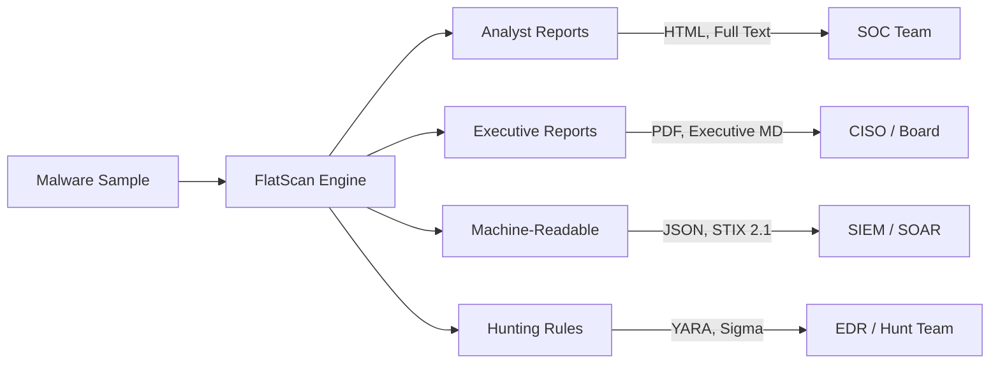

---

## Architecture Overview

FlatScan is built as a multi-stage analysis pipeline with parallel execution, a plugin system, and zero external dependencies.

```mermaid
graph TB
    subgraph "Input Layer"
        CLI[CLI Parser] --> CFG[Config]
        INT[Interactive Mode] --> CFG
        SHL[Shell Mode] --> CFG
        WCH[Watch Mode] --> CFG
    end
    
    subgraph "I/O Layer"
        CFG --> MMP{File > 100MB?}
        MMP -->|Yes| MMAP[Memory-Mapped I/O]
        MMP -->|No| BUF[Buffered Read]
        MMAP --> DATA[Raw Bytes + Hashes]
        BUF --> DATA
    end
    
    subgraph "Analysis Pipeline"
        DATA --> DET[File Type Detection]
        DET --> ENT[Entropy Analysis]
        ENT --> STR[String Extraction]
        STR --> IOC[IOC Extraction]
        IOC --> DEC[Decoder Pass]
        DEC --> CRP[Corpus Build]
        CRP --> PAT[Pattern Matching]
        
        PAT --> PG["Parallel Group"]
        
        subgraph PG["⚡ Parallel Stages"]
            FMT[Format Analysis]
            CRV[Safe Carving]
            CRY[Crypto/Config]
            SIM[Similarity Hash]
        end
        
        PG --> SEQ[Sequential Stages]
        SEQ --> PLG[Plugin Engine]
        PLG --> SCR[Risk Scoring]
    end
    
    subgraph "Output Layer"
        SCR --> TXT[Text Report]
        SCR --> JSN[JSON]
        SCR --> PDF[PDF Report]
        SCR --> HTM[HTML Report]
        SCR --> YAR[YARA Rule]
        SCR --> SIG[Sigma Rule]
        SCR --> STX[STIX 2.1]
        SCR --> RPK[Report Pack]
    end
    
    style PG fill:#1a1a2e,stroke:#e94560,stroke-width:2px
    style SCR fill:#0f3460,stroke:#e94560,stroke-width:2px
```

### Key Design Principles

| Principle | Implementation |
|-----------|---------------|
| **Zero Dependencies** | Go standard library only — no `go.mod` deps |
| **Static Only** | Never executes the sample — reads bytes and metadata |
| **Thread-Safe** | `parallelRun()` with mutex-protected findings, race-detector verified |
| **Platform Portable** | Builds for Linux, macOS, Windows; mmap on Linux with transparent fallback |
| **Extensible** | Plugin interface + JSON manifests for custom detections without recompiling |

---

## Analysis Pipeline

The engine processes files through 18 stages with parallel execution for independent operations:

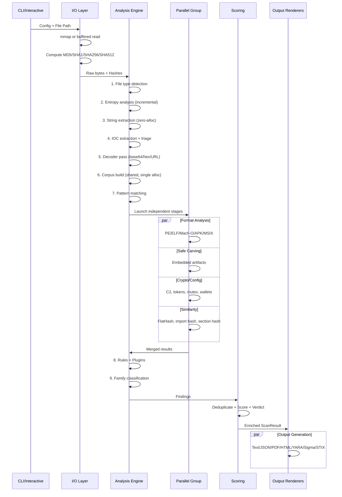

### Pipeline Stage Details

| # | Stage | Description | Optimization |
|---|-------|-------------|-------------|
| 1 | **File Read** | Reads file and computes 4 hash algorithms simultaneously | mmap for files >100MB |
| 2 | **Type Detection** | Magic bytes + extension mapping for 25+ file types | — |
| 3 | **Entropy** | Full-file Shannon entropy + sliding-window high-entropy regions | Incremental histogram O(step) |
| 4 | **String Extraction** | ASCII + UTF-16LE string extraction with mode-based limits | Zero-alloc byte-slice indexing |
| 5 | **IOC Extraction** | URLs, domains, IPs, emails, hashes, CVEs, registry keys, paths | Batch normalization |
| 6 | **Decoder Pass** | Base64, hex, URL-percent with configurable nesting depth | — |
| 7 | **Corpus Build** | Shared lowercase corpus for all pattern-matching stages | Single alloc, 5x reuse |
| 8 | **Pattern Matching** | Behavioral signatures, import chains, capability detection | Corpus string search |
| 9 | **Format Analysis** | PE/ELF/Mach-O/APK/MSIX/ZIP/DEX structural parsing | ⚡ Parallel |
| 10 | **Safe Carving** | Embedded PE/ELF/DEX/ZIP/PDF/gzip/7z/RAR detection | ⚡ Parallel |
| 11 | **Crypto/Config** | C2 endpoints, webhook tokens, mutex, wallet strings, XOR keys | ⚡ Parallel |
| 12 | **Similarity** | FlatHash, byte-histogram, string-set, import, section hashes | ⚡ Parallel |
| 13 | **Rules Engine** | JSON rule packs + `.rule` declarative detections | Corpus-aware |
| 14 | **Plugin Engine** | Built-in + JSON manifest plugins | Registry pattern |
| 15 | **Family Classifier** | Ransomware, stealer, loader, RAT, riskware classification | — |
| 16 | **IOC Triage** | PKI/schema/OID/loopback suppression | Audit trail |
| 17 | **Risk Scoring** | Severity-weighted score with dedup + verdict assignment | — |
| 18 | **Profile Enrichment** | MITRE TTPs, business impact, capabilities, recommendations | — |

---

## Features

### Core Analysis

- Full-file MD5, SHA1, SHA256, and SHA512 hashing
- File type and MIME hint detection (25+ formats)
- ASCII and UTF-16LE string extraction with zero-allocation performance
- IOC extraction for URLs, domains, IPv4, IPv6, emails, hashes, CVEs, registry keys, paths
- IOC triage with built-in PKI, schema, OID, and loopback allowlists
- Suspicious base64, hex, and URL-percent decoding with nesting depth control
- Shannon entropy scoring and high-entropy region detection

### Format Parsers

- **PE**: imports, sections, timestamp, subsystem, certificate table, overlay, import hash, .NET detection
- **ELF**: class, machine, type, imports, sections
- **Mach-O**: CPU, type, imports, sections
- **ZIP/APK/JAR/MSIX/AppX/Office XML**: entry inspection without disk extraction
- **MSIX/AppX**: manifest parsing, publisher, capabilities, undeclared payloads, Magniber detection
- **Android APK/DEX**: manifest, permissions, exported components, DEX string/API scanning

### Behavioral Detection

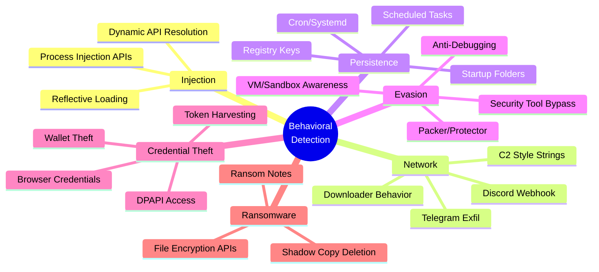

### Output Formats

- **Text**: minimal, Summary, and Full report modes
- **JSON**: complete structured result for automation
- **PDF**: CISO/management-ready with executive summary, MITRE matrix, risk cards
- **HTML**: interactive analyst report with filters and expandable sections
- **IOC**: categorized text export with promoted payload hashes
- **YARA**: auto-generated hunting rule with structural guards
- **Sigma**: SIEM/EDR hunting rule with ATT&CK tags
- **STIX 2.1**: threat intelligence bundle (File SCO, Malware SDO, Indicators, Relationships)
- **Report Pack**: all of the above in a single directory

### Operational Modes

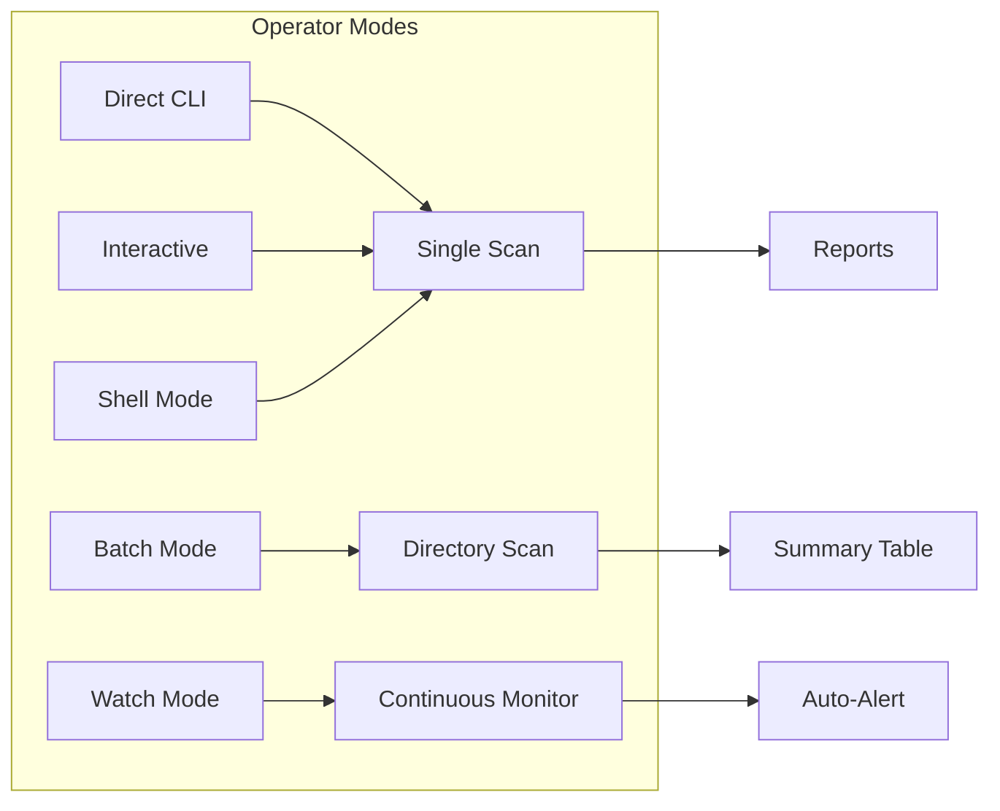

| Mode | Command | Use Case |
|------|---------|----------|
| **Direct CLI** | `./flatscan -f sample.bin -m deep` | One-off scans and automation |
| **Interactive** | `./flatscan --interactive` | Guided wizard for new analysts |
| **Shell** | `./flatscan --shell` | Repeated scans in one session |
| **Batch** | `./flatscan --dir ./samples -m deep` | Directory-wide triage |
| **Watch** | `./flatscan --dir ./inbox --watch` | Monitor for new files |

---

## Quick Start

### Build

```bash
go build -o flatscan .

# With version tag
go build -ldflags "-X main.version=0.3.0" -o flatscan .
```

### Scan Commands

```bash
# ⚡ Quick triage
./flatscan -m quick -f sample.exe --report-mode Summary

# 🔬 Deep scan with full report pack
./flatscan -m deep -f sample.exe --report-pack reports/case-001 --carve --debug

# 📂 Batch scan entire directory
./flatscan --dir ./samples -m deep

# 👁 Watch directory for new files
./flatscan --dir ./inbox --watch -m deep --watch-interval 5

# 📊 JSON to stdout for scripting
./flatscan -m deep -f sample.exe --json - --no-progress --no-splash --no-color | jq '.risk_score'

# 🔐 Full stealer analysis
./flatscan -m deep -f sample/mercuristealer \
  --report-mode Full \
  --report reports/stealer.txt \
  --json reports/stealer.json \
  --pdf reports/stealer.pdf \
  --html reports/stealer.html \
  --yara reports/stealer.yar \
  --sigma reports/stealer.yml \
  --stix reports/stealer.stix.json \
  --extract-ioc reports/stealer.iocs.txt \
  --carve --debug

# 📱 Android APK analysis with custom rules
./flatscan -m deep -f suspicious.apk --rules plugins/android-risk.rule --report-pack reports/apk-case

# 🎯 STIX threat intelligence export
./flatscan -m deep -f malware.exe --stix reports/threat-intel.stix.json

# 🛡️ CI/CD gate check (exit code based)
SCORE=$(./flatscan -m quick -f build.exe --json - --no-progress --no-splash --no-color 2>/dev/null | jq '.risk_score')
[ "$SCORE" -ge 30 ] && echo "BLOCKED" && exit 1

# 🔄 Batch report packs for all samples
for f in samples/*; do
  ./flatscan -m deep -f "$f" --report-pack "reports/$(basename "$f")" --no-splash --no-progress
done

# 💬 Interactive guided mode
./flatscan --interactive

# 🖥️ Manual command shell
./flatscan --shell
```

---

## Output Types

| Output | Flag | Purpose |
| --- | --- | --- |
| Text report | `--report PATH` | Human-readable report. Honors `--report-mode`. |
| JSON report | `--json PATH` | Complete structured result for automation and pipelines. |
| JSON stdout | `--json -` | Same as JSON report but piped to stdout for scripting. |
| PDF report | `--pdf PATH` | CISO/management-ready report with executive summary, MITRE matrix, impact, actions. |
| HTML report | `--html PATH` | Interactive analyst report with filters and expandable technical sections. |
| IOC export | `--extract-ioc PATH` | Categorized IOC text file with promoted payload hashes. |
| YARA rule | `--yara PATH` | Auto-generated hunting rule with structural guards and entropy conditions. |
| Sigma rule | `--sigma PATH` | Auto-generated SIEM/EDR hunting rule with ATT&CK tags. |
| STIX bundle | `--stix PATH` | STIX 2.1 JSON bundle with File SCO, Malware SDO, Indicators, Relationships. |
| Report pack | `--report-pack DIR` | All formats: PDF, HTML, JSON, IOC, YARA, Sigma, STIX, text, executive markdown. |
| Case DB | `--case ID --case-db PATH` | Local JSONL case record for sample tracking. |
| Stdout | default | Text report to stdout, colorized when terminal supports it. |

---

## Scan Modes

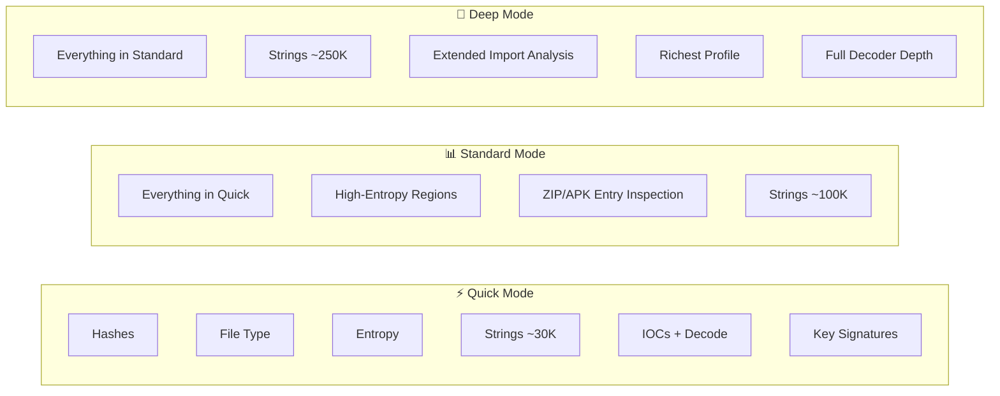

| Mode | String Limit | Use Case |
| --- | --- | --- |
| `quick` | 30,000 | Fast triage — hashes, type, strings, IOCs, signatures |
| `standard` | 100,000 | Normal analyst triage — adds entropy regions and ZIP inspection |
| `deep` | 250,000 | Final reports — largest limits, richest profile output |

---

## Scoring Logic

FlatScan assigns a risk score from 0-100 based on cumulative finding severity:

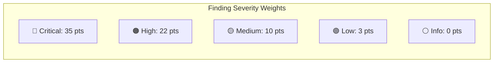

| Score Range | Verdict | Meaning |
| --- | --- | --- |
| `0-9` | No strong indicators | Static scan found no strong evidence. **Not a clean verdict.** |
| `10-29` | Low suspicion | Weak or limited indicators. Review context. |
| `30-54` | Suspicious | Meaningful suspicious evidence. Correlate with telemetry. |
| `55-79` | High suspicion | Strong suspicious indicators. Treat as high risk. |
| `80-100` | Likely malicious | Multiple high-confidence indicators. Prioritize containment. |

### Scoring Flow

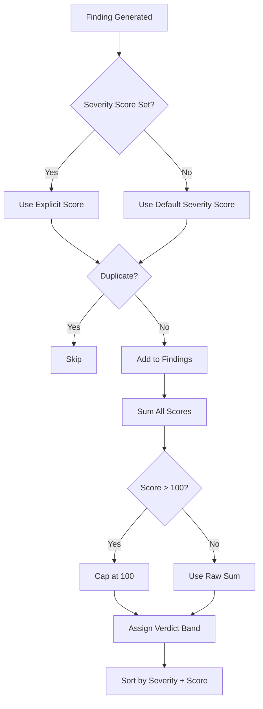

---

## Plugin System

FlatScan supports extensible analysis through a plugin interface:

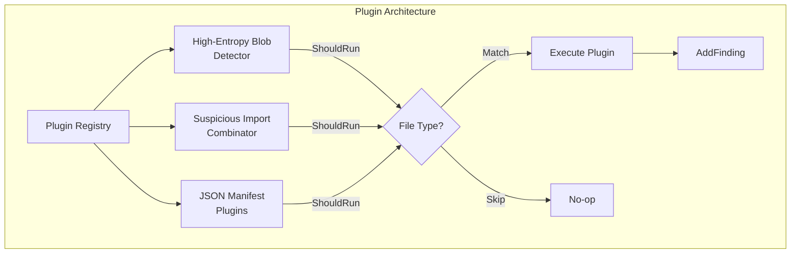

### Built-in Plugins

| Plugin | Purpose | Triggers On |
|--------|---------|-------------|
| **High-Entropy Blob** | Detects large encrypted/packed regions | Any binary with >7.5 entropy in 64KB+ regions |
| **Import Combinator** | Detects process hollowing and reflective injection | PE files with specific API combinations |

### JSON Plugin Manifest

External plugins can be defined without recompiling:

```json
{
  "name": "Custom Webhook Detector",
  "version": "1.0",
  "author": "SOC Team",
  "description": "Detects exfiltration via webhook services",
  "file_types": ["PE executable", "ELF binary"],
  "mode_min": "standard",
  "checks": [
    {
      "title": "Webhook exfiltration endpoint",
      "severity": "High",
      "category": "Exfiltration",
      "score": 20,
      "strings_any": ["discord.com/api/webhooks", "api.telegram.org/bot"],
      "tactic": "Exfiltration",
      "technique": "Exfiltration Over Web Service"
    }
  ]
}
```

---

## Performance Architecture

FlatScan achieves high performance through several architectural optimizations:

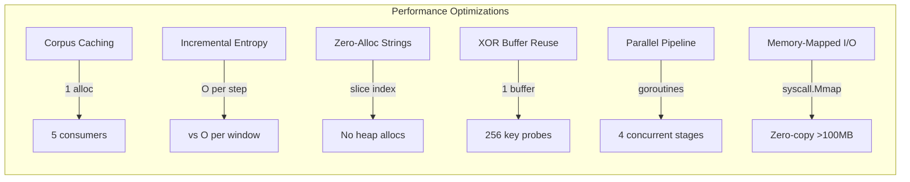

| Optimization | Before | After | Impact |
|-------------|--------|-------|--------|
| **Corpus Build** | 5 independent builds (~240MB total) | 1 shared build (~48MB) | **5x memory reduction** |
| **Entropy Window** | O(window) per step | O(step) incremental | **2x faster entropy** |
| **String Extraction** | Per-string heap alloc | Direct slice indexing | **Zero allocations** |
| **XOR Scan** | New buffer per key | Single reused buffer | **256x fewer allocs** |
| **Pipeline** | Sequential stages | 4 parallel goroutines | **~40% faster on multi-core** |
| **Large File I/O** | Buffered read+copy | mmap zero-copy | **Near-instant for >100MB** |

---

## Module Map

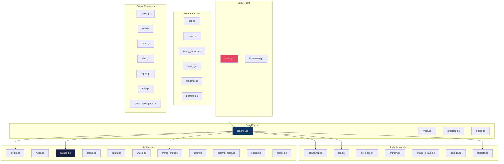

### Source Statistics

| Category | Files | Lines of Code |
|----------|-------|---------------|
| **Core Engine** | 4 | ~1,300 |
| **Analysis Modules** | 7 | ~2,800 |
| **Format Parsers** | 5 | ~2,500 |
| **Output Renderers** | 7 | ~3,200 |
| **Architecture** | 11 | ~2,100 |
| **Tests** | 1 | ~314 |
| **Total** | **39** | **~11,867** |

---

## Safety Note

FlatScan performs **static analysis only**. It does not execute samples. That reduces risk, but it does not make malware handling safe by itself.

> ⚠️ **Recommended handling:**
> - Work inside an isolated malware-analysis VM
> - Do not double-click or execute samples
> - Keep samples password-protected when sharing
> - Store reports separately from live malware
> - Treat generated findings as triage evidence, not a final clean/malicious verdict

---

## Limitations

- Static analysis can miss environment-gated, packed, staged, encrypted, or dynamically generated behavior
- Hashes cannot be decoded or reversed — FlatScan can classify hash-looking values as IOCs, but cannot recover original data
- Generated YARA and Sigma rules are starting points for hunting — review before deployment
- Safe carving reports offsets and hashes; it does not extract payloads to disk
- PKCS#7/CMS signature parsing is dependency-free and best-effort
- The local case database is JSONL, not SQLite, to keep FlatScan dependency-free
- MITRE mapping is static-evidence mapping, not proof that the behavior executed
- PDF reports are generated by FlatScan's internal PDF writer (no external dependencies)

---

## Documentation

| Document | Purpose |
|----------|---------|
| [install.md](install.md) | Build, verify, cross-compile, lab setup |
| [usage.md](usage.md) | Comprehensive flag reference, mode details, output interpretation |
| [contributing.md](contributing.md) | Code style, testing, adding detections, PR guidelines |
| [security.md](security.md) | Security policy, safe handling, output safety, dependency policy |
| [changelog.md](changelog.md) | Version history with all changes |

---

## Project URL

Use this URL for issues, releases, documentation, and source references:

https://github.com/Masriyan/FlatScan
