# FlatScan

<div align="center">

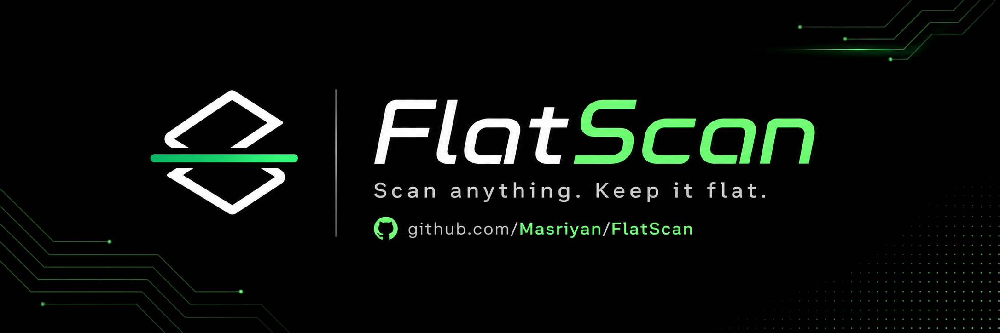

**Static Malware Analysis Engine — zero external dependencies, cgo-free, statically linked**

[](https://go.dev)
[]()
[](LICENSE)
[]()
[]()
[]()

Repository: https://github.com/Masriyan/FlatScan

</div>

---

FlatScan is a production-grade static malware analysis and reporting engine written in pure Go. It is designed for analysts who need fast triage, IOC extraction, suspicious capability detection, executive reporting, and hunting-rule handoff — all **without executing the sample**.

FlatScan reads a file, hashes it, identifies the format, extracts strings, decodes suspicious encoded data, extracts and triages IOCs, inspects executable/container metadata, scores findings, enriches them into a malware profile, and produces text, JSON, PDF, HTML, IOC, YARA, Sigma, STIX 2.1, case database, and report-pack outputs.

---

## Table of Contents

- [Why FlatScan Exists](#why-flatscan-exists)
- [Architecture Overview](#architecture-overview)
- [Analysis Pipeline](#analysis-pipeline)
- [Features](#features)
- [Quick Start](#quick-start)
- [Output Types](#output-types)
- [Web GUI](#web-gui)
- [Sample Report](#sample-report)
- [Scan Modes](#scan-modes)
- [Scoring Logic](#scoring-logic)
- [Plugin System](#plugin-system)
- [Performance Architecture](#performance-architecture)
- [Module Map](#module-map)
- [Safety Note](#safety-note)
- [Limitations](#limitations)
- [Documentation](#documentation)
- [Project URL](#project-url)

---

## Why FlatScan Exists

Malware triage often has two audiences:

| Audience | Needs |
|----------|-------|
| **Security Analysts** | Technical evidence: hashes, strings, imports, IOCs, entropy, sections, decoded data, TTPs, hunting rules |
| **CISO / Management** | Risk context: what it likely is, why it matters, business impact, recommended actions |

FlatScan serves both. It does static analysis for safety and speed, then converts the result into both machine-readable output and management-ready reporting.

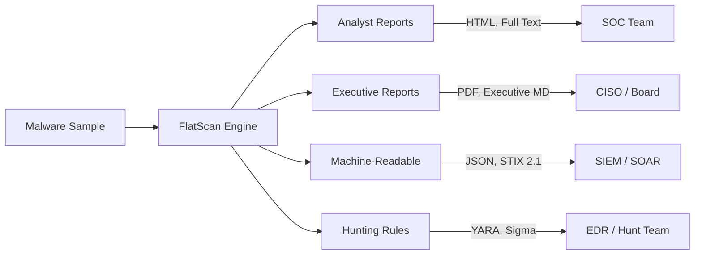
```mermaid
graph LR
    A[Malware Sample] --> B[FlatScan Engine]
    B --> C[Analyst Reports]
    B --> D[Executive Reports]
    B --> E[Machine-Readable]
    B --> F[Hunting Rules]
    
    C -->|HTML, Full Text| G[SOC Team]
    D -->|PDF, Executive MD| H[CISO / Board]
    E -->|JSON, STIX 2.1| I[SIEM / SOAR]
    F -->|YARA, Sigma| J[EDR / Hunt Team]
```

---

## Architecture Overview

FlatScan is built as a multi-stage analysis pipeline with parallel execution, a plugin system, and **no external dependencies** — `go.mod` requires nothing, and the pure-Go disassembly engine is vendored in-tree as `internal/x86asm` (an unmodified copy of `golang.org/x/arch/x86/x86asm`, BSD-3-Clause). No cgo, no runtime or system dependencies, no network needed to build.


```mermaid
graph TB
    subgraph "Input Layer"
        CLI[CLI Parser] --> CFG[Config]
        INT[Interactive Mode] --> CFG
        SHL[Shell Mode] --> CFG
        WCH[Watch Mode] --> CFG
    end
    
    subgraph "I/O Layer"
        CFG --> MMP{File > 100MB?}
        MMP -->|Yes| MMAP[Memory-Mapped I/O]
        MMP -->|No| BUF[Buffered Read]
        MMAP --> DATA[Raw Bytes + Hashes]
        BUF --> DATA
    end
    
    subgraph "Analysis Pipeline"
        DATA --> DET[File Type Detection]
        DET --> ENT[Entropy Analysis]
        ENT --> STR[String Extraction]
        STR --> IOC[IOC Extraction]
        IOC --> DEC[Decoder Pass]
        DEC --> CRP[Corpus Build]
        CRP --> PAT[Pattern Matching]
        
        PAT --> PG["Parallel Group"]
        
        subgraph PG["⚡ Parallel Stages"]
            FMT[Format Analysis]
            CRV[Safe Carving]
            CRY[Crypto/Config]
            SIM[Similarity Hash]
        end
        
        PG --> SEQ[Sequential Stages]
        SEQ --> PLG[Plugin Engine]
        PLG --> SCR[Risk Scoring]
    end
    
    subgraph "Output Layer"
        SCR --> TXT[Text Report]
        SCR --> JSN[JSON]
        SCR --> PDF[PDF Report]
        SCR --> HTM[HTML Report]
        SCR --> YAR[YARA Rule]
        SCR --> SIG[Sigma Rule]
        SCR --> STX[STIX 2.1]
        SCR --> RPK[Report Pack]
    end
    
    style PG fill:#1a1a2e,stroke:#e94560,stroke-width:2px
    style SCR fill:#0f3460,stroke:#e94560,stroke-width:2px
```

### Key Design Principles

| Principle | Implementation |
|-----------|---------------|
| **Zero external dependencies** | `go.mod` requires nothing and there is no `go.sum`. The Go standard library plus one vendored, unmodified package — `internal/x86asm`, a copy of `golang.org/x/arch/x86/x86asm` (BSD-3-Clause, disassembly engine) held in-tree so the build needs no download and no network. No cgo, no native libraries, no runtime dependencies |
| **Static Only** | Never executes the sample — reads bytes and metadata |
| **Thread-Safe** | `parallelRun()` with mutex-protected findings, race-detector verified. Analysis stages recover panics individually, so one malformed sample cannot abort a batch |
| **Platform Portable** | Builds for Linux, macOS, Windows; mmap on Linux with transparent fallback |
| **Extensible** | Plugin interface + JSON manifests for custom detections without recompiling |

### Verification status

| Check | Result |
|-------|--------|
| `go build` / `go vet` / `gofmt -l` | Clean |
| `go test ./...` | 189 tests (344 cases including subtests), all passing |
| `go test -race ./...` | Clean |
| `go test -cover ./...` | 50.6% of statements |
| `golangci-lint run` | 0 issues (errcheck, govet, staticcheck, gosec, errorlint, ineffassign, unused, bodyclose, nilerr, misspell, unconvert, wastedassign) |
| `govulncheck ./...` | No vulnerabilities found |

**Test environment.** Verified on **Fedora Linux 44 (x86_64, kernel 7.1.7)** with **Go 1.26.5**. The
`go.mod` floor is Go 1.25. CI additionally runs the same suite on `ubuntu-latest`.
Linux is the only platform these results are measured on: macOS and Windows are
supported targets and the code cross-compiles to them, but the numbers above are
not independently reproduced there, and `mmap_linux.go` is Linux-only by
construction (other platforms take the buffered-read fallback).

---

## Analysis Pipeline

The engine processes files through 18 stages with parallel execution for independent operations:

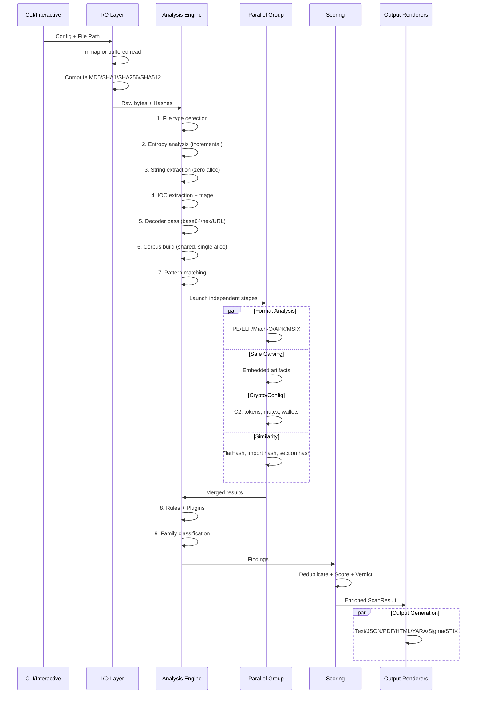
```mermaid
sequenceDiagram
    participant CLI as CLI/Interactive
    participant IO as I/O Layer
    participant Engine as Analysis Engine
    participant Parallel as Parallel Group
    participant Score as Scoring
    participant Output as Output Renderers
    
    CLI->>IO: Config + File Path
    IO->>IO: mmap or buffered read
    IO->>IO: Compute MD5/SHA1/SHA256/SHA512
    IO->>Engine: Raw bytes + Hashes
    
    Engine->>Engine: 1. File type detection
    Engine->>Engine: 2. Entropy analysis (incremental)
    Engine->>Engine: 3. String extraction (zero-alloc)
    Engine->>Engine: 4. IOC extraction + triage
    Engine->>Engine: 5. Decoder pass (base64/hex/URL)
    Engine->>Engine: 6. Corpus build (shared, single alloc)
    Engine->>Engine: 7. Pattern matching
    
    Engine->>Parallel: Launch independent stages
    
    par Format Analysis
        Parallel->>Parallel: PE/ELF/Mach-O/APK/MSIX
    and Safe Carving
        Parallel->>Parallel: Embedded artifacts
    and Crypto/Config
        Parallel->>Parallel: C2, tokens, mutex, wallets
    and Similarity
        Parallel->>Parallel: FlatHash, import hash, section hash
    end
    
    Parallel->>Engine: Merged results
    Engine->>Engine: 8. Rules + Plugins
    Engine->>Engine: 9. Family classification
    Engine->>Score: Findings
    Score->>Score: Deduplicate + Score + Verdict
    Score->>Output: Enriched ScanResult
    
    par Output Generation
        Output->>Output: Text/JSON/PDF/HTML/YARA/Sigma/STIX
    end
```

### Pipeline Stage Details

| # | Stage | Description | Optimization |
|---|-------|-------------|-------------|
| 1 | **File Read** | Reads file and computes 4 hash algorithms simultaneously | mmap for files >100MB |
| 2 | **Type Detection** | Magic bytes + extension mapping for 25+ file types | — |
| 3 | **Entropy** | Full-file Shannon entropy + sliding-window high-entropy regions | Incremental histogram O(step) |
| 4 | **String Extraction** | ASCII + UTF-16LE string extraction with mode-based limits | Zero-alloc byte-slice indexing |
| 5 | **IOC Extraction** | URLs, domains, IPs, emails, hashes, CVEs, registry keys, paths | Batch normalization |
| 6 | **Decoder Pass** | Base64, hex, URL-percent with configurable nesting depth | — |
| 7 | **Corpus Build** | Shared lowercase corpus for all pattern-matching stages | Single alloc, 5x reuse |
| 8 | **Pattern Matching** | Behavioral signatures, import chains, capability detection | Corpus string search |
| 9 | **Format Analysis** | PE/ELF/Mach-O/APK/MSIX/ZIP/DEX structural parsing | ⚡ Parallel |
| 10 | **Safe Carving** | Embedded PE/ELF/DEX/ZIP/PDF/gzip/7z/RAR detection | ⚡ Parallel |
| 11 | **Crypto/Config** | C2 endpoints, webhook tokens, mutex, wallet strings, XOR keys | ⚡ Parallel |
| 12 | **Similarity** | FlatHash, byte-histogram, string-set, import, section hashes | ⚡ Parallel |
| 13 | **API Chain Detection** | Behavioral attack chains from API family combinations | 7 built-in chains |
| 14 | **Packer Fingerprinting** | Section-name + overlay marker detection for 8 packers | PE-only |
| 15 | **Rules Engine** | JSON rule packs + `.rule` declarative detections | Corpus-aware |
| 16 | **Plugin Engine** | Built-in + JSON manifest plugins | Registry pattern |
| 17 | **Family Classifier** | Ransomware, stealer, loader, RAT, riskware, cryptominer, wiper | — |
| 18 | **IOC Triage** | PKI/schema/OID/loopback suppression | Audit trail |
| 19 | **Risk Scoring** | Severity-weighted score with dedup + verdict + per-category breakdown | — |
| 20 | **Profile Enrichment** | MITRE TTPs, business impact, capabilities, recommendations | — |

---

## Features

### Core Analysis

- Full-file MD5, SHA1, SHA256, and SHA512 hashing
- File type and MIME hint detection (25+ formats)
- ASCII and UTF-16LE string extraction with zero-allocation performance
- IOC extraction: URLs, domains, IPv4, IPv6, emails, hashes, CVEs, registry keys, paths, **mutex names, named pipes, Ethereum/Monero/Bitcoin wallet addresses** (0.5.0)
- IOC triage with built-in PKI, schema, OID, and loopback allowlists
- **IOC confidence & categorization** — every indicator tagged `ioc` / `suspicious-infra` / `benign-infra` / `build-artifact` / `compiler-metadata` / `source-path` / `package-namespace` with a confidence weight; non-actionable noise (Rust/Cargo/PDB/namespace) is excluded from `--extract-ioc` and STIX (0.9.0)
- **Multi-evidence correlation engine** — serious capabilities require corroborating evidence groups; every finding carries a numeric `confidence` and `evidence_count` so a lone generic string never reads as high-confidence (0.9.0)
- **Named-family fingerprints** — RedLine, LummaC2, StealC, Vidar, Raccoon, Agent Tesla, FormBook/XLoader, AsyncRAT, Quasar, Remcos, XWorm, njRAT. Attribution requires a family-name marker **plus** a corroborating evidence group, so generic stealer behavior never names a family and a packed sample whose name markers are unrecoverable falls back to a generic bucket rather than being guessed at (0.9.0)
- **Similarity matching** against a JSONL reference store (`--similarity-db`) — "N% similar to <known sample>" (0.9.0)
- **CAPA-style capability rules** over strings + imports (incl. hashdb-resolved) + disasm techniques + IOC categories → ATT&CK; **YARA-quality scoring** (compiler-string exclusion + FP-risk) (0.9.0)
- **Malware config extraction** (C2/mutex/token/webhook/wallet/campaign), **offline threat-intel enrichment** (`--intel-db`), and **expected-behavior prediction** for sandbox/EDR validation (0.9.0)
- **Recursive static payload resolution** (`--resolve-depth`) — peels base64/hex, gzip/zlib, single-byte-XOR, and carving layers and re-scans each recovered stage, surfacing a provenance-tagged `payload_tree` so a buried PE/ELF/DEX/archive is scored instead of hiding behind its wrapper; pure data transformation, sample never executed (0.10.0)
- **DGA (algorithmically-generated domain) scoring** on extracted domains — dictionary-free lexical model (entropy + FANCI features + n-gram normality) flagging likely C2 domains as MITRE T1568.002 (0.7.0)
- Suspicious base64, hex, and URL-percent decoding with nesting depth control, plus **separator-delimited hex and whole-buffer reversed-string recovery** that follows multi-stage script/LNK obfuscation and recovers hidden C2 IOCs (0.7.1)
- **Code-level disassembly (x86/x64 PE+ELF)** — instruction-level detection of API-hashing (ROR13) loops, PEB walks, GetPC/shellcode stubs, and anti-VM (VMware backdoor, hypervisor CPUID, Red Pill), with **hash-database resolution of hash-obfuscated imports** (ROR13/DJB2/SDBM) feeding the import/behavior layer (0.8.0)
- Shannon entropy scoring and high-entropy region detection
- **Per-category score breakdown** shown in every report and JSON output (0.5.0)

### Format Parsers

- **PE**: imports, sections, timestamp, subsystem, certificate table, overlay, import hash, .NET detection, **exploit-mitigation posture (ASLR/DEP/CFG/HEVA), Rich-header hash, TLS callbacks, Authenticode signer, entry-point sanity** (0.7.0)
- **ELF**: class, machine, type, imports, sections, **static+stripped posture, legacy/IoT architecture profile, high-entropy code packing** (0.7.1)
- **Mach-O**: CPU, type, imports, sections
- **Windows shortcut (.lnk)**: ShellLinkHeader + StringData parsing, LOLBin target detection, embedded command-line extraction & deobfuscation, reversed-URL C2 recovery (0.7.1)
- **Scripts (.ps1/.psm1/.bat/.cmd/.vbs/.js/.wsf/.hta/.sh)**: PowerShell/script behavioral engine — Defender/AMSI tampering, download-and-execute cradles, multi-layer deobfuscation, persistence (0.7.1)
- **ZIP/APK/JAR/MSIX/AppX/Office XML**: entry inspection without disk extraction
- **MSIX/AppX**: manifest parsing, publisher, capabilities, undeclared payloads, Magniber detection
- **Android APK/DEX**: manifest, permissions, exported components, DEX string/API scanning
- **Code-level disassembly (x86/x64 PE+ELF)**: entry-point instruction analysis — API-hashing loops (ROR13), PEB walks, GetPC/shellcode stubs, instruction-level anti-VM (VMware backdoor, hypervisor CPUID, Red Pill), and hash-database resolution of hash-obfuscated imports (0.8.0)

### Behavioral Detection

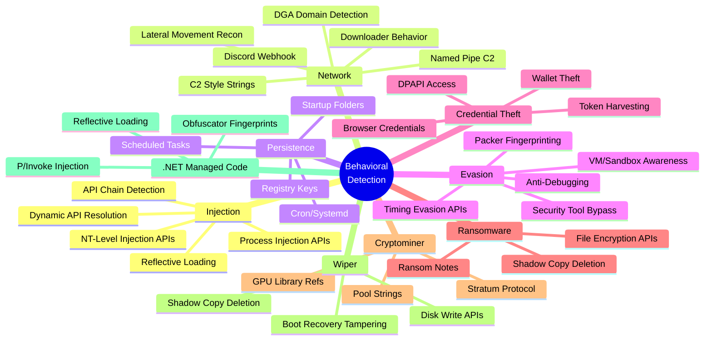
```mermaid
mindmap
  root((Behavioral<br/>Detection))
    Injection
      Process Injection APIs
      NT-Level Injection APIs
      Dynamic API Resolution
      Reflective Loading
      API Chain Detection
    Network
      Downloader Behavior
      C2 Style Strings
      Discord Webhook
      Named Pipe C2
      Lateral Movement Recon
      DGA Domain Detection
    Persistence
      Registry Keys
      Startup Folders
      Scheduled Tasks
      Cron/Systemd
    Evasion
      VM/Sandbox Awareness
      Anti-Debugging
      Timing Evasion APIs
      Security Tool Bypass
      Packer Fingerprinting
    Credential Theft
      Browser Credentials
      DPAPI Access
      Wallet Theft
      Token Harvesting
    Ransomware
      Ransom Notes
      File Encryption APIs
      Shadow Copy Deletion
    Cryptominer
      Stratum Protocol
      GPU Library Refs
      Pool Strings
    Wiper
      Shadow Copy Deletion
      Disk Write APIs
      Boot Recovery Tampering
    .NET Managed Code
      Reflective Loading
      P/Invoke Injection
      Obfuscator Fingerprints
```

### Output Formats

- **Text**: minimal, Summary, and Full report modes
- **JSON**: complete structured result for automation
- **PDF**: CISO/management-ready with executive summary, MITRE matrix, risk cards
- **HTML**: interactive analyst report with filters and expandable sections
- **IOC**: categorized text export with promoted payload hashes
- **YARA**: auto-generated hunting rule with structural guards
- **Sigma**: SIEM/EDR hunting rule with ATT&CK tags
- **STIX 2.1**: threat intelligence bundle (File SCO, Malware SDO, Indicators, Relationships)
- **Report Pack**: all of the above in a single directory

### Operational Modes

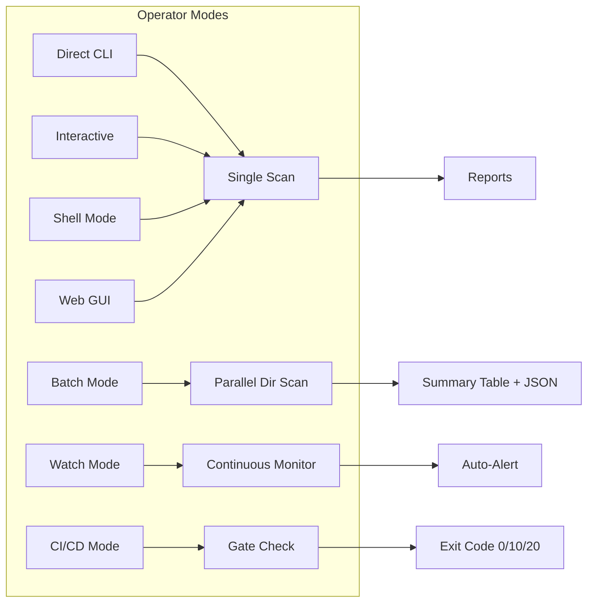
```mermaid
graph LR
    subgraph "Operator Modes"
        A[Direct CLI] --> E[Single Scan]
        B[Interactive] --> E
        C[Shell Mode] --> E
        D[Batch Mode] --> F[Parallel Dir Scan]
        G[Watch Mode] --> H[Continuous Monitor]
        I[CI/CD Mode] --> J[Gate Check]
        W[Web GUI] --> E
    end
    
    E --> K[Reports]
    F --> L[Summary Table + JSON]
    H --> M[Auto-Alert]
    J --> N[Exit Code 0/10/20]
```

| Mode | Command | Use Case |
|------|---------|----------|
| **Direct CLI** | `./flatscan -f sample.bin -m deep` | One-off scans and automation |
| **Web GUI** | `./flatscan --web` | Browser-based upload, scan, and report download |
| **Interactive** | `./flatscan --interactive` | Guided wizard for new analysts |
| **Shell** | `./flatscan --shell` | Repeated scans in one session |
| **Batch** | `./flatscan --dir ./samples -m deep --batch-json results.json` | Parallel directory-wide triage |
| **Watch** | `./flatscan --dir ./inbox --watch --watch-alert-only` | Monitor for new files, alert on threats |
| **CI/CD** | `./flatscan -f build.exe --ci --ci-threshold 30` | Pipeline gate with semantic exit codes |

---

## Quick Start

### Build

The Go sources and `go.mod` live in the **`source go/`** directory; build from there and emit the binary to the repo root:

```bash
cd "source go"
go build -o ../flatscan .

# With version tag
go build -ldflags "-X main.version=0.10.2" -o ../flatscan .
```

> The build has **no external dependencies**: `go.mod` requires nothing, there is
> no `go.sum`, and nothing is downloaded. It therefore works offline and
> air-gapped out of the box — `GOPROXY=off go build` succeeds on a clean checkout.
> The x86/x64 disassembly engine is `internal/x86asm`, an unmodified vendored copy
> of `golang.org/x/arch/x86/x86asm` (BSD-3-Clause, The Go Authors), attributed in
> `internal/x86asm/LICENSE` and documented in `internal/x86asm/README.md`. The
> build is **cgo-free** — no native libraries required.

### Scan Commands

```bash
# ⚡ Quick triage
./flatscan -m quick -f sample.exe --report-mode Summary

# 🔬 Deep scan with full report pack
./flatscan -m deep -f sample.exe --report-pack reports/case-001 --carve --debug

# 📂 Batch scan entire directory
./flatscan --dir ./samples -m deep

# 👁 Watch directory for new files
./flatscan --dir ./inbox --watch -m deep --watch-interval 5

# 📊 JSON to stdout for scripting
./flatscan -m deep -f sample.exe --json - --no-progress --no-splash --no-color | jq '.risk_score'

# 🔐 Full stealer analysis
./flatscan -m deep -f sample/mercuristealer \
  --report-mode Full \
  --report reports/stealer.txt \
  --json reports/stealer.json \
  --pdf reports/stealer.pdf \
  --html reports/stealer.html \
  --yara reports/stealer.yar \
  --sigma reports/stealer.yml \
  --stix reports/stealer.stix.json \
  --extract-ioc reports/stealer.iocs.txt \
  --carve --debug

# 📱 Android APK analysis with custom rules
./flatscan -m deep -f suspicious.apk --rules plugins/android-risk.rule --report-pack reports/apk-case

# 🎯 STIX threat intelligence export
./flatscan -m deep -f malware.exe --stix reports/threat-intel.stix.json

# 🛡️ CI/CD gate — native exit codes (0=clean, 10=suspicious, 20=malicious)
./flatscan -m quick -f build.exe --ci --ci-threshold 30 --no-splash; echo "Exit: $?"

# 📊 Machine-readable CSV pipeline
./flatscan -f sample.bin -m quick --output-format csv --no-splash 2>/dev/null

# 📂 Parallel batch scan with JSON summary
./flatscan --dir ./samples -m quick --batch-json results.json --no-splash

# 🔄 Batch report packs for all samples
for f in samples/*; do
  ./flatscan -m deep -f "$f" --report-pack "reports/$(basename "$f")" --no-splash --no-progress
done

# 💬 Interactive guided mode
./flatscan --interactive

# 🖥️ Manual command shell
./flatscan --shell

# 🌐 Local web GUI (open http://localhost:5000 in a browser)
./flatscan --web

# 🌐 Web GUI on a custom port
./flatscan --web --web-port 8080
```

---

## Output Types

| Output | Flag | Purpose |
| --- | --- | --- |
| Text report | `--report PATH` | Human-readable report. Honors `--report-mode`. |
| JSON report | `--json PATH` | Complete structured result for automation and pipelines. |
| JSON stdout | `--json -` | Same as JSON report but piped to stdout for scripting. |
| PDF report | `--pdf PATH` | CISO/management-ready report with executive summary, MITRE matrix, risk bar, impact. |
| HTML report | `--html PATH` | Interactive dark analyst report with global search, MITRE heatmap, IOC tabs, theme toggle. |
| IOC export | `--extract-ioc PATH` | Categorized IOC text with payload hashes, mutexes, named pipes, crypto wallets. |
| YARA rule | `--yara PATH` | Auto-generated hunting rule with structural guards and entropy conditions. |
| Sigma rule | `--sigma PATH` | Auto-generated SIEM/EDR hunting rule with ATT&CK tags. |
| STIX bundle | `--stix PATH` | STIX 2.1 JSON bundle with File SCO, Malware SDO, Indicators, Relationships. |
| Report pack | `--report-pack DIR` | All formats: PDF, HTML, JSON, IOC, YARA, Sigma, STIX, text, executive markdown. |
| Case DB | `--case ID --case-db PATH` | Local JSONL case record for sample tracking. |
| CSV | `--output-format csv` | `filename,score,verdict,findings,iocs,sha256` one-liner to stdout. |
| JSONL | `--output-format jsonl` | Compact single-line JSON to stdout for SIEM streaming. |
| Batch JSON | `--batch-json PATH` | JSON summary of batch: scanned/malicious/suspicious/clean/errors + per-file results. |
| Stdout | default | Text report to stdout, colorized when terminal supports it. |

---

## Web GUI

FlatScan ships a **self-contained local web interface**. Run `--web` and open the printed URL in a browser — no separate install, no CDN, no npm, and **zero new Go dependencies** (the entire single-page app is embedded in the binary).

```bash
./flatscan --web                 # http://localhost:5000
./flatscan --web --web-port 8080 # custom port
```

On startup it prints:

```text
[flatscan-web] WARNING: no authentication — bind to localhost only
[flatscan-web] listening on http://localhost:5000
[flatscan-web] open your browser at http://localhost:5000
```

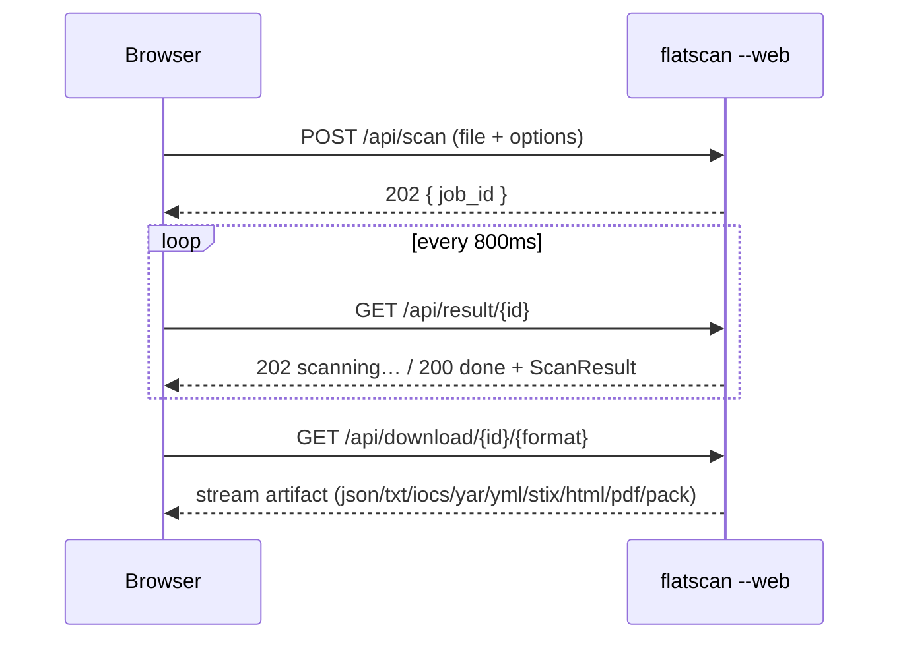
```mermaid
sequenceDiagram
    participant B as Browser
    participant S as flatscan --web
    B->>S: POST /api/scan (file + options)
    S-->>B: 202 { job_id }
    loop every 800ms
        B->>S: GET /api/result/{id}
        S-->>B: 202 scanning… / 200 done + ScanResult
    end
    B->>S: GET /api/download/{id}/{format}
    S-->>B: stream artifact (json/txt/iocs/yar/yml/stix/html/pdf/pack)
```

**Workflow:** drag a file onto the drop zone (or click to browse) → pick a scan mode (quick / standard / deep) → toggle options (`--carve`, `--yara`, `--sigma`, `--stix`, `--report-pack`) → **Run Scan**. The page polls the job and renders the result across **nine tabs**: overview, findings, IOC, functions, PE details, artifacts, profile, log, and outputs. Every generated format can be downloaded directly from the **outputs** tab, including the full report pack as a `.zip`. The last 10 scans are kept in an in-session history for quick reload.

### Screenshots

The web GUI analyzing a Windows banker trojan sample (`banker.exe` — verdict **SUSPICIOUS, 34/100**):

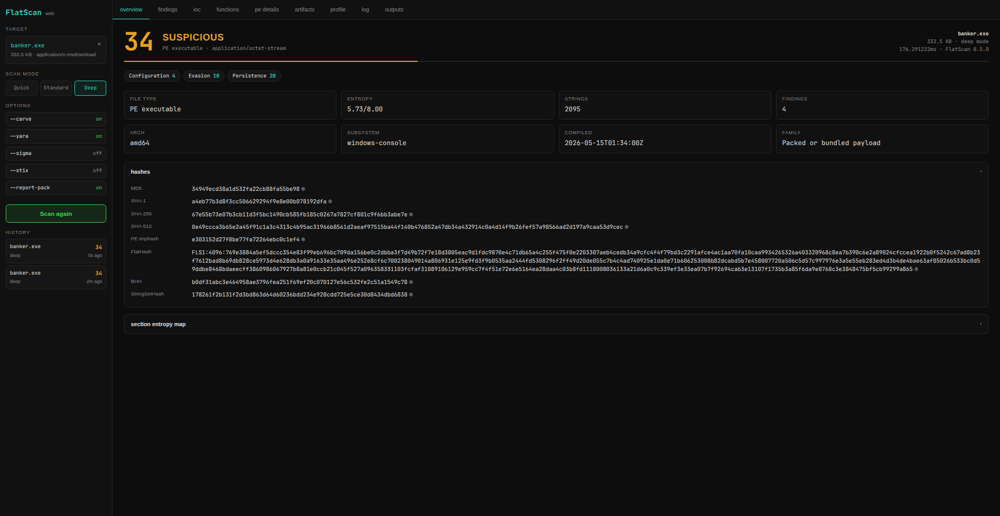

<p align="center"><em>Overview — verdict bar, score breakdown, stat cells, collapsible hashes, and the section entropy map.</em></p>

| | |
|:---:|:---:|
| 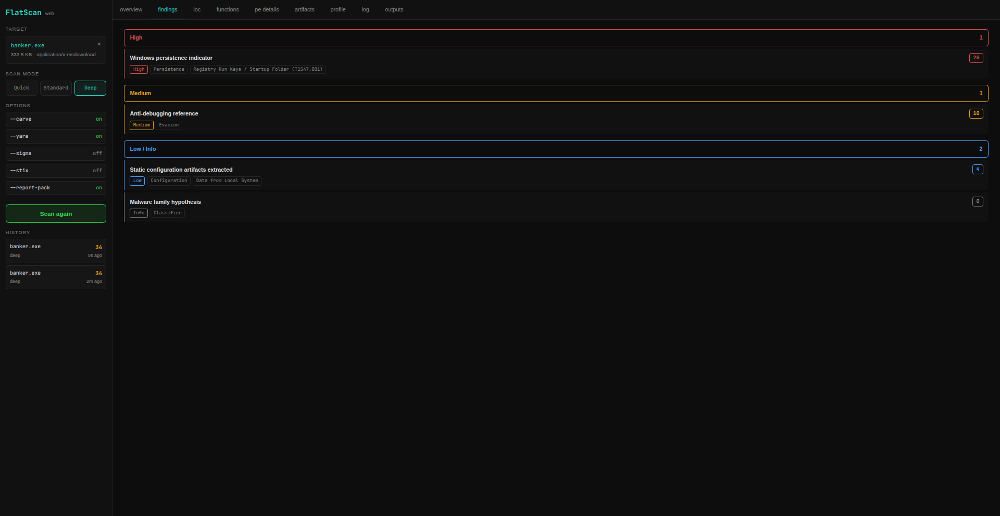 | 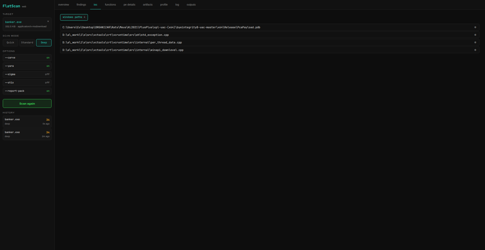 |
| **Findings** — grouped by severity with ATT&CK tags | **IOC** — per-category indicators with copy buttons |
| 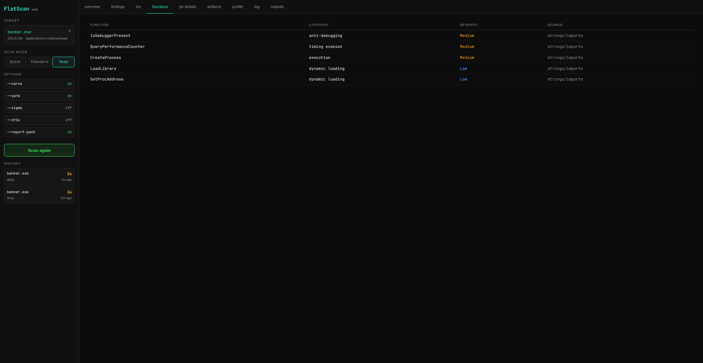 | 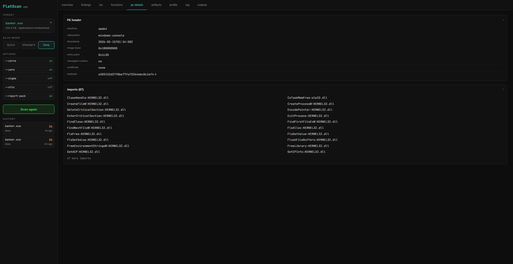 |
| **Functions** — suspicious APIs, deduplicated and severity-sorted | **PE details** — header fields + imports, suspicious ones highlighted |
| 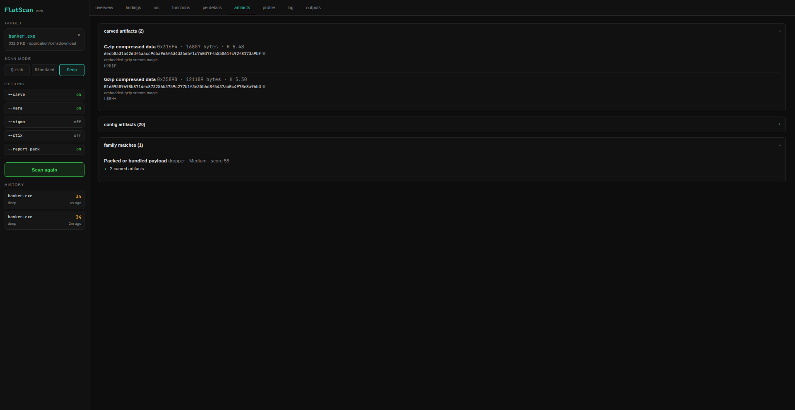 | 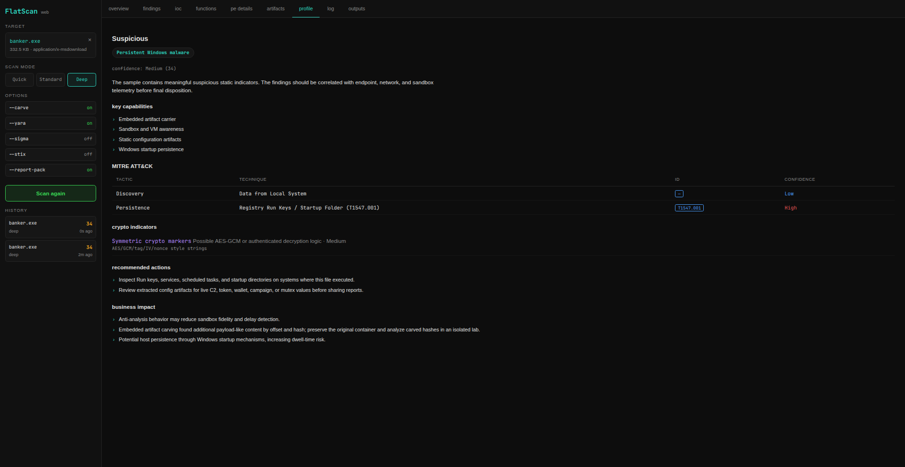 |
| **Artifacts** — carved/config artifacts, external tools, family matches | **Profile** — classification, MITRE ATT&CK TTPs, crypto indicators |
| 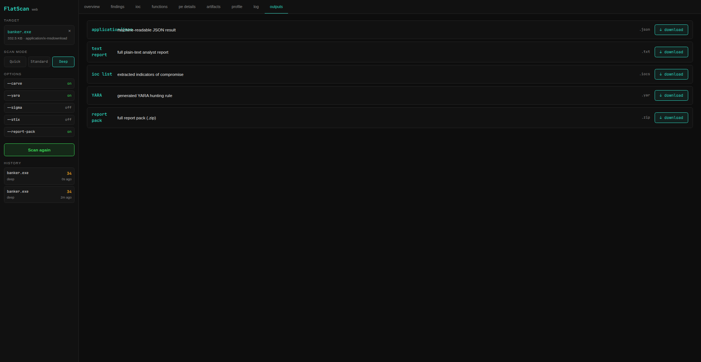 | |
| **Outputs** — one-click download of every format incl. report pack `.zip` | |

| Endpoint | Method | Purpose |
| --- | --- | --- |
| `/` | GET | Serves the embedded single-page UI |
| `/api/scan` | POST | `multipart/form-data` upload; returns `202 { "job_id": ... }` |
| `/api/result/{id}` | GET | Poll job status; returns the full `ScanResult` + `available_downloads` when done |
| `/api/download/{id}/{format}` | GET | Streams one artifact (`json`, `txt`, `iocs`, `yar`, `yml`, `stix`, `pack`) |

> 🔒 **Security:** the server binds to `127.0.0.1` only and has **no authentication** — it is a single-user local tool. Each upload is isolated in its own temp directory (reaped after 30 minutes), filenames are sanitized, and uploads are capped at 256 MB. Do not expose the port to untrusted networks. See [security.md](security.md#web-gui-security). As of v0.7.0, the web GUI also serves HTML and PDF report downloads.

---

## Sample Report

Below is the full **plain-text report** for the same `banker.exe` sample shown in the screenshots above — a `deep` scan produced by FlatScan ([reports/banker.exe.txt](reports/banker.exe.txt)). It demonstrates the verdict, score breakdown, malware profile, findings with ATT&CK mappings, suspicious APIs, IOCs, carved artifacts, similarity hashes, and full PE metadata.

**At a glance:**

| Field | Value |
| --- | --- |
| Verdict | **Suspicious (34/100)** |
| Score breakdown | `Persistence:20  Evasion:10  Configuration:4` |
| File type | PE executable (amd64, windows-console) · 332.5 KiB |
| Entropy | 5.73 / 8.00 — normal |
| Likely type | Persistent Windows malware |
| Top finding | `[High] Windows persistence indicator` — ATT&CK T1547.001 |
| Carved artifacts | 2 gzip blobs · 20 embedded compressed streams |
| SHA-256 | `67e55b73e07b3cb11d3f5bc1490cb585fb185c0267a7827cf801c9f6bb3abe7e` |

<details>
<summary><strong>📄 Click to expand the full text report (banker.exe.txt)</strong></summary>

```text
FlatScan 0.5.0 report
Target: /tmp/flatscan_web_18b67081d06bd58c-8c6fba26_3793890109/banker.exe
Mode: deep
Verdict: Suspicious (34/100)
Score breakdown: [Persistence:20 Evasion:10 Configuration:4]
File type: PE executable
MIME hint: application/octet-stream
Size: 332.5 KiB (340480 bytes)
Analyzed bytes: 332.5 KiB
Entropy: 5.73/8.00 - normal
Strings: 2095
Duration: 348.588417ms

Malware profile:
- Classification: Suspicious
- Confidence: Medium (34/100)
- Likely type: Persistent Windows malware
- Capabilities: Embedded artifact carrier, Sandbox and VM awareness, Static configuration artifacts, Windows startup persistence
- MITRE TTPs mapped: 2
- Crypto indicators: 1
- Assessment: The sample contains meaningful suspicious static indicators. The findings should be correlated with endpoint, network, and sandbox telemetry before final disposition.

Hashes:
- MD5: 34949ecd38a1d532fa22cb88fa55be98
- SHA1: a4eb77b3d8f3cc506629294f9e8e00b078192dfa
- SHA256: 67e55b73e07b3cb11d3f5bc1490cb585fb185c0267a7827cf801c9f6bb3abe7e
- SHA512: 0e49ccca3b65e2a45f91c1a3c4313c4b95ac31966b8561d2aeaf97515ba44f140b476852a47db34a432914c0a4d14f9b26fef57a98566ad2d197a9caa53d9cec
- PE import hash: e303152d27f8be77fa72264ebc0c1ef4

Findings: 4
- [High] Persistence: Windows persistence indicator (Run keys, service creation, scheduled task, or startup folder strings are present) score=20
  ATT&CK: Persistence / Registry Run Keys / Startup Folder (T1547.001)
  Recommendation: Inspect Run keys, services, scheduled tasks, and startup directories on systems where this file executed.
- [Medium] Evasion: Anti-debugging reference (debugger detection strings or APIs are present) score=10
- [Low] Configuration: Static configuration artifacts extracted (20 likely configuration or secret-handling artifacts) score=4
  ATT&CK: Discovery / Data from Local System
  Recommendation: Review extracted config artifacts for live C2, token, wallet, campaign, or mutex values before sharing reports.
- [Info] Classifier: Malware family hypothesis (Packed or bundled payload (Medium))

Suspicious functions/APIs: 10
- [Medium] IsDebuggerPresent (anti-debugging, strings/imports)
- [Medium] QueryPerformanceCounter (timing evasion, strings/imports)
- [Low] LoadLibrary (dynamic loading, strings/imports)
- [Low] GetProcAddress (dynamic loading, strings/imports)
- [Medium] CreateProcess (execution, strings/imports)
- [Medium] CreateProcess (execution, pe imports)
- [Low] GetProcAddress (dynamic loading, pe imports)
- [Medium] IsDebuggerPresent (anti-debugging, pe imports)
- [Low] LoadLibrary (dynamic loading, pe imports)
- [Medium] QueryPerformanceCounter (timing evasion, pe imports)

IOCs: 4 total

Windows paths:
- C:\Users\Eu\Desktop\ORGANIZAR\Rats\Meus\KL2021\PlusPlus\xpl-uac-(x64)\byeintegrity8-uac-master\x64\Release\PcaPayload.pdb
- D:\a\_work\1\s\src\vctools\crt\vcruntime\src\eh\std_exception.cpp
- D:\a\_work\1\s\src\vctools\crt\vcruntime\src\internal\per_thread_data.cpp
- D:\a\_work\1\s\src\vctools\crt\vcruntime\src\internal\winapi_downlevel.cpp

Family classifier: 1 hypotheses
- [Medium] Packed or bundled payload (dropper) score=55 evidence=2 carved artifacts

Crypto/config artifacts: 20
- [Low] embedded-compressed-blob from raw-bytes: zlib at 0x6012 (compressed stream magic found in file body)
- [Low] embedded-compressed-blob from raw-bytes: zlib at 0xbfe2 (compressed stream magic found in file body)
- [Low] embedded-compressed-blob from raw-bytes: zlib at 0xde06 (compressed stream magic found in file body)
- [Low] embedded-compressed-blob from raw-bytes: zlib at 0xee9a (compressed stream magic found in file body)
- [Low] embedded-compressed-blob from raw-bytes: zlib at 0x112d0 (compressed stream magic found in file body)
- [Low] embedded-compressed-blob from raw-bytes: zlib at 0x11750 (compressed stream magic found in file body)
- [Low] embedded-compressed-blob from raw-bytes: zlib at 0x11bd0 (compressed stream magic found in file body)
- [Low] embedded-compressed-blob from raw-bytes: zlib at 0x12050 (compressed stream magic found in file body)
- [Low] embedded-compressed-blob from raw-bytes: zlib at 0x124d0 (compressed stream magic found in file body)
- [Low] embedded-compressed-blob from raw-bytes: zlib at 0x12950 (compressed stream magic found in file body)
- [Low] embedded-compressed-blob from raw-bytes: zlib at 0x23694 (compressed stream magic found in file body)
- [Low] embedded-compressed-blob from raw-bytes: zlib at 0x25e47 (compressed stream magic found in file body)
- [Low] embedded-compressed-blob from raw-bytes: zlib at 0x30470 (compressed stream magic found in file body)
- [Low] embedded-compressed-blob from raw-bytes: gzip at 0x316f4 (compressed stream magic found in file body)
- [Low] embedded-compressed-blob from raw-bytes: zlib at 0x3313e (compressed stream magic found in file body)
- [Low] embedded-compressed-blob from raw-bytes: zlib at 0x33146 (compressed stream magic found in file body)
- [Low] embedded-compressed-blob from raw-bytes: zlib at 0x331a1 (compressed stream magic found in file body)
- [Low] embedded-compressed-blob from raw-bytes: zlib at 0x331a9 (compressed stream magic found in file body)
- [Low] embedded-compressed-blob from raw-bytes: gzip at 0x3589b (compressed stream magic found in file body)
- [Low] embedded-compressed-blob from raw-bytes: zlib at 0x362d8 (compressed stream magic found in file body)

Carved artifacts: 2
- Gzip compressed data offset=0x316f4 length=16807 sha256=6ecb8a31a426df4aacc9dba966f6343346bf1c74037ffa55061fc92f8173a9bf entropy=5.48 preview=H9D$P
- Gzip compressed data offset=0x3589b length=121189 sha256=01609509698b8714ec873256b3759c277b1f3e35b6d8f5437aa0c4970e8a96b3 entropy=5.30 preview=L$8H+

Similarity hashes:
- FlatHash:          FLS1:4096:769e3884a5ef5dccc354e83f99eb696bc709da156be0c2dbba3f7d49b72f7e18d3805eac9d1fdc9870e4c71db65a4c255f475f0e2203307aeb4cedb34a9cfc4f4f79bd3c2291afce4ac1aa70fa10caa9934265326a403320968c8ea7b390c6e2a89024cfccea1922b0f5242c67ad8b23f7612bad8b69db828ce5973d4e628db3a0a91633e35aa496e252e8cf6c700238049014a806931e125e9fd3f9b0535aa2444fd5308296f2ff49d20de055c7b4c4ad740925e1da0e71b606253008b82dcabd5b7e458007720a506c5d57c997976e3a5e55eb283ed4d3b4de4bae63af85026b533bc0d59ddbe8468bdaeecff3860986067927b8a81e0ccb21c045f527a096358331103fcfaf31089106129e959cc7f4f51e72e6e5164ea28daa4c03b8fd1118008036133a21d6a0c9c339ef3e33ea07b7f92694cab3e13107f1735b3a85f6da9e8768c3e3848475bf5cb99299a865
- Byte histogram:    b0df31abc3e464958ae3796fea251f69ef20c070127e56c532fe2c51a1549c78
- String set:        178261f2b131f2d3bd863d64d60236bdd234e928cdd725e5ce30d8434dbd6838

Analysis plugins: 6
- similarity status=complete summary=computed FlatHash and structural similarity hashes
- safe-carver status=complete summary=2 embedded artifacts reported
- crypto-config-extractor status=complete summary=20 config artifacts
- family-classifier status=complete summary=1 family hypotheses
- high-entropy-blob-detector status=complete summary=ran in 1ms
- suspicious-import-combinator status=complete summary=ran in 0s

PE details:
- Machine: amd64
- Timestamp: 2026-05-15T01:34:00Z
- Subsystem: windows-console
- Image base: 0x180000000
- Entry point: 0x1c30
- Managed .NET runtime: false
- Certificate table present: false

Sections:
- .text raw=0x400 size=243200 entropy=5.69 flags=X
- .rdata raw=0x3ba00 size=77824 entropy=4.57 flags=-
- .data raw=0x4ea00 size=3072 entropy=2.03 flags=W
- .pdata raw=0x4f600 size=12288 entropy=5.38 flags=-
- _RDATA raw=0x52600 size=512 entropy=1.95 flags=-
- .rsrc raw=0x52800 size=512 entropy=4.72 flags=-
- .reloc raw=0x52a00 size=2048 entropy=4.96 flags=-

PE imports: 87 stored
- CloseHandle:KERNEL32.dll
- CoTaskMemFree:ole32.dll
- CreateFileW:KERNEL32.dll
- CreateProcessW:KERNEL32.dll
- ... (83 more; see reports/banker.exe.txt for the full list)

Suspicious strings:
- IsDebuggerPresent
```

</details>

> The sample report above was generated with FlatScan 0.5.0. The engine and output format are backward-compatible in later versions; v0.7.0 adds PE Header Intelligence (mitigations, Rich hash, TLS callbacks, Authenticode, entry-point), v0.7.1 adds the LNK/script/ELF-posture detections, and v0.8.0 adds the instruction-level **Code analysis (disassembly)** section. The full untruncated file (including all 87 PE imports) lives at [`reports/banker.exe.txt`](reports/banker.exe.txt).

---

## Scan Modes

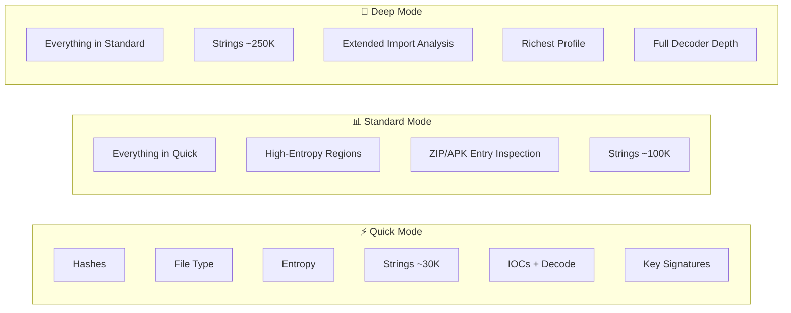
```mermaid
graph LR
    subgraph Quick["⚡ Quick Mode"]
        Q1[Hashes]
        Q2[File Type]
        Q3[Entropy]
        Q4[Strings ~30K]
        Q5[IOCs + Decode]
        Q6[Key Signatures]
    end
    
    subgraph Standard["📊 Standard Mode"]
        S1[Everything in Quick]
        S2[High-Entropy Regions]
        S3[ZIP/APK Entry Inspection]
        S4[Strings ~100K]
    end
    
    subgraph Deep["🔬 Deep Mode"]
        D1[Everything in Standard]
        D2[Strings ~250K]
        D3[Extended Import Analysis]
        D4[Richest Profile]
        D5[Full Decoder Depth]
    end
```

| Mode | String Limit | Use Case |
| --- | --- | --- |
| `quick` | 30,000 | Fast triage — hashes, type, strings, IOCs, signatures |
| `standard` | 100,000 | Normal analyst triage — adds entropy regions and ZIP inspection |
| `deep` | 250,000 | Final reports — largest limits, richest profile output |

---

## Scoring Logic

FlatScan assigns a risk score from 0-100 based on cumulative finding severity:

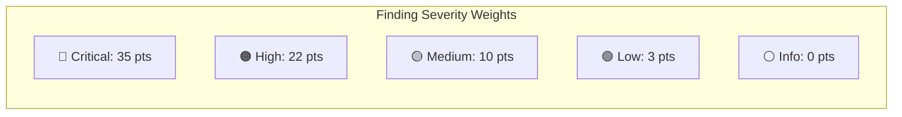
```mermaid
graph LR
    subgraph Severity["Finding Severity Weights"]
        C["🔴 Critical: 35 pts"]
        H["🟠 High: 22 pts"]
        M["🟡 Medium: 10 pts"]
        L["🟢 Low: 3 pts"]
        I["⚪ Info: 0 pts"]
    end
```

| Score Range | Verdict | Meaning |
| --- | --- | --- |
| `0-9` | No strong indicators | Static scan found no strong evidence. **Not a clean verdict.** |
| `10-29` | Low suspicion | Weak or limited indicators. Review context. |
| `30-54` | Suspicious | Meaningful suspicious evidence. Correlate with telemetry. |
| `55-79` | High suspicion | Strong suspicious indicators. Treat as high risk. |
| `80-100` | Likely malicious | Multiple high-confidence indicators. Prioritize containment. |

### Scoring Flow

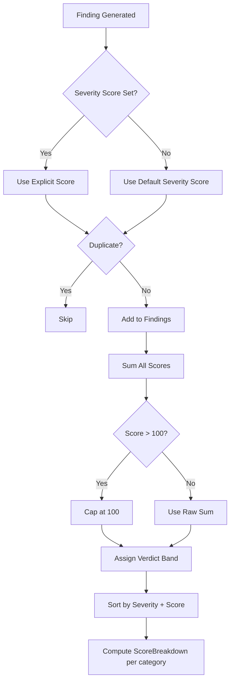
```mermaid
graph TD
    A[Finding Generated] --> B{Severity Score Set?}
    B -->|Yes| C[Use Explicit Score]
    B -->|No| D[Use Default Severity Score]
    C --> E{Duplicate?}
    D --> E
    E -->|Yes| F[Skip]
    E -->|No| G[Add to Findings]
    G --> H[Sum All Scores]
    H --> I{Score > 100?}
    I -->|Yes| J[Cap at 100]
    I -->|No| K[Use Raw Sum]
    J --> L[Assign Verdict Band]
    K --> L
    L --> M[Sort by Severity + Score]
    M --> N[Compute ScoreBreakdown per category]
```

### Score Breakdown (0.5.0)

Every scan shows a compact per-category breakdown in the report header and in JSON output:

```
Score breakdown: [Credential Access:44 Evasion:31 Exfiltration:28 Packing:24 Persistence:20]
```

Available in `ScanResult.score_breakdown` (JSON) for programmatic use.

### Exit Codes (0.5.0)

| Code | Condition | Use |
|------|-----------|-----|
| `0` | Score < 30 | Clean / no strong indicators |
| `10` | Score ≥ 30 | Suspicious / CI threshold exceeded |
| `20` | Score ≥ 80 | Likely malicious |
| `1` | Scan error | File not found, parse failure |
| `2` | Usage error | Bad flags |

### CI/CD Gate Example

```bash
# One-liner for GitHub Actions / GitLab CI
./flatscan -f artifact.exe --ci --ci-threshold 30 --no-splash
# Exit 0 = pass, Exit 10 = block
```

---

## Plugin System

FlatScan supports extensible analysis through a plugin interface:

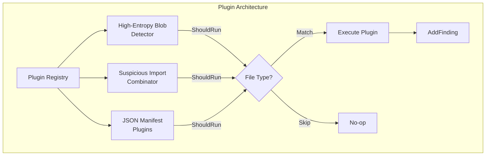
```mermaid
graph TB
    subgraph "Plugin Architecture"
        REG[Plugin Registry] --> BP1[High-Entropy Blob<br/>Detector]
        REG --> BP2[Suspicious Import<br/>Combinator]
        REG --> JP[JSON Manifest<br/>Plugins]
        
        BP1 -->|ShouldRun| CHK{File Type?}
        BP2 -->|ShouldRun| CHK
        JP -->|ShouldRun| CHK
        
        CHK -->|Match| RUN[Execute Plugin]
        CHK -->|Skip| NOP[No-op]
        
        RUN --> FIND[AddFinding]
    end
```

### Built-in Plugins

| Plugin | Purpose | Triggers On |
|--------|---------|-------------|
| **High-Entropy Blob** | Detects large encrypted/packed regions | Any binary with >7.5 entropy in 64KB+ regions |
| **Import Combinator** | Detects process hollowing and reflective injection | PE files with specific API combinations |

### JSON Plugin Manifest

External plugins can be defined without recompiling:

```json
{
  "name": "Custom Webhook Detector",
  "version": "1.0",
  "author": "SOC Team",
  "description": "Detects exfiltration via webhook services",
  "file_types": ["PE executable", "ELF binary"],
  "mode_min": "standard",
  "checks": [
    {
      "title": "Webhook exfiltration endpoint",
      "severity": "High",
      "category": "Exfiltration",
      "score": 20,
      "strings_any": ["discord.com/api/webhooks", "api.telegram.org/bot"],
      "tactic": "Exfiltration",
      "technique": "Exfiltration Over Web Service"
    }
  ]
}
```

---

## Performance Architecture

FlatScan achieves high performance through several architectural optimizations:

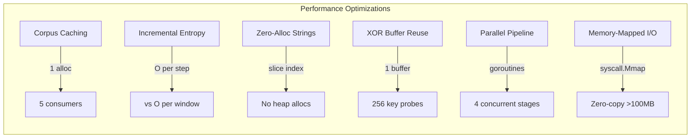
```mermaid
graph LR
    subgraph "Performance Optimizations"
        A[Corpus Caching] -->|1 alloc| B[5 consumers]
        C[Incremental Entropy] -->|O per step| D[vs O per window]
        E[Zero-Alloc Strings] -->|slice index| F[No heap allocs]
        G[XOR Buffer Reuse] -->|1 buffer| H[256 key probes]
        I[Parallel Pipeline] -->|goroutines| J[4 concurrent stages]
        K[Memory-Mapped I/O] -->|syscall.Mmap| L[Zero-copy >100MB]
    end
```

| Optimization | Before | After | Impact |
|-------------|--------|-------|--------|
| **Corpus Build** | 5 independent builds (~240MB total) | 1 shared build (~48MB) | **5x memory reduction** |
| **Entropy Window** | O(window) per step | O(step) incremental | **2x faster entropy** |
| **String Extraction** | Per-string heap alloc | Direct slice indexing | **Zero allocations** |
| **XOR Scan** | New buffer per key | Single reused buffer | **256x fewer allocs** |
| **Pipeline** | Sequential stages | 4 parallel goroutines | **~40% faster on multi-core** |
| **Large File I/O** | Buffered read+copy | mmap zero-copy | **Near-instant for >100MB** |

---

## Module Map

> All Go source files below live in the **`source go/`** directory alongside `go.mod`. Runtime assets (`rules/`, `plugins/`) and documentation stay at the repository root.

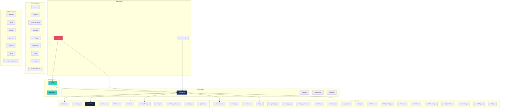
```mermaid
graph TB
    subgraph "Entry Points"
        main.go
        interactive.go
    end
    
    subgraph "Core Engine"
        scanner.go
        types.go
        progress.go
        logger.go
    end
    
    subgraph "Analysis Modules"
        signatures.go
        chains.go
        packer.go
        ioc.go
        ioc_triage.go
        entropy.go
        strings_extract.go
        decode.go
        formats.go
        pe_intel.go
        dga.go
        dotnet.go
        falsepositive.go
        disasm.go
        hashdb.go
        deobfuscate.go
        masquerade.go
        correlation.go
        capability.go
        intel.go
    end
    
    subgraph "Format Parsers"
        apk.go
        carve.go
        config_extract.go
        family.go
        similarity.go
        platform.go
        lnk.go
        script.go
        pdf_document.go
    end
    
    subgraph "Output Renderers"
        report.go
        pdf.go
        html.go
        yara.go
        sigma.go
        stix.go
        case_report_pack.go
    end
    
    subgraph "Architecture"
        plugin.go
        rules.go
        parallel.go
        cache.go
        batch.go
        watch.go
        mmap_linux.go
        color.go
        external_tools.go
        expert.go
        splash.go
    end
    
    subgraph "Web Interface"
        web.go
        web_ui.go
    end
    
    main.go --> scanner.go
    main.go --> web.go
    web.go --> web_ui.go
    web.go --> scanner.go
    interactive.go --> scanner.go
    scanner.go --> signatures.go
    scanner.go --> ioc.go
    scanner.go --> formats.go
    scanner.go --> parallel.go
    scanner.go --> plugin.go
    scanner.go --> mmap_linux.go
    
    style main.go fill:#e94560,color:#fff
    style scanner.go fill:#0f3460,color:#fff
    style parallel.go fill:#16213e,color:#fff
    style web.go fill:#2dd4bf,color:#000
    style web_ui.go fill:#2dd4bf,color:#000
```

### Source Statistics

| Category | Files | Lines of Code |
|----------|-------|---------------|
| **Core Engine** | 4 | ~1,300 |
| **Analysis Modules** | 11 | ~3,600 |
| **Format Parsers** | 5 | ~2,500 |
| **Output Renderers** | 7 | ~3,200 |
| **Architecture** | 11 | ~2,100 |
| **Web Interface** | 2 | ~1,380 |
| **Tests** | 3 | ~700 |
| **Total** | **47** | **~15,400** |

---

## Safety Note

FlatScan performs **static analysis only**. It does not execute samples. That reduces risk, but it does not make malware handling safe by itself.

> ⚠️ **Recommended handling:**
> - Work inside an isolated malware-analysis VM
> - Do not double-click or execute samples
> - Keep samples password-protected when sharing
> - Store reports separately from live malware
> - Treat generated findings as triage evidence, not a final clean/malicious verdict

---

## Limitations

- Static analysis can miss environment-gated, packed, staged, encrypted, or dynamically generated behavior
- Hashes cannot be decoded or reversed — FlatScan can classify hash-looking values as IOCs, but cannot recover original data
- Generated YARA and Sigma rules are starting points for hunting — review before deployment
- Safe carving reports offsets and hashes; it does not extract payloads to disk
- PKCS#7/CMS signature parsing is dependency-free and best-effort
- The local case database is JSONL, not SQLite, to keep FlatScan lightweight and cgo-free (the only third-party code is the vendored pure-Go `internal/x86asm` disassembler)
- MITRE mapping is static-evidence mapping, not proof that the behavior executed
- PDF reports are generated by FlatScan's internal PDF writer (no external dependencies)

---

## Documentation

| Document | Purpose |
|----------|---------|
| **[wiki/](wiki/Home.md)** | **Full documentation set** — installation, quick start, exhaustive CLI reference, output formats, detection engine, web UI, CI/CD, rules & plugins, architecture, troubleshooting, FAQ |
| [install.md](install.md) | Build, verify, cross-compile, lab setup |
| [usage.md](usage.md) | Comprehensive flag reference, mode details, output interpretation |
| [USECASE.md](USECASE.md) | Use cases, deployment scenarios, and recommended workflows |
| [contributing.md](contributing.md) | Code style, testing, adding detections, PR guidelines |
| [security.md](security.md) | Security policy, safe handling, output safety, dependency policy |
| [changelog.md](changelog.md) | Version history with all changes |
| [roadmap.md](roadmap.md) | What's shipped (0.1.0–0.10.2) and the 5-year direction |
| [flatscan_qa_report.md](flatscan_qa_report.md) | Full QA / hardening audit (0.10.0, historical record) |
| [QC_REPORT.md](QC_REPORT.md) | Cumulative quality-assurance audit log per release |

---

## Project URL

Use this URL for issues, releases, documentation, and source references:

https://github.com/Masriyan/FlatScan
