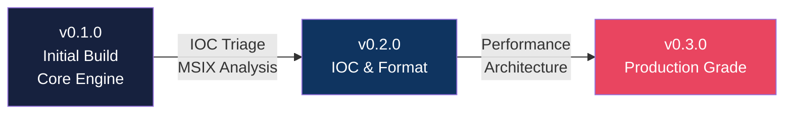

# Changelog

Repository: https://github.com/Masriyan/FlatScan

All notable project changes are documented here. Format follows [Keep a Changelog](https://keepachangelog.com/).

---

## Version Evolution

| Version | Focus | Key Features |
|---------|-------|-------------|
| **0.3.0** | Performance & Architecture | Parallel pipeline, plugins, STIX 2.1, watch mode, mmap, structured logging |
| **0.2.0** | IOC Triage & MSIX | IOC suppression, MSIX/AppX analysis, Magniber detection, interactive mode |
| **0.1.0** | Initial Build | Full analysis engine, 12 output formats, PE/ELF/Mach-O/APK/DEX parsers |

---

## 0.3.0 - Performance and Architecture Release

### Added

- **Colorized terminal output** — ANSI severity badges, emoji section headers, risk score visual bar, verdict color coding. Auto-detects terminal capability and respects `NO_COLOR` environment variable and `--no-color` flag.
- **Batch directory scanning** — `--dir PATH` scans all regular files in a directory with per-file progress and a colorized summary table showing verdicts, scores, findings, IOC counts, and file types.
- **Watch mode** — `--dir PATH --watch` monitors a directory for new or modified files and auto-scans them with immediate colorized alerts for malicious detections. Configurable polling interval via `--watch-interval`.
- **JSON stdout** — `--json -` pipes machine-readable JSON output directly to stdout for scripting and pipeline integration.
- **STIX 2.1 export** — `--stix PATH` generates a standards-compliant STIX 2.1 JSON bundle containing File SCO (with PE extension), Malware Analysis SDO, IOC Indicators (URLs, domains, IPs), Malware SDO, and Relationship objects. Included in `--report-pack` output.
- **Build-time version injection** — `var version` can be set at build time via `go build -ldflags "-X main.version=1.0.0"`.
- **Structured logging** — `Logger` module with levels (DEBUG/INFO/WARN/ERROR), thread-safe writes, entry capture for post-scan analysis, and backward-compatible `AsDebugLogger()` bridge.
- **Analysis plugin interface** — `AnalysisPlugin` interface with `Name()`, `Version()`, `ShouldRun()`, and `Run()` methods. Plugin registry with `RegisterPlugin()`. Two built-in plugins: high-entropy blob detector and suspicious PE import combinator (process hollowing, reflective injection).
- **JSON plugin manifests** — External plugins can be defined via JSON files with string-matching checks, mode filters, and file type filters. Loaded via `LoadJSONPlugin()`.
- **Scan caching** — SHA256-based result cache with TTL expiry and file-size validation. Thread-safe for concurrent batch scanning. Supports `Get`, `Put`, `Invalidate`, `Clean`, and `Size` operations.
- **Memory-mapped I/O** — `syscall.Mmap` on Linux for files exceeding 100 MB. Transparent fallback to buffered read on other platforms or failure. Zero-copy hash computation directly over the mapped region.

### Changed

- **Parallel analysis pipeline** — Independent analysis stages (format analysis, carving, crypto/config extraction, similarity hashing) now execute concurrently via `parallelRun()`. Thread-safe finding append via package-level mutex. Verified clean by Go race detector.
- **Interactive mode reports** now use colorized output when terminal supports it. File exports remain plain text (no ANSI escape codes).
- **Progress bar phases** updated to reflect new pipeline stages: `running analysis plugins`, `running rules and classification`.
- **Report pack** now includes STIX 2.1 JSON bundle alongside existing PDF, HTML, JSON, IOC, YARA, Sigma, and executive markdown outputs.
- **Scanner debug log** now uses structured `Logger` entries instead of bare string formatting.

### Performance

- **Corpus caching** — Single shared corpus string built once and passed to all 5 pattern-matching stages (previously rebuilt independently by each stage).
- **Incremental entropy** — Sliding-window entropy uses an incremental histogram update, reducing per-iteration cost from O(window) to O(step).
- **Zero-alloc string extraction** — Direct byte-slice indexing eliminates thousands of per-string heap allocations.
- **XOR buffer reuse** — Single pre-allocated buffer shared across all single-byte XOR key probes.
- **IOC batch normalization** — Deferred IOC normalization runs once at the end instead of per-extraction.
- **Named constants** — 13 named constants replacing magic numbers in the analysis pipeline.

## 0.2.0 - IOC Triage and MSIX Analysis

### Added

- IOC triage layer with built-in suppression for common benign PKI, certificate-revocation, OCSP, XML schema, Android schema, W3C, OpenXML, OID, loopback, and broadcast artifacts.
- `--ioc-allowlist` for operator-supplied IOC allowlists without recompiling.
- Guided interactive mode with `--interactive` and `-i`.
- Manual command shell with `--shell` for typing repeated FlatScan commands inside one program session.
- Shell-style argument parsing for quoted paths in manual command shell mode.
- JSON IOC audit fields: `suppressed_count`, `suppression_reason`, and `suppression_log`.
- Top-level `iocs.pe_hashes` for embedded payload pivots.
- Promotion of carved ZIP-local payload records into top-level IOCs when the carved preview points at an embedded `.exe` or `.dll`.
- Promotion of decompressed embedded PE execution hashes into top-level IOCs.
- Priority tiers for embedded payload hashes based on compression ratio and entropy.
- MSIX/AppX package detection from `AppxManifest.xml`, `AppxSignature.p7x`, `AppxBlockMap.xml`, and `[Content_Types].xml`.
- MSIX manifest parsing for identity name, publisher, version, declared executables, capabilities, and undeclared executable payloads.
- MSIX findings for unknown or untrusted publisher, `runFullTrust`, and hidden executable payloads.
- AppxSignature.p7x hashing and dependency-free certificate parse status.
- Magniber-style random lowercase directory/executable-name detection.
- Magniber ransomware family hypothesis scoring for MSIX delivery, embedded payloads, random naming, matching directory/file stems, entropy, and small loader payloads.
- Report rendering for MSIX metadata, embedded PE payload hashes, IOC suppression counts, and suppression audit details.
- PDF and HTML report sections for promoted payload hashes and MSIX metadata.
- Unit tests for IOC triage and MSIX hidden-payload detection.

### Changed

- YARA generation now avoids FlatScan self-generated classification strings as match strings.
- YARA generation now uses triaged IOCs, suspicious payload entry names, MSIX structure guards, and `math.entropy()` where useful.
- Sigma generation for archive/container samples now focuses on hashes and payload image path patterns instead of command-line matches on schema URLs or format strings.
- IOC exports now prioritize embedded payload hashes ahead of network indicators.
- ZIP-family entry analysis records entry type, SHA256, entropy, offset, and compression ratio when entry bytes are inspected.
- Family classification can now escalate MSIX + embedded payload + Magniber naming evidence to `Magniber ransomware`.

### Fixed

- Suppressed benign DigiCert, Microsoft schema, OpenXML, W3C, and ASN.1/OID artifacts that previously appeared as actionable IOCs.
- Prevented benign MSIX format infrastructure from dominating IOC exports and generated hunting content.
- Corrected signal ordering so embedded payload hashes are no longer buried only in carved artifact output.

## 0.1.0 - Initial Development Build

### Added

- Go CLI scanner named `flatscan`.
- Scan modes: `quick`, `standard`, and `deep`.
- Text report modes: `minimal`, `Summary`, and `Full`.
- Full-file MD5, SHA1, SHA256, and SHA512 hashing.
- File type and MIME hint detection.
- ASCII string extraction.
- UTF-16LE string extraction.
- IOC extraction:
  - URLs
  - domains
  - IPv4
  - IPv6
  - emails
  - MD5
  - SHA1
  - SHA256
  - SHA512
  - CVEs
  - registry keys
  - Windows paths
  - Unix paths
- Suspicious base64 decoding.
- Suspicious hex decoding.
- URL-percent decoding.
- Nested decode depth control with `--decode-depth`.
- Entropy scoring.
- High-entropy region detection.
- PE parser:
  - machine type
  - timestamp
  - subsystem
  - image base
  - entry point
  - imports
  - approximate import hash
  - section table
  - section entropy
  - executable/writable section flags
  - certificate table presence
  - overlay size
  - .NET runtime detection through `_CorExeMain` / `mscoree.dll`
- ELF parser:
  - class
  - machine
  - type
  - imports
  - sections
- Mach-O parser:
  - CPU
  - type
  - imports
  - sections
- ZIP/APK/JAR/Office Open XML container inspection.
- APK-aware Android manifest parser for package identity, version, SDK targets, requested permissions, exported components, intent actions, network-security config references, signature files, assets, native libraries, and embedded payloads.
- DEX-aware string/API scanner for Android SMS, contacts, location, recording, accessibility services, overlays, device administrator behavior, runtime command execution, dynamic class loading, WebView bridges, native loading, package installation, networking, and Java crypto indicators.
- Declarative rule/plugin pack engine with `--rules` and `--plugins`.
- Rule matching for file types, strings, regexes, functions/APIs, domains, URLs, SHA256 values, and entropy ranges.
- Optional safe embedded file carving with `--carve` and `--max-carves`.
- Malware family classifier for ransomware, infostealers, loaders, RAT-like behavior, Android riskware, webshell/toolkit content, and bundled payloads.
- Crypto/config extractor for C2-like URLs, token markers, mutex candidates, ransom notes, wallet-looking strings, decoded configs, embedded compressed streams, and simple XOR candidates.
- Similarity hashing:
  - FlatHash
  - byte-histogram hash
  - string-set hash
  - import hash
  - section hash
  - DEX string hash
  - archive-content hash
- Optional external metadata-tool integration with `--external-tools`.
- Interactive analyst HTML report with `--html`.
- Professional report pack export with `--report-pack`.
- Local JSONL case database recording with `--case` and `--case-db`.
- Archive-entry suspicious heuristics:
  - path traversal names
  - executable/script extensions
  - Office macro indicators
  - Android package indicators
  - archive bomb heuristic
- Behavioral findings:
  - process injection API chains
  - dynamic API resolution
  - downloader behavior
  - command-and-control style network strings
  - Discord webhook exfiltration
  - Discord account/API access indicators
  - browser credential decryption indicators
  - Windows persistence indicators
  - Linux persistence indicators
  - suspicious PowerShell execution
  - script host and LOLBin indicators
  - ransomware-style strings
  - credential and wallet theft indicators
  - VM/sandbox awareness
  - anti-debugging references
  - security tooling bypass indicators
  - packer/protector markers
  - high IOC density
- Malware profile enrichment:
  - classification
  - likely malware type
  - confidence score
  - business impact
  - key capabilities
  - recommended actions
  - MITRE-style TTP entries
  - cryptography indicators
  - executive assessment
- Cryptography and secret-handling indicators:
  - Windows CNG BCrypt
  - Windows CryptoAPI/DPAPI-style references
  - Chromium `encrypted_key` workflow
  - symmetric crypto markers
  - decoded-obfuscation layer indicators
- CISO/management-ready PDF report with:
  - cover page
  - executive assessment
  - risk cards
  - CISO decision summary
  - final analyst assessment
  - evidence summary table
  - business impact
  - management actions
  - MITRE ATT&CK TTP matrix
  - priority findings
  - cryptography and secret-handling assessment
  - hunting guidance
  - sample metadata
  - IOCs
  - executable/container details
  - Android APK/DEX details
  - advanced analysis section
  - family classifier output
  - crypto/config artifacts
  - safe carved artifact hashes
  - similarity hashes
  - suspicious strings
  - decoded artifacts
- JSON report export with `--json`.
- HTML report export with `--html`.
- IOC text export with `--extract-ioc`.
- YARA hunting rule export with `--yara`.
- Sigma SIEM/EDR hunting rule export with `--sigma`.
- Startup ASCII banner and loading bar.
- Progress display with percentage updates.
- `--no-progress` for automation.
- `--no-splash` for disabling the startup banner/loading bar.
- `--splash-seconds` for splash duration control.
- Debug logging with `--debug`.
- Unit tests for IOC extraction, decoding, file type detection, PDF generation, YARA rendering, Sigma rendering, custom rules, and HTML rendering.

### Changed

- Improved progress renderer to clear leftover terminal characters when shorter progress messages overwrite longer ones.
- Improved PDF layout alignment, wrapping, section styling, table grids, long IOC handling, headers, and footers.
- Improved APK scoring to avoid treating normal Android package structure as malicious while still surfacing Android-specific high-risk behaviors.
- Expanded documentation into:
  - `README.md`
  - `install.md`
  - `usage.md`
  - `contributing.md`
  - `security.md`
  - `changelog.md`

### Notes

- FlatScan is static-only and does not execute target samples.
- Generated YARA rules should be reviewed before production deployment.
- Cryptographic hashes are classified as IOCs but cannot be reversed.
