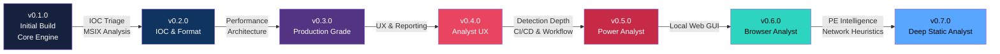

# Changelog

Repository: https://github.com/Masriyan/FlatScan

All notable project changes are documented here. Format follows [Keep a Changelog](https://keepachangelog.com/).

---

## Version Evolution

```mermaid
graph LR
    A["v0.1.0<br/>Initial Build<br/>Core Engine"] -->|"IOC Triage<br/>MSIX Analysis"| B["v0.2.0<br/>IOC & Format"]
    B -->|"Performance<br/>Architecture"| C["v0.3.0<br/>Production Grade"]
    C -->|"UX & Reporting"| D["v0.4.0<br/>Analyst UX"]
    D -->|"Detection Depth<br/>CI/CD & Workflow"| E["v0.5.0<br/>Power Analyst"]
    E -->|"Local Web GUI"| F["v0.6.0<br/>Browser Analyst"]
    F -->|"PE Intelligence<br/>Network Heuristics"| G["v0.7.0<br/>Deep Static Analyst"]
    
    style A fill:#16213e,color:#fff
    style B fill:#0f3460,color:#fff
    style C fill:#533483,color:#fff
    style D fill:#e94560,color:#fff
    style E fill:#c62a47,color:#fff
    style F fill:#2dd4bf,color:#000
    style G fill:#58a6ff,color:#000
```

| Version | Focus | Key Features |
|---------|-------|-------------|
| **0.10.0** | Recursive Payload Resolution | Static layer-peeling (Flagship Epic Tier 1): recovers buried payloads through base64/hex decoding, gzip/zlib decompression, single-byte-XOR unwrapping, and recursive carving, then re-scans each recovered stage with the full detection engine — surfacing a provenance-tagged **payload tree** (`payload_tree`) with per-stage score/verdict/family/IOCs. Pure data transformation, sample never executed (no detonation). Bounded work budgets; gated to standard/deep via `--resolve-depth` |
| **0.9.0** | Detection Precision | IOC confidence & categorization (build-artifact/source-path/namespace vs actionable) with export hygiene, multi-evidence correlation engine + per-finding confidence/evidence-count, named-family fingerprints (RedLine/Lumma/StealC/AsyncRAT/…), similarity matching vs a reference store (`--similarity-db`), CAPA-style capability rules + YARA-quality scoring, malware-config extraction, offline threat-intel enrichment (`--intel-db`), expected-behavior prediction |
| **0.8.0** | Code-Level Analysis | Instruction-level disassembly pass (x86/x64 PE+ELF via `golang.org/x/arch`) — API-hashing loops, PEB walks, GetPC/shellcode stubs, VMware-backdoor/CPUID/Red-Pill anti-VM; hash-database resolution of hash-obfuscated imports (ROR13/DJB2/SDBM) feeding the import/behavior layer |
| **0.7.1** | Initial-Access Vectors | Windows shortcut (.lnk) parser, PowerShell/script behavioral analyzer, multi-layer (base64 → delimited-hex → reversed-string) deobfuscation, deeper ELF posture/packing heuristics, .NET downloader-dropper detection |
| **0.7.0** | PE Intelligence & Network Heuristics | PE Header Intelligence (DllCharacteristics/exploit-mitigation posture, Rich-header hash, TLS callbacks, Authenticode signer, entry-point sanity), DGA domain scorer, .NET detection, detection-artifact false-positive guard, PDF Unicode rendering fix, HTML/PDF downloads in web mode |
| **0.6.0** | Local Web GUI | Self-contained `--web` browser interface (zero new dependencies), drag-and-drop upload, async scan jobs, 9 result tabs, on-the-fly download of every output format incl. zipped report pack |
| **0.5.0** | Detection Depth & CI/CD | API chain detection, packer fingerprinting, CI/CD mode, semantic exit codes, parallel batch, score breakdown, new IOC types, cryptominer/wiper families |
| **0.4.0** | Analyst UX & Reporting | Shell completion, grouped help, post-scan hints, dark HTML report, PDF risk bar, batch Size column |
| **0.3.0** | Performance & Architecture | Parallel pipeline, plugins, STIX 2.1, watch mode, mmap, structured logging |
| **0.2.0** | IOC Triage & MSIX | IOC suppression, MSIX/AppX analysis, Magniber detection, interactive mode |
| **0.1.0** | Initial Build | Full analysis engine, 12 output formats, PE/ELF/Mach-O/APK/DEX parsers |

---

## 0.10.0 - Recursive Payload Resolution Release

_Released 2026-06-14._

The first tier of the roadmap's **Dynamic Context (without detonation)** flagship
epic. A flat string/IOC pass can only see what malware leaves in cleartext; real
samples bury their next stage under encoding, compression, single-byte XOR, or
plain appension. This release peels those layers off by **pure data
transformation** — the sample is never executed — and re-scans whatever
structured payload emerges, so a buried PE/ELF/DEX/archive is surfaced and scored
instead of hiding behind its wrapper. **No score regression** on the validation
set; every previously-detected PE/APK keeps its score.

### Added

- **Recursive static payload resolution** (`payload_resolve.go`, `--resolve-depth`)
  — a bounded BFS that derives candidate payloads from the sample via:
  - **base64 / hex** decoding that recovers *binary* payloads (the existing decode
    path keeps only printable decodes; a base64-encoded PE was previously dropped),
  - **gzip / zlib** stream inflation found anywhere in the buffer,
  - **single-byte-XOR** unwrapping of executables (the classic second layer after
    base64), brute-forced against the recovered header,
  - **recursive carving** of embedded executables/archives.

  Each recovered stage is re-scanned through a non-recursive subset of the real
  engine (strings → IOCs → pattern/family/capability scoring → finalized score)
  and emitted as a node in a new **`payload_tree`** with full provenance
  (`method`, `detail`, `depth`, `parent_id`) plus per-stage `file_type`, `sha256`,
  `entropy`, `score`, `verdict`, `family`, and top actionable IOCs/findings.
- **Obfuscated-payload findings** — an executable recovered by peeling an
  encoding/compression/XOR layer raises a High **"Obfuscated executable payload
  resolved"** finding (Defense Evasion / **T1027.009 Embedded Payloads**); a stage
  that itself scores Suspicious+ raises a Medium. Conservative by design: a plainly
  embedded payload with no malicious content stays informational so benign
  installers that legitimately embed executables are not over-scored.
- **`--resolve-depth <n>`** (0–6, default 3; `0` disables) — caps recursion depth.
  Resolution is gated to standard/deep modes and protected by global work budgets
  (decode/inflate attempt caps, a 24-node cap, and per-buffer size caps) so a large
  binary riddled with incidental `0x78`/`0x1f8b` bytes cannot turn layer-peeling
  into a hot loop. A 12-file deep batch stays within a few seconds.

### Fixed

- The resolver routes gzip/zlib streams through actual inflation (validating them)
  rather than recording raw compression-magic byte-pairs as carve nodes, and skips
  ZIP member-entry headers when the host is itself a ZIP-family archive — so the
  payload tree shows real recovered stages (e.g. an APK's embedded native ELF and
  PDFs) instead of incidental-magic noise.

---

## 0.9.0 - Detection Precision Release

_Released 2026-06-12._

A sample-driven precision pass: the engine had strong reporting and IOC output,
but its weakest dimension was detection *accuracy* — IOC noise, single-string
findings inflating confidence, and generic family labels. This release closes
those gaps. **No score regression** on the validation set, with one deliberate
correction (a false credential-dumping attribution removed from `8bba…`,
100→98, same verdict). All additions are backward-compatible JSON.

### Added

- **IOC confidence & categorization** (`ioc_classify.go`) — every extracted
  indicator is tagged `ioc` / `suspicious-infra` / `benign-infra` /
  `build-artifact` / `compiler-runtime-metadata` / `source-path` /
  `package-namespace`, with a confidence weight and context note (`classified`
  field). **Export hygiene:** `--extract-ioc` and STIX now drop build-artifact /
  source-path / namespace noise (Rust `…/.cargo/registry/…`, PDB paths,
  `System.*`/`androidx.*` fragments) so the IOC list stays trustworthy. Context
  is value-aware (a Discord *webhook URL* is suspicious-infra; bare `discord.com`
  is benign-infra; `android.googlesource.com` is a real domain, not a namespace).
- **Correlation engine + per-finding confidence** (`correlation.go`) — `Finding`
  gains `confidence` (0–100) and `evidence_count`. Serious capabilities
  (OS credential dumping, browser theft, keylogging) now require multiple
  corroborating evidence groups, so a lone generic string (e.g. `"lsass"`) no
  longer yields a high-confidence Credential Access finding. The weak
  single-OR credential signature was replaced.
- **Named-family fingerprints** (`family_fingerprints.go`) — multi-signal
  fingerprints for RedLine, LummaC2, StealC, Vidar, Raccoon, Agent Tesla,
  FormBook/XLoader, AsyncRAT, Quasar, Remcos, XWorm, njRAT. Scored above the
  generic buckets so a confirmed family becomes the headline hypothesis; a lone
  family-name string never attributes on its own.
- **Similarity matching** (`similarity_match.go`, `--similarity-db`) — ranks the
  sample against a local JSONL reference store: exact-match on the digest
  dimensions (imphash, section, string-set, byte-histogram, rich header) plus
  chunk-overlap on the FlatHash → **"N% similar to <label>"** with the matched
  dimensions, surfaced in `similarity.matches` and a finding.
- **CAPA-style capability rules** (`capability.go`) — declarative rules match
  over the full feature set — strings, imports **including hashdb-resolved API
  names**, disassembly techniques, and IOC categories — and map to ATT&CK. The
  headline win: capabilities like process injection are detected even when the
  binary resolves its APIs by hash. Starter pack: injection, browser theft,
  disable-security, scheduled-task, self-deletion, clipboard hijacking.
- **YARA-quality scoring** (`yara.go`) — generated rules now exclude
  compiler/runtime/library/source strings and non-actionable IOC categories, and
  carry a `rule_quality_score` and `expected_fp_risk` in the rule meta.
- **Malware config extraction** (`config_family.go`) — consolidates the operator
  primitives (C2, mutex, bot token, webhook, wallet, campaign/build IDs, version)
  into a `malware_config` view keyed to the detected family. Informational (no
  score inflation — the underlying values are already counted as IOCs).
- **Offline threat-intel enrichment** (`intel.go`, `--intel-db`) — a local JSONL
  database maps known indicators (sha256/imphash/flat-hash/url/domain/ipv4) to
  family / campaign / first-seen / related; matches attach to `enrichment` and a
  high-confidence finding. Fully offline.
- **Expected-behavior prediction** (`behavior.go`) — derives a runtime-behavior
  checklist from the static evidence (`profile.expected_behavior`) for analysts
  validating in a sandbox/EDR.

### Fixed

- A lone generic credential string (e.g. `OpenProcess` + `"lsass"`) no longer
  produces a high-severity OS Credential Dumping finding (`8bba…` 100→98).
- **UTF-16 scripts** (`.ps1`/`.js`/etc. saved as UTF-16LE/BE, a common dropper
  encoding) were classified as `"unknown binary"` and skipped the script
  behavioral engine, because the ASCII `looksText` check failed on the
  interleaved NUL bytes. Added `looksUTF16Text` detection and UTF-16→UTF-8
  decoding in `analyzeScript`; a UTF-16 JScript dropper in the sample set went
  from `"unknown binary"` (17) to `"JScript"` (31, Suspicious) with proper
  script analysis.
- **IOC overmatching on Rust/Go binaries** — dependency-registry domains
  (`index.crates.io`, Go module proxy, npm/PyPI/Maven) and certificate-authority
  / PKI domains (`openssl.org`, `*.digicert.com`, `entrust.net`, …) were
  extracted as actionable IOCs, drowning the real indicators (one Rust sample
  reported **570 IOCs**, of which only `api.telegram.org` was operational). Added
  `isPackageRegistryDomain` (→ build-artifact) and `isPKIDomain` (→ benign-infra)
  to the categorizer, and the batch triage IOC count now reports **actionable**
  indicators only — that sample's column dropped **570 → 15**.

---

## 0.8.0 - Code-Level Analysis Release

_Released 2026-06-12._

FlatScan's behavioral detection was substring matching over an extracted-string
corpus — a structural ceiling that can only see what malware leaves in cleartext.
This release adds a **code-level analysis layer beneath the string layer**: it
disassembles the entry point and detects techniques that leave no string behind.
First new third-party dependency: `golang.org/x/arch` (pure Go, no cgo).

### Added

- **Disassembly pass** (`disasm.go`) — decodes x86/x64 instructions from the entry
  point of PE and ELF binaries (`golang.org/x/arch/x86/x86asm`), gated to
  `standard`/`deep` modes, bounded and panic-safe on adversarial bytes. Detects:
  - **API-hashing routine** — the canonical `ROR …, 13` import-hashing idiom (High).
    APIs resolved by hash leave no `"VirtualAlloc"` string for the corpus to match.
  - **Direct PEB access / manual resolution** — `fs:[0x30]` (x86) / `gs:[0x60]`
    (x64) reads; escalates to High when combined with ROR13 hashing (manual module
    mapping). TEB self-reference offsets are excluded to avoid CRT false positives.
  - **GetPC / position-independent stub** — `call $+5 ; pop` shellcode idiom.
  - **Anti-VM at the instruction level** — VMware backdoor magic `0x564D5868`
    ("VMXh"), hypervisor `CPUID` leaf `0x4000_0000`, Red-Pill `SIDT/SGDT/SLDT/STR`,
    and repeated `RDTSC` timing checks — none of which require a VM-name string.
  - New `result.Code` field (arch, instructions decoded, indirect call/jump counts,
    techniques, entry-point disassembly) rendered in JSON and the text report.
- **Hash-database import resolution** (`hashdb.go`) — the emulator-free form of
  "resolve hashed imports." Precomputes ROR13/ROR13+NUL/DJB2/SDBM hashes over a
  dictionary of ~120 commonly-abused Win32/NT APIs and matches the disassembled
  immediates against them (the HashDB approach). Recovered names are fed into the
  `Functions` list (tagged by behavior family) and raise a High **"Resolved
  hash-obfuscated API imports"** finding (T1140) — so a hash-resolving loader gets a
  real import list instead of an opaque "packed" verdict. Conservative: requires ≥2
  matches, or ≥1 when a ROR13 loop was also seen (a 32-bit collision against a fixed
  dictionary is implausible).
- *Measured on the sample set*: the packed DLL gained Red-Pill/RDTSC anti-VM findings
  (**68 → 84**) and the x64 banker gained a PEB-access finding (**34 → 46**) — both
  within their existing malicious/suspicious tier, with **no previously-detected
  PE/APK sample dropping** in score.

### Notes

- Adds `golang.org/x/arch` to `go.mod` and raises the module's Go directive
  (toolchain `go get` set it to 1.25). The default build remains **cgo-free**.
- Emulated unpacking / inline-decryptor emulation (improvementprompt-v2 Task 2.2/2.3)
  is intentionally deferred: a correct general-purpose x86 emulator is a large,
  fragile component best done behind a Unicorn build tag. The hash-database approach
  delivers the headline "resolve hashed imports" outcome reliably and without cgo.

---

## 0.7.1 - Initial-Access Vectors Release

_Released 2026-06-11._

A live-sample sweep (12 real specimens) showed PE/APK detection was excellent but
non-PE initial-access/dropper formats were badly under-scored. This release closes
those false-negative gaps. **No regression**: every previously-detected PE/APK
sample keeps its score.

### Added

- **Windows shortcut (.lnk) parser** (`lnk.go`) — LNK files were classified as
  "unknown binary" and never structurally parsed, so the embedded command line —
  the entire payload of a malicious shortcut — was invisible. New `looksLNK`
  detection (`ShellLinkHeader` size `0x4C` + LinkCLSID) returns the `Windows
  shortcut` type, and `analyzeLNK` parses the header flags and StringData blocks
  to recover the target (LOLBin detection: powershell/cmd/mshta/rundll32/regsvr32/…)
  and the `CommandLineArguments`, which are fed through the shared script engine.
  Findings: interpreter/LOLBin target (T1204.002), download-and-execute cradle
  (T1105), string obfuscation (T1027), oversized-shortcut payload tell.
  - *Result*: the live PowerShell-downloader LNK went **22 "Low suspicion" → 78
    "High suspicion"**, and its reversed-string C2 URL is now recovered as an IOC.
- **PowerShell / script behavioral analyzer** (`script.go`) — `.ps1/.psm1`,
  `.bat/.cmd`, `.vbs`, `.js`, `.wsf`, `.hta`, `.sh` are now typed and routed to a
  behavioral engine (also reused for LNK command lines) instead of being scored as
  generic "text". Detects Microsoft Defender tampering (`Set/Add-MpPreference`,
  T1562.001), AMSI/ETW bypass, download-and-execute cradles (T1105), stealthy
  interpreter flags, character-code / reversed-string / heavy-base64 obfuscation
  (T1027), and scheduled-task / Run-key persistence (T1053.005 / T1547.001).
  - *Result*: the obfuscated Defender-disabling `.ps1` went **4 "No strong
    indicators" → 100 "Likely malicious"**.
- **Multi-layer deobfuscation** (`decode.go`) — the recursive decoder now follows
  separator-delimited hex (e.g. `70}6f}77`, a common second-stage script layer),
  recovers whole-buffer **reversed-string** IOCs, and no longer stops early
  (`looksEncoded` recognizes the new layer types so recursion continues). Shared
  `decodeAllLayers` / `reverseString` helpers are reused by the script and LNK
  analyzers and surface every decoded layer as a `script-layer` artifact.
- **Deeper ELF analysis** (`formats.go`) — `analyzeELFPosture` adds heuristics that
  work even when an ELF is stripped and statically linked (the common Linux-bot
  shape where imports and WX-section checks find nothing): static+stripped posture
  (T1027), legacy/embedded-architecture IoT-malware profile, and high-entropy
  executable-section packing (T1027.002). Findings are individually modest so
  static Go/busybox binaries aren't over-scored.
  - *Result*: the stripped static i386 ELF went **4 → 22** with concrete posture
    findings (static analysis cannot reach a malicious verdict on a fully opaque
    stripped binary without dynamic execution).
- **.NET downloader-dropper detection** (`dotnet.go`) — adds the managed
  download-to-disk-and-run pattern (HTTP client + `Process.Start`/`ProcessStartInfo`,
  T1105) that the existing reflective-loader rule missed, plus hidden-window child
  process (T1564), Base64 in-memory assembly load (T1620), and managed Run-key
  persistence (T1547.001).
  - *Result*: the small .NET HTTP-downloader went **13 "Low suspicion" → 35
    "Suspicious"**.

### Fixed

- **IOC false positives from code** (`ioc_triage.go`) — `.NET`/Java namespace
  fragments such as `System.Net` and `System.IO` were extracted as domains because
  `.net`/`.io` are TLDs. Added the common `System.*` namespaces to the default
  domain allowlist.

---

## 0.7.0 - PE Intelligence & Network Heuristics Release

_Released 2026-06-07._

### Added

- **PE Header Intelligence** (`pe_intel.go`, extends `formats.go`) — deepens Windows PE static analysis with the fields analysts reach for first, all parsed with the Go standard library (no new dependencies). New `PEInfo` fields surface in every renderer (text/JSON/PDF/HTML/web):
  - **Exploit-mitigation posture** — decodes `DllCharacteristics` into enabled mitigations (ASLR, DEP, CFG, High-Entropy VA, Force Integrity, …) and the absent baseline set, with naming aligned to winchecksec / BinSkim / PESecurity. A *Conservative* finding fires only when both ASLR and DEP are missing (legacy-but-benign binaries also lack mitigations); partial gaps are informational. Grounded in the SHAP analysis of Barnes & Ghafarian (JCP 2025), which found `DllCharacteristics` the single most discriminative static PE-header feature.
  - **Rich-header hash** — XOR-decodes the MSVC build-toolchain "Rich" header (Pistelli's algorithm) into a clustering/attribution fingerprint, added to `SimilarityInfo`.
  - **TLS callbacks** — detects routines that execute before `main` (anti-debug / early-exec). MITRE T1574.
  - **Authenticode signer** — recovers signer subject/issuer and signed / self-signed status by scanning the WIN_CERTIFICATE PKCS#7 blob for embedded X.509 certificates (read from file, truncation-safe). The MSIX signature path now shares this recovery.
  - **Entry-point sanity** — flags an entry point in a writable section or outside all mapped sections (packer/injection tells). MITRE T1027.
- **DGA domain scorer** (`dga.go`) — scores every extracted domain for algorithmic generation using a dictionary-free lexical model grounded in FANCI (USENIX 2018) features, Shannon entropy, and a Phoenix-style n-gram normality / Yadav bigram-distance signal. High scorers raise a Command-and-Control finding (MITRE **T1568.002**, Dynamic Resolution: DGA) and populate the new `dga_domains` result field. Conservative: Medium only for a very-high score on a frequently-abused TLD.
- **Managed-code (.NET) detection** (`dotnet.go`) — closes a recall gap surfaced by the sample sweep. A managed PE has almost no native import table, so the generic native signatures and API chains rarely fire on .NET malware (a reflective .NET loader scored on packing/entropy alone). `AnalyzeDotNet` adds managed-specific behavioral findings, gated to .NET binaries and requiring evidence *combinations* so ordinary .NET apps (which all use reflection/AES/AppDomain) don't trip:
  - **In-memory reflective loading** — `System.Reflection` dynamic invocation co-occurring with symmetric decryption **and** stream decompression (High), or with one of the two (Medium). MITRE T1620.
  - **Managed P/Invoke into native injection APIs** — `DllImport`/delegate marshaling plus `VirtualAlloc`/`WriteProcessMemory`/`CreateRemoteThread` (High). MITRE T1055.
  - **.NET obfuscator/protector fingerprints** — ConfuserEx, .NET Reactor, SmartAssembly, Eazfuscator, Babel, Dotfuscator, Agile.NET, etc. (Medium).
  - *Result*: the packed .NET loader in the sweep went **75 "High suspicion" → 97 "Likely malicious"** via a precise `Loader` finding instead of an opaque "packed" verdict; the other .NET stealer (already 100) was unchanged.
- **Detection/analysis-artifact recognizer** (`falsepositive.go`) — a major precision fix. FlatScan's detection is substring-based over a file's string corpus, so any file that *contains* malware indicators as data (an AV signature set, a YARA/Sigma rule pack, a sandbox, a threat-intel feed, an analysis tool — including FlatScan's own binary — or an incident report) previously lit up every signature and scored 100/"Likely malicious". `AssessResearchArtifact` recognizes this: a real specimen is focused, but a catalog carries headline strings for many *mutually-exclusive* archetypes at once (ransomware **and** cryptominer **and** wiper **and** credential dumper **and** Discord stealer **and** webshell). When ≥4 disjoint archetypes are present (or ≥3 plus security-tooling/MITRE markers), the verdict is annotated and the score is capped to the "Low suspicion" tier. Raw findings and score breakdown are preserved for transparency via the new `benign_context` field.
  - *Measured on a 6-sample malware set*: FlatScan's own ELF dropped from **100 "Likely malicious"** → **20 "Low suspicion (likely security tool…)"**, while all five real samples (APK loader 100, two stealers 100, packed .NET 75, banker 34) were **unchanged** — zero true-positive regression.

- **HTML & PDF downloads in web mode** (`web.go`) — the `--web` UI now renders and serves the analyst (HTML) and management (PDF) reports as downloads alongside the machine-readable formats; `available_downloads` now includes `html` and `pdf`.

### Fixed

- **Core scanner data race** in `parallelRun` — `AnalyzeFormats`, `ExtractCryptoAndConfigWithCorpus`, and `BuildSimilarityInfo` ran concurrently on shared `*ScanResult` state (and `BuildSimilarityInfo` copied the whole struct), firing on every scan and yielding nondeterministic similarity hashes. The pipeline now respects data dependencies (formats → `carve ∥ similarity` → crypto/config), similarity hashers take `*ScanResult`, and concurrent `Plugins` appends are serialized via `appendPlugin`. Verified race-clean (`go test -race`, multi-type `go build -race`).
- **PDF Unicode punctuation rendering** (`pdf.go`) — `escapePDFText` previously replaced *every* non-ASCII rune with `?`, so em-dashes, curly quotes, ellipses, and bullets throughout the PDF rendered as `?`. A typographic→ASCII replacer now maps them to legible equivalents (`—`→`-`, `'`/`'`→`'`, `…`→`...`, `•`→`-`, …) before escaping — a report-wide formatting fix.
- **`TestRenderHTMLReport` drift** — the HTML report's redesign had dropped the literal title the test asserted. The document `<title>` is now the descriptive `FlatScan Malware Analysis Report — <file>`, restoring a green test suite (**23/23**) and improving the browser-tab title.

### Changed

- **Archive payload findings are now aggregated** — archives with many embedded executables (e.g. an APK bundling native libraries) previously emitted one High "Executable payload inside archive" finding per entry, flooding the report. The first `maxArchivePayloadFindings` (6) are listed individually; the remainder roll up into a single "Multiple executable payloads inside archive" finding. The malicious APK in the sweep dropped from 13 to 7 container findings (still 100).

---

## 0.6.0 - Local Web GUI Release

Released 2026-06-06.

### Added

- **Self-contained web GUI** (`--web`) — launches a local single-page analysis console in the browser. Implemented as two new files with **zero new external dependencies** (Go standard library only):
  - `web.go` — HTTP server, async scan-job model, and four endpoints: `GET /` (UI), `POST /api/scan` (multipart upload), `GET /api/result/{id}` (poll), `GET /api/download/{id}/{format}` (stream artifact).
  - `web_ui.go` — the entire dark "terminal" single-page app (HTML + CSS + vanilla ES2020) embedded as a Go string constant; no CDN, fonts, or npm packages.
- **`--web-port <n>` flag** — port for `--web` mode (default `5000`).
- **Drag-and-drop upload** with file preview, scan-mode selector (quick/standard/deep), and per-request option toggles: `--carve`, `--yara`, `--sigma`, `--stix`, `--report-pack`.
- **Asynchronous scan jobs** — uploads return a job id immediately (HTTP 202); the browser polls every 800 ms and renders results on completion. Each job runs in its own goroutine with panic recovery.
- **Nine result tabs** rendered entirely from the JSON `ScanResult`: overview (verdict bar, score breakdown, stat cells, collapsible hashes + section-entropy map), findings (grouped by severity, expandable), IOC (per-category sub-tabs with copy buttons), functions (deduplicated, severity-sorted table), PE details (header + suspicious-import highlighting), artifacts (carved / config / external tools / family matches), profile (classification, MITRE ATT&CK TTPs, crypto indicators, recommendations), log, and outputs (download buttons).
- **In-browser downloads** for every generated format — `json`, `txt`, `iocs`, `yar`, `yml`, `stix`, and a **`pack`** option that streams the full report pack zipped on the fly (`archive/zip`).
- **In-session scan history** (last 10 scans, click to reload a previous result).

### Security

- Server binds to **loopback only** (`127.0.0.1`) and ships **no authentication** — it is a single-user local tool. A clear warning is printed on startup.
- **Per-job isolation** — every upload is written into its own `os.MkdirTemp` directory; all generated artifacts stay inside it. A background reaper deletes finished jobs and their temp dirs after 30 minutes.
- **Upload filename sanitization** (`safeFileName`) strips path separators, `..` traversal, control characters, and quotes — preventing directory escape and `Content-Disposition` header injection.
- **Upload size cap** of 256 MB enforced via `http.MaxBytesReader`; multipart spill files are cleaned up after the upload is copied out.
- `X-Content-Type-Options: nosniff` is set on every response; no CORS headers are emitted.

### Changed

- Version bumped to **0.6.0** (the web UI footer and `--version` now report 0.6.0).
- `main.go` gained two `Config` fields (`WebMode`, `WebPort`), two flag registrations, a `main()` dispatch branch, and a `--web` carve-out in the "no target specified" check, plus a new **WEB** section in `--help`.

### Known Issues

- The core scanner's parallel pipeline (`parallelRun` → `ExtractCryptoAndConfigWithCorpus` vs `BuildSimilarityInfo`) has a **pre-existing data race** that the race detector flags on a full scan (CLI and web alike). It is not introduced by the web GUI and is tracked for a fix. See QC_REPORT.md.

---

## 0.5.0 - Detection Depth, CI/CD, and Workflow Release

### Added

- **API behavioral chain detection** (`chains.go`) — 7 multi-stage attack chains scored as single Critical/High findings instead of N individual low signals: Classic DLL Injection, Process Hollowing, Keylogger + Exfiltration, Credential Theft + Webhook, Persistence + Evasion, Ransomware Encrypt + Wipe, Named Pipe C2 + Injection. Each chain carries a MITRE tactic/technique and recommendation.
- **Packer / protector fingerprinting** (`packer.go`) — Section-name and overlay-marker detection for UPX, Themida/WinLicense, VMProtect, MPRESS, ASPack, Enigma Protector, PELock, plus a generic single-section/high-entropy/no-imports heuristic.
- **Wiper family detection** — Shadow copy / boot-recovery deletion strings (`vssadmin delete`, `bcdedit /set recoveryenabled no`) and low-level disk write API chains mapped to MITRE T1490/T1485.
- **Cryptominer family detection** — Stratum protocol strings, GPU library references (`cuda.dll`, `OpenCL`), Monero-specific strings (`cryptonight`, `randomx`, `donate.v2.xmrig`) mapped to MITRE T1496.
- **~20 new API patterns** in `signatures.go`: NT-level injection (`ZwMapViewOfSection`, `NtAllocateVirtualMemory`, `NtWriteVirtualMemory`, `RtlCreateUserThread`), thread control (`SetThreadContext`, `GetThreadContext`, `ResumeThread`), timing/anti-analysis evasion (`GetTickCount64`, `QueryPerformanceCounter`, `GetVolumeInformation`, `NtQuerySystemInformation`), named pipe C2 (`CreateNamedPipe`, `ConnectNamedPipe`, `TransactNamedPipe`), lateral movement recon (`NetShareEnum`, `NetGroupGetUsers`), BCrypt APIs (`BCryptGenerateSymmetricKey`, `BCryptImportKeyPair`, `CryptHashData`, `CryptDeriveKey`).
- **Entropy false-positive mitigation** — Compressed/archive formats (zip, 7z, rar, gz, bz2, xz, zst, lz4, cab) skip the global-entropy finding; section-level entropy findings are unaffected.
- **New IOC types** (`ioc.go`, `types.go`): Ethereum wallet addresses (`0x[40 hex]`), Monero addresses (95-char base58), Bitcoin addresses, mutex names (`Global\...`, `Local\...`), named pipe paths (`\\.\pipe\...`). Added `Mutexes`, `NamedPipes`, `CryptoWallets` fields to `IOCSet`. Updated `MergeIOCSet`, `IOCCount`, IOC file export, text reports, color reports, and HTML IOC tabs.
- **`--ci` / `--ci-threshold <n>` flags** — CI/CD mode: suppresses splash and progress, prints a single machine-readable summary line to stderr (`FLATSCAN: MALICIOUS score=82 file=sample.bin findings=13 sha256=...`), exits 10 if score ≥ threshold (default 55), exits 0 otherwise.
- **Semantic exit codes** — `0` clean (score < 30), `10` suspicious (score ≥ 30), `20` likely malicious (score ≥ 80), `1` scan error, `2` usage error. Applies to all scans, not just CI mode.
- **`--output-format text|json|csv|jsonl`** — Machine-readable stdout formats. `csv` produces `filename,score,verdict,findings,iocs,sha256`. `jsonl` writes a compact single-line JSON object suitable for streaming into SIEM or `jq` pipelines. Both suppress hints and text report.
- **`--batch-json <path>`** — Writes a structured JSON summary after batch scans: `scanned`, `malicious`, `suspicious`, `clean`, `errors`, `duration`, and per-file `results` array.
- **`--watch-alert-only`** — In watch mode, silently skips files scoring below the alert threshold (55). Clean files update a one-line status counter instead of printing a full scan result.
- **Score breakdown in report header** — Every scan shows a compact per-category breakdown: `Score breakdown: [Credential Access:44 Evasion:31 Network:12 Packing:24 ...]`. Also included in JSON output as `score_breakdown`.
- **Parallel batch scanning** — `RunBatchScan` now uses a `runtime.NumCPU()` goroutine worker pool with a semaphore, reducing wall-clock time proportionally to available cores.
- **HTML global search** — A search input in the sticky nav bar live-filters both finding cards and IOC rows as you type. Match count is displayed.
- **HTML new IOC tabs** — Mutexes, Named Pipes, and Crypto Wallets tabs added to the tabbed IOC panel.
- **`--batch-json` help section** and **CI/CD section** added to grouped `--help` output.

### Changed

- `FinalizeRisk` now computes `ScoreBreakdown map[string]int` (category → cumulative score) alongside the existing risk score.
- Scanner pipeline calls `DetectAPIChains` and `DetectPackers` after pattern matching and format analysis.
- `hints.go` suppresses hints when `--ci`, `--output-format != text`, or `--json -` is active to avoid polluting machine-readable stdout.
- `RunConfiguredScan` text report printing gate now also checks `cfg.OutputFormat == "text"` and `!cfg.CI`.
- Batch scan progress suppresses per-file progress bars (sub-processes set `NoProgress = true`) to keep output clean.
- `IOCSet` extended with `Mutexes`, `NamedPipes`, `CryptoWallets` across `MergeIOCSet`, `IOCCount`, text report, color report, HTML, and IOC file export.

### Fixed

- Watch mode `--watch-alert-only` flag now correctly suppresses clean file output rather than printing an empty block.
- `--output-format csv/jsonl` no longer prints the hints block alongside the machine-readable line.

---

## 0.4.0 - Analyst UX and Reporting Release

### Added

- **Shell completion** (`completion.go`) — `--completion bash|zsh|fish` prints a ready-to-source completion script. Covers all flags, file/dir path completions, and enum values for `--mode`, `--report-mode`, and `--completion`.
- **Grouped, colored `--help`** — Replaced raw `flag.PrintDefaults` with hand-written sections (SCAN TARGET, OUTPUT, CI/CD, ADVANCED, WATCH/CASE, FLAGS) with ANSI color coding (cyan headers, green flags, dim notes) and `NO_COLOR` / non-terminal fallback.
- **Post-scan hints** (`hints.go`) — After each scan, FlatScan prints contextual follow-up tips based on what was found vs. what flags were used: `--carve` for high-entropy regions, `-m deep` when findings are dense, `--pdf`/`--yara`/`--stix` for high-score results, `--external-tools` in deep mode.
- **HTML dark analyst theme** — Complete HTML report rewrite: CSS custom properties for dark/light theme, `toggleTheme()` button, sticky nav bar with verdict badge and section jump links.
- **HTML SVG risk gauge** — Semicircle arc gauge with score-to-angle math, colored fill, and score label.
- **HTML MITRE heatmap** — TTPs grouped by tactic into columns; cells colored by confidence level.
- **HTML tabbed IOC panel** — URLs, Domains, IPs, Hashes, Registry, Paths, Emails, CVEs tabs with per-tab search filter and per-IOC clipboard copy buttons.
- **HTML syntax-highlighted JSON** — Token-by-token JSON coloring (keys, strings, numbers, booleans, nulls) in the raw JSON section.
- **PDF segmented risk bar** — Cover page horizontal bar split into green/amber/orange/red segments with a score-marker triangle.
- **PDF severity badge chips** — Colored filled-rectangle severity badges replacing plain `[High]` text prefix in finding rows.
- **PDF footer** — Version string and scan date added to every page footer.
- **Batch table Size column** — Batch summary table now shows `Size` column using `formatBytes`, plus improved footer with malicious/suspicious/clean/error counts.

### Changed

- `main.go` `main()` captures `ScanResult` and passes it to `PrintPostScanHints`.
- `printGroupedHelp` changed to a zero-parameter function writing directly to `os.Stderr`.
- Better error messages: `"unknown mode %q — valid values: quick, standard, deep"`, `"no target specified — use -f <file> or --dir <directory>"`.
- `const defaultVersion` bumped from `0.3.0` to `0.4.0`.

---

## 0.3.0 - Performance and Architecture Release

### Added

- **Colorized terminal output** — ANSI severity badges, emoji section headers, risk score visual bar, verdict color coding. Auto-detects terminal capability and respects `NO_COLOR` environment variable and `--no-color` flag.
- **Batch directory scanning** — `--dir PATH` scans all regular files in a directory with per-file progress and a colorized summary table showing verdicts, scores, findings, IOC counts, and file types.
- **Watch mode** — `--dir PATH --watch` monitors a directory for new or modified files and auto-scans them with immediate colorized alerts for malicious detections. Configurable polling interval via `--watch-interval`.
- **JSON stdout** — `--json -` pipes machine-readable JSON output directly to stdout for scripting and pipeline integration.
- **STIX 2.1 export** — `--stix PATH` generates a standards-compliant STIX 2.1 JSON bundle containing File SCO (with PE extension), Malware Analysis SDO, IOC Indicators (URLs, domains, IPs), Malware SDO, and Relationship objects. Included in `--report-pack` output.
- **Build-time version injection** — `var version` can be set at build time via `go build -ldflags "-X main.version=1.0.0"`.
- **Structured logging** — `Logger` module with levels (DEBUG/INFO/WARN/ERROR), thread-safe writes, entry capture for post-scan analysis, and backward-compatible `AsDebugLogger()` bridge.
- **Analysis plugin interface** — `AnalysisPlugin` interface with `Name()`, `Version()`, `ShouldRun()`, and `Run()` methods. Plugin registry with `RegisterPlugin()`. Two built-in plugins: high-entropy blob detector and suspicious PE import combinator (process hollowing, reflective injection).
- **JSON plugin manifests** — External plugins can be defined via JSON files with string-matching checks, mode filters, and file type filters. Loaded via `LoadJSONPlugin()`.
- **Scan caching** — SHA256-based result cache with TTL expiry and file-size validation. Thread-safe for concurrent batch scanning. Supports `Get`, `Put`, `Invalidate`, `Clean`, and `Size` operations.
- **Memory-mapped I/O** — `syscall.Mmap` on Linux for files exceeding 100 MB. Transparent fallback to buffered read on other platforms or failure. Zero-copy hash computation directly over the mapped region.

### Changed

- **Parallel analysis pipeline** — Independent analysis stages (format analysis, carving, crypto/config extraction, similarity hashing) now execute concurrently via `parallelRun()`. Thread-safe finding append via package-level mutex. Verified clean by Go race detector.
- **Interactive mode reports** now use colorized output when terminal supports it. File exports remain plain text (no ANSI escape codes).
- **Progress bar phases** updated to reflect new pipeline stages: `running analysis plugins`, `running rules and classification`.
- **Report pack** now includes STIX 2.1 JSON bundle alongside existing PDF, HTML, JSON, IOC, YARA, Sigma, and executive markdown outputs.
- **Scanner debug log** now uses structured `Logger` entries instead of bare string formatting.

### Performance

- **Corpus caching** — Single shared corpus string built once and passed to all 5 pattern-matching stages (previously rebuilt independently by each stage).
- **Incremental entropy** — Sliding-window entropy uses an incremental histogram update, reducing per-iteration cost from O(window) to O(step).
- **Zero-alloc string extraction** — Direct byte-slice indexing eliminates thousands of per-string heap allocations.
- **XOR buffer reuse** — Single pre-allocated buffer shared across all single-byte XOR key probes.
- **IOC batch normalization** — Deferred IOC normalization runs once at the end instead of per-extraction.
- **Named constants** — 13 named constants replacing magic numbers in the analysis pipeline.

### Fixed

- **JSON stdout (`--json -`)** — Text report no longer prints to stdout when `--json -` is active, making the output parseable by `jq` and other JSON tools.
- **STIX verdict mapping** — Scores 30-79 now correctly map to `"suspicious"` instead of incorrectly mapping 10-54 as `"benign"`.
- **Logger thread safety** — Merged double-lock in `log()` method into a single critical section to prevent log interleaving.
- **Logger `WithPrefix`** — Child loggers now use independent entry lists instead of sharing the parent's slice.
- **Watch mode hash preview** — Added bounds check for SHA256 string slicing to prevent panic on empty hash.
- **Version constant** — Updated default version from `0.2.0` to `0.3.0`.
- **Interactive STIX support** — Added STIX 2.1 export to interactive mode output profile 3 (full analyst/CISO pack).
- **Test coverage** — Expanded from 12 to 22 tests covering STIX, cache, logger, parallel pipeline, plugin system, and JSON stdout.

## 0.2.0 - IOC Triage and MSIX Analysis

### Added

- IOC triage layer with built-in suppression for common benign PKI, certificate-revocation, OCSP, XML schema, Android schema, W3C, OpenXML, OID, loopback, and broadcast artifacts.
- `--ioc-allowlist` for operator-supplied IOC allowlists without recompiling.
- Guided interactive mode with `--interactive` and `-i`.
- Manual command shell with `--shell` for typing repeated FlatScan commands inside one program session.
- Shell-style argument parsing for quoted paths in manual command shell mode.
- JSON IOC audit fields: `suppressed_count`, `suppression_reason`, and `suppression_log`.
- Top-level `iocs.pe_hashes` for embedded payload pivots.
- Promotion of carved ZIP-local payload records into top-level IOCs when the carved preview points at an embedded `.exe` or `.dll`.
- Promotion of decompressed embedded PE execution hashes into top-level IOCs.
- Priority tiers for embedded payload hashes based on compression ratio and entropy.
- MSIX/AppX package detection from `AppxManifest.xml`, `AppxSignature.p7x`, `AppxBlockMap.xml`, and `[Content_Types].xml`.
- MSIX manifest parsing for identity name, publisher, version, declared executables, capabilities, and undeclared executable payloads.
- MSIX findings for unknown or untrusted publisher, `runFullTrust`, and hidden executable payloads.
- AppxSignature.p7x hashing and dependency-free certificate parse status.
- Magniber-style random lowercase directory/executable-name detection.
- Magniber ransomware family hypothesis scoring for MSIX delivery, embedded payloads, random naming, matching directory/file stems, entropy, and small loader payloads.
- Report rendering for MSIX metadata, embedded PE payload hashes, IOC suppression counts, and suppression audit details.
- PDF and HTML report sections for promoted payload hashes and MSIX metadata.
- Unit tests for IOC triage and MSIX hidden-payload detection.

### Changed

- YARA generation now avoids FlatScan self-generated classification strings as match strings.
- YARA generation now uses triaged IOCs, suspicious payload entry names, MSIX structure guards, and `math.entropy()` where useful.
- Sigma generation for archive/container samples now focuses on hashes and payload image path patterns instead of command-line matches on schema URLs or format strings.
- IOC exports now prioritize embedded payload hashes ahead of network indicators.
- ZIP-family entry analysis records entry type, SHA256, entropy, offset, and compression ratio when entry bytes are inspected.
- Family classification can now escalate MSIX + embedded payload + Magniber naming evidence to `Magniber ransomware`.

### Fixed

- Suppressed benign DigiCert, Microsoft schema, OpenXML, W3C, and ASN.1/OID artifacts that previously appeared as actionable IOCs.
- Prevented benign MSIX format infrastructure from dominating IOC exports and generated hunting content.
- Corrected signal ordering so embedded payload hashes are no longer buried only in carved artifact output.

## 0.1.0 - Initial Development Build

### Added

- Go CLI scanner named `flatscan`.
- Scan modes: `quick`, `standard`, and `deep`.
- Text report modes: `minimal`, `Summary`, and `Full`.
- Full-file MD5, SHA1, SHA256, and SHA512 hashing.
- File type and MIME hint detection.
- ASCII string extraction.
- UTF-16LE string extraction.
- IOC extraction:
  - URLs
  - domains
  - IPv4
  - IPv6
  - emails
  - MD5
  - SHA1
  - SHA256
  - SHA512
  - CVEs
  - registry keys
  - Windows paths
  - Unix paths
- Suspicious base64 decoding.
- Suspicious hex decoding.
- URL-percent decoding.
- Nested decode depth control with `--decode-depth`.
- Entropy scoring.
- High-entropy region detection.
- PE parser:
  - machine type
  - timestamp
  - subsystem
  - image base
  - entry point
  - imports
  - approximate import hash
  - section table
  - section entropy
  - executable/writable section flags
  - certificate table presence
  - overlay size
  - .NET runtime detection through `_CorExeMain` / `mscoree.dll`
- ELF parser:
  - class
  - machine
  - type
  - imports
  - sections
- Mach-O parser:
  - CPU
  - type
  - imports
  - sections
- ZIP/APK/JAR/Office Open XML container inspection.
- APK-aware Android manifest parser for package identity, version, SDK targets, requested permissions, exported components, intent actions, network-security config references, signature files, assets, native libraries, and embedded payloads.
- DEX-aware string/API scanner for Android SMS, contacts, location, recording, accessibility services, overlays, device administrator behavior, runtime command execution, dynamic class loading, WebView bridges, native loading, package installation, networking, and Java crypto indicators.
- Declarative rule/plugin pack engine with `--rules` and `--plugins`.
- Rule matching for file types, strings, regexes, functions/APIs, domains, URLs, SHA256 values, and entropy ranges.
- Optional safe embedded file carving with `--carve` and `--max-carves`.
- Malware family classifier for ransomware, infostealers, loaders, RAT-like behavior, Android riskware, webshell/toolkit content, and bundled payloads.
- Crypto/config extractor for C2-like URLs, token markers, mutex candidates, ransom notes, wallet-looking strings, decoded configs, embedded compressed streams, and simple XOR candidates.
- Similarity hashing:
  - FlatHash
  - byte-histogram hash
  - string-set hash
  - import hash
  - section hash
  - DEX string hash
  - archive-content hash
- Optional external metadata-tool integration with `--external-tools`.
- Interactive analyst HTML report with `--html`.
- Professional report pack export with `--report-pack`.
- Local JSONL case database recording with `--case` and `--case-db`.
- Archive-entry suspicious heuristics:
  - path traversal names
  - executable/script extensions
  - Office macro indicators
  - Android package indicators
  - archive bomb heuristic
- Behavioral findings:
  - process injection API chains
  - dynamic API resolution
  - downloader behavior
  - command-and-control style network strings
  - Discord webhook exfiltration
  - Discord account/API access indicators
  - browser credential decryption indicators
  - Windows persistence indicators
  - Linux persistence indicators
  - suspicious PowerShell execution
  - script host and LOLBin indicators
  - ransomware-style strings
  - credential and wallet theft indicators
  - VM/sandbox awareness
  - anti-debugging references
  - security tooling bypass indicators
  - packer/protector markers
  - high IOC density
- Malware profile enrichment:
  - classification
  - likely malware type
  - confidence score
  - business impact
  - key capabilities
  - recommended actions
  - MITRE-style TTP entries
  - cryptography indicators
  - executive assessment
- Cryptography and secret-handling indicators:
  - Windows CNG BCrypt
  - Windows CryptoAPI/DPAPI-style references
  - Chromium `encrypted_key` workflow
  - symmetric crypto markers
  - decoded-obfuscation layer indicators
- CISO/management-ready PDF report with:
  - cover page
  - executive assessment
  - risk cards
  - CISO decision summary
  - final analyst assessment
  - evidence summary table
  - business impact
  - management actions
  - MITRE ATT&CK TTP matrix
  - priority findings
  - cryptography and secret-handling assessment
  - hunting guidance
  - sample metadata
  - IOCs
  - executable/container details
  - Android APK/DEX details
  - advanced analysis section
  - family classifier output
  - crypto/config artifacts
  - safe carved artifact hashes
  - similarity hashes
  - suspicious strings
  - decoded artifacts
- JSON report export with `--json`.
- HTML report export with `--html`.
- IOC text export with `--extract-ioc`.
- YARA hunting rule export with `--yara`.
- Sigma SIEM/EDR hunting rule export with `--sigma`.
- Startup ASCII banner and loading bar.
- Progress display with percentage updates.
- `--no-progress` for automation.
- `--no-splash` for disabling the startup banner/loading bar.
- `--splash-seconds` for splash duration control.
- Debug logging with `--debug`.
- Unit tests for IOC extraction, decoding, file type detection, PDF generation, YARA rendering, Sigma rendering, custom rules, and HTML rendering.

### Changed

- Improved progress renderer to clear leftover terminal characters when shorter progress messages overwrite longer ones.
- Improved PDF layout alignment, wrapping, section styling, table grids, long IOC handling, headers, and footers.
- Improved APK scoring to avoid treating normal Android package structure as malicious while still surfacing Android-specific high-risk behaviors.
- Expanded documentation into:
  - `README.md`
  - `install.md`
  - `usage.md`
  - `contributing.md`
  - `security.md`
  - `changelog.md`

### Notes

- FlatScan is static-only and does not execute target samples.
- Generated YARA rules should be reviewed before production deployment.
- Cryptographic hashes are classified as IOCs but cannot be reversed.
