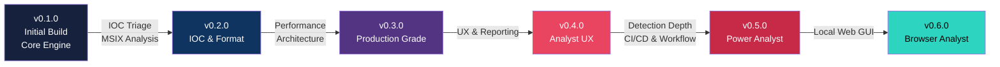

# Changelog

Repository: https://github.com/Masriyan/FlatScan

All notable project changes are documented here. Format follows [Keep a Changelog](https://keepachangelog.com/).

---

## Version Evolution

```mermaid
graph LR
    A["v0.1.0<br/>Initial Build<br/>Core Engine"] -->|"IOC Triage<br/>MSIX Analysis"| B["v0.2.0<br/>IOC & Format"]
    B -->|"Performance<br/>Architecture"| C["v0.3.0<br/>Production Grade"]
    C -->|"UX & Reporting"| D["v0.4.0<br/>Analyst UX"]
    D -->|"Detection Depth<br/>CI/CD & Workflow"| E["v0.5.0<br/>Power Analyst"]
    E -->|"Local Web GUI"| F["v0.6.0<br/>Browser Analyst"]
    
    style A fill:#16213e,color:#fff
    style B fill:#0f3460,color:#fff
    style C fill:#533483,color:#fff
    style D fill:#e94560,color:#fff
    style E fill:#c62a47,color:#fff
    style F fill:#2dd4bf,color:#000
```

| Version | Focus | Key Features |
|---------|-------|-------------|
| **0.6.0** | Local Web GUI | Self-contained `--web` browser interface (zero new dependencies), drag-and-drop upload, async scan jobs, 9 result tabs, on-the-fly download of every output format incl. zipped report pack |
| **0.5.0** | Detection Depth & CI/CD | API chain detection, packer fingerprinting, CI/CD mode, semantic exit codes, parallel batch, score breakdown, new IOC types, cryptominer/wiper families |
| **0.4.0** | Analyst UX & Reporting | Shell completion, grouped help, post-scan hints, dark HTML report, PDF risk bar, batch Size column |
| **0.3.0** | Performance & Architecture | Parallel pipeline, plugins, STIX 2.1, watch mode, mmap, structured logging |
| **0.2.0** | IOC Triage & MSIX | IOC suppression, MSIX/AppX analysis, Magniber detection, interactive mode |
| **0.1.0** | Initial Build | Full analysis engine, 12 output formats, PE/ELF/Mach-O/APK/DEX parsers |

---

## 0.6.0 - Local Web GUI Release

Released 2026-06-06.

### Added

- **Self-contained web GUI** (`--web`) — launches a local single-page analysis console in the browser. Implemented as two new files with **zero new external dependencies** (Go standard library only):
  - `web.go` — HTTP server, async scan-job model, and four endpoints: `GET /` (UI), `POST /api/scan` (multipart upload), `GET /api/result/{id}` (poll), `GET /api/download/{id}/{format}` (stream artifact).
  - `web_ui.go` — the entire dark "terminal" single-page app (HTML + CSS + vanilla ES2020) embedded as a Go string constant; no CDN, fonts, or npm packages.
- **`--web-port <n>` flag** — port for `--web` mode (default `5000`).
- **Drag-and-drop upload** with file preview, scan-mode selector (quick/standard/deep), and per-request option toggles: `--carve`, `--yara`, `--sigma`, `--stix`, `--report-pack`.
- **Asynchronous scan jobs** — uploads return a job id immediately (HTTP 202); the browser polls every 800 ms and renders results on completion. Each job runs in its own goroutine with panic recovery.
- **Nine result tabs** rendered entirely from the JSON `ScanResult`: overview (verdict bar, score breakdown, stat cells, collapsible hashes + section-entropy map), findings (grouped by severity, expandable), IOC (per-category sub-tabs with copy buttons), functions (deduplicated, severity-sorted table), PE details (header + suspicious-import highlighting), artifacts (carved / config / external tools / family matches), profile (classification, MITRE ATT&CK TTPs, crypto indicators, recommendations), log, and outputs (download buttons).
- **In-browser downloads** for every generated format — `json`, `txt`, `iocs`, `yar`, `yml`, `stix`, and a **`pack`** option that streams the full report pack zipped on the fly (`archive/zip`).
- **In-session scan history** (last 10 scans, click to reload a previous result).

### Security

- Server binds to **loopback only** (`127.0.0.1`) and ships **no authentication** — it is a single-user local tool. A clear warning is printed on startup.
- **Per-job isolation** — every upload is written into its own `os.MkdirTemp` directory; all generated artifacts stay inside it. A background reaper deletes finished jobs and their temp dirs after 30 minutes.
- **Upload filename sanitization** (`safeFileName`) strips path separators, `..` traversal, control characters, and quotes — preventing directory escape and `Content-Disposition` header injection.
- **Upload size cap** of 256 MB enforced via `http.MaxBytesReader`; multipart spill files are cleaned up after the upload is copied out.
- `X-Content-Type-Options: nosniff` is set on every response; no CORS headers are emitted.

### Changed

- Version bumped to **0.6.0** (the web UI footer and `--version` now report 0.6.0).
- `main.go` gained two `Config` fields (`WebMode`, `WebPort`), two flag registrations, a `main()` dispatch branch, and a `--web` carve-out in the "no target specified" check, plus a new **WEB** section in `--help`.

### Known Issues

- The core scanner's parallel pipeline (`parallelRun` → `ExtractCryptoAndConfigWithCorpus` vs `BuildSimilarityInfo`) has a **pre-existing data race** that the race detector flags on a full scan (CLI and web alike). It is not introduced by the web GUI and is tracked for a fix. See QC_REPORT.md.

---

## 0.5.0 - Detection Depth, CI/CD, and Workflow Release

### Added

- **API behavioral chain detection** (`chains.go`) — 7 multi-stage attack chains scored as single Critical/High findings instead of N individual low signals: Classic DLL Injection, Process Hollowing, Keylogger + Exfiltration, Credential Theft + Webhook, Persistence + Evasion, Ransomware Encrypt + Wipe, Named Pipe C2 + Injection. Each chain carries a MITRE tactic/technique and recommendation.
- **Packer / protector fingerprinting** (`packer.go`) — Section-name and overlay-marker detection for UPX, Themida/WinLicense, VMProtect, MPRESS, ASPack, Enigma Protector, PELock, plus a generic single-section/high-entropy/no-imports heuristic.
- **Wiper family detection** — Shadow copy / boot-recovery deletion strings (`vssadmin delete`, `bcdedit /set recoveryenabled no`) and low-level disk write API chains mapped to MITRE T1490/T1485.
- **Cryptominer family detection** — Stratum protocol strings, GPU library references (`cuda.dll`, `OpenCL`), Monero-specific strings (`cryptonight`, `randomx`, `donate.v2.xmrig`) mapped to MITRE T1496.
- **~20 new API patterns** in `signatures.go`: NT-level injection (`ZwMapViewOfSection`, `NtAllocateVirtualMemory`, `NtWriteVirtualMemory`, `RtlCreateUserThread`), thread control (`SetThreadContext`, `GetThreadContext`, `ResumeThread`), timing/anti-analysis evasion (`GetTickCount64`, `QueryPerformanceCounter`, `GetVolumeInformation`, `NtQuerySystemInformation`), named pipe C2 (`CreateNamedPipe`, `ConnectNamedPipe`, `TransactNamedPipe`), lateral movement recon (`NetShareEnum`, `NetGroupGetUsers`), BCrypt APIs (`BCryptGenerateSymmetricKey`, `BCryptImportKeyPair`, `CryptHashData`, `CryptDeriveKey`).
- **Entropy false-positive mitigation** — Compressed/archive formats (zip, 7z, rar, gz, bz2, xz, zst, lz4, cab) skip the global-entropy finding; section-level entropy findings are unaffected.
- **New IOC types** (`ioc.go`, `types.go`): Ethereum wallet addresses (`0x[40 hex]`), Monero addresses (95-char base58), Bitcoin addresses, mutex names (`Global\...`, `Local\...`), named pipe paths (`\\.\pipe\...`). Added `Mutexes`, `NamedPipes`, `CryptoWallets` fields to `IOCSet`. Updated `MergeIOCSet`, `IOCCount`, IOC file export, text reports, color reports, and HTML IOC tabs.
- **`--ci` / `--ci-threshold <n>` flags** — CI/CD mode: suppresses splash and progress, prints a single machine-readable summary line to stderr (`FLATSCAN: MALICIOUS score=82 file=sample.bin findings=13 sha256=...`), exits 10 if score ≥ threshold (default 55), exits 0 otherwise.
- **Semantic exit codes** — `0` clean (score < 30), `10` suspicious (score ≥ 30), `20` likely malicious (score ≥ 80), `1` scan error, `2` usage error. Applies to all scans, not just CI mode.
- **`--output-format text|json|csv|jsonl`** — Machine-readable stdout formats. `csv` produces `filename,score,verdict,findings,iocs,sha256`. `jsonl` writes a compact single-line JSON object suitable for streaming into SIEM or `jq` pipelines. Both suppress hints and text report.
- **`--batch-json <path>`** — Writes a structured JSON summary after batch scans: `scanned`, `malicious`, `suspicious`, `clean`, `errors`, `duration`, and per-file `results` array.
- **`--watch-alert-only`** — In watch mode, silently skips files scoring below the alert threshold (55). Clean files update a one-line status counter instead of printing a full scan result.
- **Score breakdown in report header** — Every scan shows a compact per-category breakdown: `Score breakdown: [Credential Access:44 Evasion:31 Network:12 Packing:24 ...]`. Also included in JSON output as `score_breakdown`.
- **Parallel batch scanning** — `RunBatchScan` now uses a `runtime.NumCPU()` goroutine worker pool with a semaphore, reducing wall-clock time proportionally to available cores.
- **HTML global search** — A search input in the sticky nav bar live-filters both finding cards and IOC rows as you type. Match count is displayed.
- **HTML new IOC tabs** — Mutexes, Named Pipes, and Crypto Wallets tabs added to the tabbed IOC panel.
- **`--batch-json` help section** and **CI/CD section** added to grouped `--help` output.

### Changed

- `FinalizeRisk` now computes `ScoreBreakdown map[string]int` (category → cumulative score) alongside the existing risk score.
- Scanner pipeline calls `DetectAPIChains` and `DetectPackers` after pattern matching and format analysis.
- `hints.go` suppresses hints when `--ci`, `--output-format != text`, or `--json -` is active to avoid polluting machine-readable stdout.
- `RunConfiguredScan` text report printing gate now also checks `cfg.OutputFormat == "text"` and `!cfg.CI`.
- Batch scan progress suppresses per-file progress bars (sub-processes set `NoProgress = true`) to keep output clean.
- `IOCSet` extended with `Mutexes`, `NamedPipes`, `CryptoWallets` across `MergeIOCSet`, `IOCCount`, text report, color report, HTML, and IOC file export.

### Fixed

- Watch mode `--watch-alert-only` flag now correctly suppresses clean file output rather than printing an empty block.
- `--output-format csv/jsonl` no longer prints the hints block alongside the machine-readable line.

---

## 0.4.0 - Analyst UX and Reporting Release

### Added

- **Shell completion** (`completion.go`) — `--completion bash|zsh|fish` prints a ready-to-source completion script. Covers all flags, file/dir path completions, and enum values for `--mode`, `--report-mode`, and `--completion`.
- **Grouped, colored `--help`** — Replaced raw `flag.PrintDefaults` with hand-written sections (SCAN TARGET, OUTPUT, CI/CD, ADVANCED, WATCH/CASE, FLAGS) with ANSI color coding (cyan headers, green flags, dim notes) and `NO_COLOR` / non-terminal fallback.
- **Post-scan hints** (`hints.go`) — After each scan, FlatScan prints contextual follow-up tips based on what was found vs. what flags were used: `--carve` for high-entropy regions, `-m deep` when findings are dense, `--pdf`/`--yara`/`--stix` for high-score results, `--external-tools` in deep mode.
- **HTML dark analyst theme** — Complete HTML report rewrite: CSS custom properties for dark/light theme, `toggleTheme()` button, sticky nav bar with verdict badge and section jump links.
- **HTML SVG risk gauge** — Semicircle arc gauge with score-to-angle math, colored fill, and score label.
- **HTML MITRE heatmap** — TTPs grouped by tactic into columns; cells colored by confidence level.
- **HTML tabbed IOC panel** — URLs, Domains, IPs, Hashes, Registry, Paths, Emails, CVEs tabs with per-tab search filter and per-IOC clipboard copy buttons.
- **HTML syntax-highlighted JSON** — Token-by-token JSON coloring (keys, strings, numbers, booleans, nulls) in the raw JSON section.
- **PDF segmented risk bar** — Cover page horizontal bar split into green/amber/orange/red segments with a score-marker triangle.
- **PDF severity badge chips** — Colored filled-rectangle severity badges replacing plain `[High]` text prefix in finding rows.
- **PDF footer** — Version string and scan date added to every page footer.
- **Batch table Size column** — Batch summary table now shows `Size` column using `formatBytes`, plus improved footer with malicious/suspicious/clean/error counts.

### Changed

- `main.go` `main()` captures `ScanResult` and passes it to `PrintPostScanHints`.
- `printGroupedHelp` changed to a zero-parameter function writing directly to `os.Stderr`.
- Better error messages: `"unknown mode %q — valid values: quick, standard, deep"`, `"no target specified — use -f <file> or --dir <directory>"`.
- `const defaultVersion` bumped from `0.3.0` to `0.4.0`.

---

## 0.3.0 - Performance and Architecture Release

### Added

- **Colorized terminal output** — ANSI severity badges, emoji section headers, risk score visual bar, verdict color coding. Auto-detects terminal capability and respects `NO_COLOR` environment variable and `--no-color` flag.
- **Batch directory scanning** — `--dir PATH` scans all regular files in a directory with per-file progress and a colorized summary table showing verdicts, scores, findings, IOC counts, and file types.
- **Watch mode** — `--dir PATH --watch` monitors a directory for new or modified files and auto-scans them with immediate colorized alerts for malicious detections. Configurable polling interval via `--watch-interval`.
- **JSON stdout** — `--json -` pipes machine-readable JSON output directly to stdout for scripting and pipeline integration.
- **STIX 2.1 export** — `--stix PATH` generates a standards-compliant STIX 2.1 JSON bundle containing File SCO (with PE extension), Malware Analysis SDO, IOC Indicators (URLs, domains, IPs), Malware SDO, and Relationship objects. Included in `--report-pack` output.
- **Build-time version injection** — `var version` can be set at build time via `go build -ldflags "-X main.version=1.0.0"`.
- **Structured logging** — `Logger` module with levels (DEBUG/INFO/WARN/ERROR), thread-safe writes, entry capture for post-scan analysis, and backward-compatible `AsDebugLogger()` bridge.
- **Analysis plugin interface** — `AnalysisPlugin` interface with `Name()`, `Version()`, `ShouldRun()`, and `Run()` methods. Plugin registry with `RegisterPlugin()`. Two built-in plugins: high-entropy blob detector and suspicious PE import combinator (process hollowing, reflective injection).
- **JSON plugin manifests** — External plugins can be defined via JSON files with string-matching checks, mode filters, and file type filters. Loaded via `LoadJSONPlugin()`.
- **Scan caching** — SHA256-based result cache with TTL expiry and file-size validation. Thread-safe for concurrent batch scanning. Supports `Get`, `Put`, `Invalidate`, `Clean`, and `Size` operations.
- **Memory-mapped I/O** — `syscall.Mmap` on Linux for files exceeding 100 MB. Transparent fallback to buffered read on other platforms or failure. Zero-copy hash computation directly over the mapped region.

### Changed

- **Parallel analysis pipeline** — Independent analysis stages (format analysis, carving, crypto/config extraction, similarity hashing) now execute concurrently via `parallelRun()`. Thread-safe finding append via package-level mutex. Verified clean by Go race detector.
- **Interactive mode reports** now use colorized output when terminal supports it. File exports remain plain text (no ANSI escape codes).
- **Progress bar phases** updated to reflect new pipeline stages: `running analysis plugins`, `running rules and classification`.
- **Report pack** now includes STIX 2.1 JSON bundle alongside existing PDF, HTML, JSON, IOC, YARA, Sigma, and executive markdown outputs.
- **Scanner debug log** now uses structured `Logger` entries instead of bare string formatting.

### Performance

- **Corpus caching** — Single shared corpus string built once and passed to all 5 pattern-matching stages (previously rebuilt independently by each stage).
- **Incremental entropy** — Sliding-window entropy uses an incremental histogram update, reducing per-iteration cost from O(window) to O(step).
- **Zero-alloc string extraction** — Direct byte-slice indexing eliminates thousands of per-string heap allocations.
- **XOR buffer reuse** — Single pre-allocated buffer shared across all single-byte XOR key probes.
- **IOC batch normalization** — Deferred IOC normalization runs once at the end instead of per-extraction.
- **Named constants** — 13 named constants replacing magic numbers in the analysis pipeline.

### Fixed

- **JSON stdout (`--json -`)** — Text report no longer prints to stdout when `--json -` is active, making the output parseable by `jq` and other JSON tools.
- **STIX verdict mapping** — Scores 30-79 now correctly map to `"suspicious"` instead of incorrectly mapping 10-54 as `"benign"`.
- **Logger thread safety** — Merged double-lock in `log()` method into a single critical section to prevent log interleaving.
- **Logger `WithPrefix`** — Child loggers now use independent entry lists instead of sharing the parent's slice.
- **Watch mode hash preview** — Added bounds check for SHA256 string slicing to prevent panic on empty hash.
- **Version constant** — Updated default version from `0.2.0` to `0.3.0`.
- **Interactive STIX support** — Added STIX 2.1 export to interactive mode output profile 3 (full analyst/CISO pack).
- **Test coverage** — Expanded from 12 to 22 tests covering STIX, cache, logger, parallel pipeline, plugin system, and JSON stdout.

## 0.2.0 - IOC Triage and MSIX Analysis

### Added

- IOC triage layer with built-in suppression for common benign PKI, certificate-revocation, OCSP, XML schema, Android schema, W3C, OpenXML, OID, loopback, and broadcast artifacts.
- `--ioc-allowlist` for operator-supplied IOC allowlists without recompiling.
- Guided interactive mode with `--interactive` and `-i`.
- Manual command shell with `--shell` for typing repeated FlatScan commands inside one program session.
- Shell-style argument parsing for quoted paths in manual command shell mode.
- JSON IOC audit fields: `suppressed_count`, `suppression_reason`, and `suppression_log`.
- Top-level `iocs.pe_hashes` for embedded payload pivots.
- Promotion of carved ZIP-local payload records into top-level IOCs when the carved preview points at an embedded `.exe` or `.dll`.
- Promotion of decompressed embedded PE execution hashes into top-level IOCs.
- Priority tiers for embedded payload hashes based on compression ratio and entropy.
- MSIX/AppX package detection from `AppxManifest.xml`, `AppxSignature.p7x`, `AppxBlockMap.xml`, and `[Content_Types].xml`.
- MSIX manifest parsing for identity name, publisher, version, declared executables, capabilities, and undeclared executable payloads.
- MSIX findings for unknown or untrusted publisher, `runFullTrust`, and hidden executable payloads.
- AppxSignature.p7x hashing and dependency-free certificate parse status.
- Magniber-style random lowercase directory/executable-name detection.
- Magniber ransomware family hypothesis scoring for MSIX delivery, embedded payloads, random naming, matching directory/file stems, entropy, and small loader payloads.
- Report rendering for MSIX metadata, embedded PE payload hashes, IOC suppression counts, and suppression audit details.
- PDF and HTML report sections for promoted payload hashes and MSIX metadata.
- Unit tests for IOC triage and MSIX hidden-payload detection.

### Changed

- YARA generation now avoids FlatScan self-generated classification strings as match strings.
- YARA generation now uses triaged IOCs, suspicious payload entry names, MSIX structure guards, and `math.entropy()` where useful.
- Sigma generation for archive/container samples now focuses on hashes and payload image path patterns instead of command-line matches on schema URLs or format strings.
- IOC exports now prioritize embedded payload hashes ahead of network indicators.
- ZIP-family entry analysis records entry type, SHA256, entropy, offset, and compression ratio when entry bytes are inspected.
- Family classification can now escalate MSIX + embedded payload + Magniber naming evidence to `Magniber ransomware`.

### Fixed

- Suppressed benign DigiCert, Microsoft schema, OpenXML, W3C, and ASN.1/OID artifacts that previously appeared as actionable IOCs.
- Prevented benign MSIX format infrastructure from dominating IOC exports and generated hunting content.
- Corrected signal ordering so embedded payload hashes are no longer buried only in carved artifact output.

## 0.1.0 - Initial Development Build

### Added

- Go CLI scanner named `flatscan`.
- Scan modes: `quick`, `standard`, and `deep`.
- Text report modes: `minimal`, `Summary`, and `Full`.
- Full-file MD5, SHA1, SHA256, and SHA512 hashing.
- File type and MIME hint detection.
- ASCII string extraction.
- UTF-16LE string extraction.
- IOC extraction:
  - URLs
  - domains
  - IPv4
  - IPv6
  - emails
  - MD5
  - SHA1
  - SHA256
  - SHA512
  - CVEs
  - registry keys
  - Windows paths
  - Unix paths
- Suspicious base64 decoding.
- Suspicious hex decoding.
- URL-percent decoding.
- Nested decode depth control with `--decode-depth`.
- Entropy scoring.
- High-entropy region detection.
- PE parser:
  - machine type
  - timestamp
  - subsystem
  - image base
  - entry point
  - imports
  - approximate import hash
  - section table
  - section entropy
  - executable/writable section flags
  - certificate table presence
  - overlay size
  - .NET runtime detection through `_CorExeMain` / `mscoree.dll`
- ELF parser:
  - class
  - machine
  - type
  - imports
  - sections
- Mach-O parser:
  - CPU
  - type
  - imports
  - sections
- ZIP/APK/JAR/Office Open XML container inspection.
- APK-aware Android manifest parser for package identity, version, SDK targets, requested permissions, exported components, intent actions, network-security config references, signature files, assets, native libraries, and embedded payloads.
- DEX-aware string/API scanner for Android SMS, contacts, location, recording, accessibility services, overlays, device administrator behavior, runtime command execution, dynamic class loading, WebView bridges, native loading, package installation, networking, and Java crypto indicators.
- Declarative rule/plugin pack engine with `--rules` and `--plugins`.
- Rule matching for file types, strings, regexes, functions/APIs, domains, URLs, SHA256 values, and entropy ranges.
- Optional safe embedded file carving with `--carve` and `--max-carves`.
- Malware family classifier for ransomware, infostealers, loaders, RAT-like behavior, Android riskware, webshell/toolkit content, and bundled payloads.
- Crypto/config extractor for C2-like URLs, token markers, mutex candidates, ransom notes, wallet-looking strings, decoded configs, embedded compressed streams, and simple XOR candidates.
- Similarity hashing:
  - FlatHash
  - byte-histogram hash
  - string-set hash
  - import hash
  - section hash
  - DEX string hash
  - archive-content hash
- Optional external metadata-tool integration with `--external-tools`.
- Interactive analyst HTML report with `--html`.
- Professional report pack export with `--report-pack`.
- Local JSONL case database recording with `--case` and `--case-db`.
- Archive-entry suspicious heuristics:
  - path traversal names
  - executable/script extensions
  - Office macro indicators
  - Android package indicators
  - archive bomb heuristic
- Behavioral findings:
  - process injection API chains
  - dynamic API resolution
  - downloader behavior
  - command-and-control style network strings
  - Discord webhook exfiltration
  - Discord account/API access indicators
  - browser credential decryption indicators
  - Windows persistence indicators
  - Linux persistence indicators
  - suspicious PowerShell execution
  - script host and LOLBin indicators
  - ransomware-style strings
  - credential and wallet theft indicators
  - VM/sandbox awareness
  - anti-debugging references
  - security tooling bypass indicators
  - packer/protector markers
  - high IOC density
- Malware profile enrichment:
  - classification
  - likely malware type
  - confidence score
  - business impact
  - key capabilities
  - recommended actions
  - MITRE-style TTP entries
  - cryptography indicators
  - executive assessment
- Cryptography and secret-handling indicators:
  - Windows CNG BCrypt
  - Windows CryptoAPI/DPAPI-style references
  - Chromium `encrypted_key` workflow
  - symmetric crypto markers
  - decoded-obfuscation layer indicators
- CISO/management-ready PDF report with:
  - cover page
  - executive assessment
  - risk cards
  - CISO decision summary
  - final analyst assessment
  - evidence summary table
  - business impact
  - management actions
  - MITRE ATT&CK TTP matrix
  - priority findings
  - cryptography and secret-handling assessment
  - hunting guidance
  - sample metadata
  - IOCs
  - executable/container details
  - Android APK/DEX details
  - advanced analysis section
  - family classifier output
  - crypto/config artifacts
  - safe carved artifact hashes
  - similarity hashes
  - suspicious strings
  - decoded artifacts
- JSON report export with `--json`.
- HTML report export with `--html`.
- IOC text export with `--extract-ioc`.
- YARA hunting rule export with `--yara`.
- Sigma SIEM/EDR hunting rule export with `--sigma`.
- Startup ASCII banner and loading bar.
- Progress display with percentage updates.
- `--no-progress` for automation.
- `--no-splash` for disabling the startup banner/loading bar.
- `--splash-seconds` for splash duration control.
- Debug logging with `--debug`.
- Unit tests for IOC extraction, decoding, file type detection, PDF generation, YARA rendering, Sigma rendering, custom rules, and HTML rendering.

### Changed

- Improved progress renderer to clear leftover terminal characters when shorter progress messages overwrite longer ones.
- Improved PDF layout alignment, wrapping, section styling, table grids, long IOC handling, headers, and footers.
- Improved APK scoring to avoid treating normal Android package structure as malicious while still surfacing Android-specific high-risk behaviors.
- Expanded documentation into:
  - `README.md`
  - `install.md`
  - `usage.md`
  - `contributing.md`
  - `security.md`
  - `changelog.md`

### Notes

- FlatScan is static-only and does not execute target samples.
- Generated YARA rules should be reviewed before production deployment.
- Cryptographic hashes are classified as IOCs but cannot be reversed.
