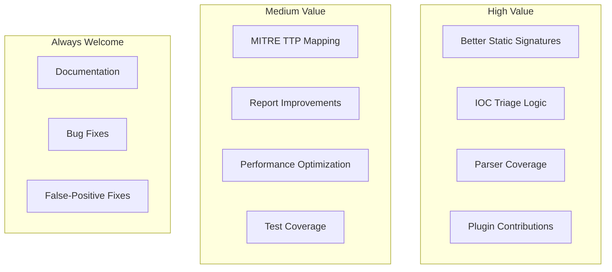
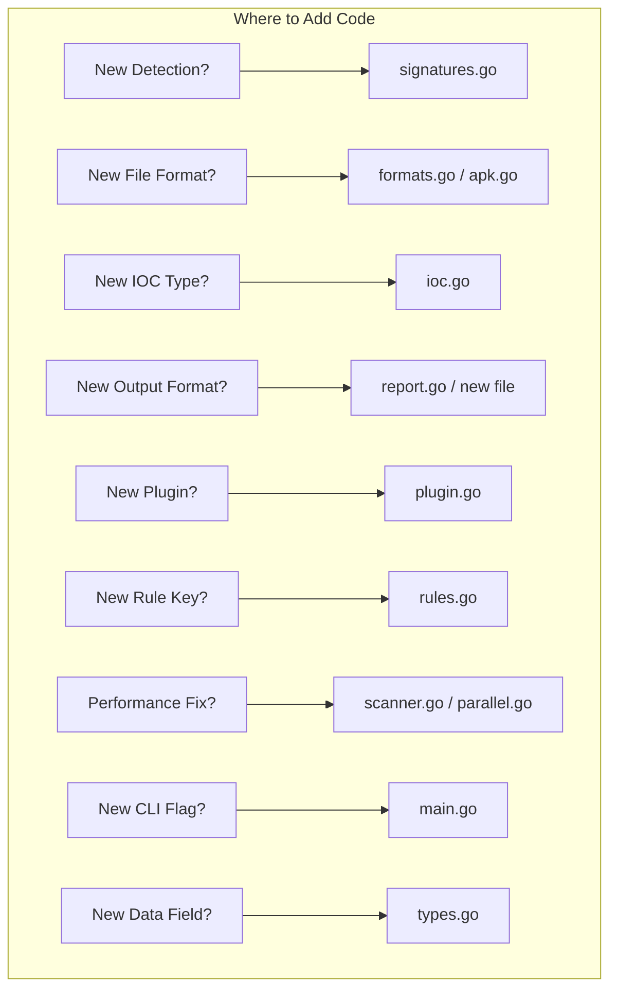
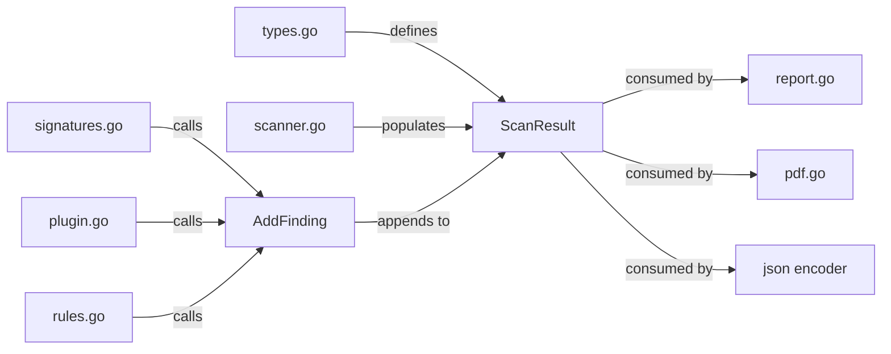
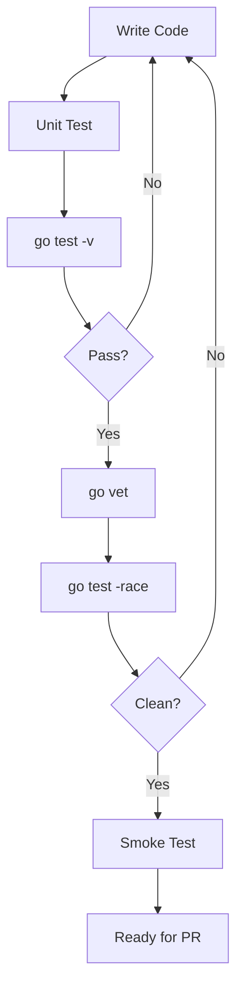
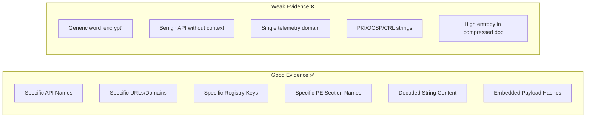
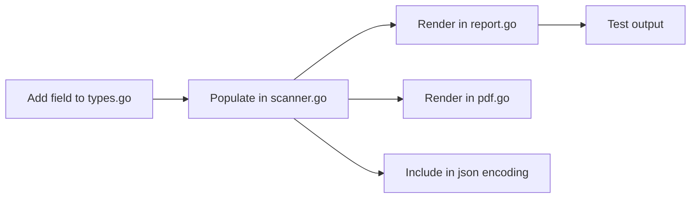

# Contributing

Repository: https://github.com/Masriyan/FlatScan

Thanks for improving FlatScan. This project is a malware-analysis engine, so contributions should prioritize **correctness, safety, and clear reporting** over flashy output.

---

## Table of Contents

- [Contribution Priorities](#contribution-priorities)
- [Development Setup](#development-setup)
- [Architecture Guide](#architecture-guide)
- [Code Style](#code-style)
- [Testing](#testing)
- [Adding New Detections](#adding-new-detections)
- [Adding Report Features](#adding-report-features)
- [Plugin Development](#plugin-development)
- [IOC & Rule Quality](#ioc--rule-quality)
- [Handling Malware Samples](#handling-malware-samples)
- [Commit & PR Guidelines](#commit--pr-guidelines)

---

## Contribution Priorities



| Priority | Contribution Type |
|----------|------------------|
| 🔴 High | Better static signatures with clear evidence and low FP risk |
| 🔴 High | Better IOC triage logic that reduces false positives |
| 🔴 High | Better parser coverage for PE, ELF, Mach-O, APK, MSIX |
| 🟡 Medium | Plugin contributions (built-in or JSON manifest) |
| 🟡 Medium | Improved malware profile enrichment and MITRE mapping |
| 🟡 Medium | Better PDF/HTML report sections |
| 🟡 Medium | YARA/Sigma export improvements |
| 🟢 Always | Tests for scanner behavior and report output |
| 🟢 Always | Documentation that helps analysts |
| 🟢 Always | Bug fixes and false-positive corrections |

---

## Development Setup

```bash
git clone https://github.com/Masriyan/FlatScan
cd FlatScan
go test ./...
go build -o flatscan .
```

### Verification

```bash
go vet ./...
go test -race -count=1 ./...
gofmt -w *.go
```

---

## Architecture Guide

Understanding the pipeline helps you know where to add code:



### Key Files

| File | Responsibility | When to Edit |
|------|---------------|-------------|
| `types.go` | All data structures | Adding new fields to ScanResult |
| `scanner.go` | Analysis pipeline orchestration | Changing pipeline order or adding stages |
| `signatures.go` | Behavioral detection | Adding new signature patterns |
| `plugin.go` | Plugin interface and registry | Adding built-in plugins |
| `rules.go` | Rule pack engine | Adding new rule matching keys |
| `ioc.go` | IOC extraction | Adding new IOC types |
| `ioc_triage.go` | IOC suppression | Updating allowlists |
| `formats.go` | File type detection | Adding new magic bytes |
| `main.go` | CLI flags and dispatch | Adding new flags |

### Data Flow



---

## Code Style

| Rule | Rationale |
|------|-----------|
| Use Go standard library only | Zero dependencies is a core design principle |
| Run `gofmt` on modified files | Consistent formatting |
| Prefer clear data structures | Over ad hoc string-only logic |
| Add comments only where non-obvious | Don't over-comment |
| Never execute target samples | Static analysis only |
| No default network calls | Any enrichment must be explicit and optional |
| Thread-safe finding writes | Use `AddFinding`/`AddFindingDetailed` — they hold `findingsMu` |

---

## Testing

### Before Submitting

```bash
gofmt -w *.go
go test -v ./...
go vet ./...
go test -race -count=1 ./...
go build -o flatscan .
```

### Smoke Tests

```bash
# Quick smoke test
./flatscan -m quick -f README.md --report-mode minimal --no-progress --no-color

# Full output smoke test
./flatscan -m deep -f README.md \
  --report-mode Full \
  --report reports/readme.full.txt \
  --json reports/readme.json \
  --pdf reports/readme.pdf \
  --yara reports/readme.yar \
  --sigma reports/readme.sigma.yml \
  --stix reports/readme.stix.json \
  --extract-ioc reports/readme.iocs.txt \
  --no-progress --no-color
```

### Test Coverage Flow



---

## Adding New Detections

### Finding Quality Guidelines



### Steps

1. **Add clear evidence** — specific strings, APIs, or structural indicators
2. **Choose severity conservatively** — prefer `Medium` over `High` when uncertain
3. **Match existing categories** — check `signatures.go` for patterns
4. **Add MITRE tactic/technique** only when evidence supports it
5. **Add a practical recommendation** — what should the analyst do?
6. **Avoid duplicates** — `AddFinding` auto-deduplicates by title+evidence
7. **Add or update tests** when possible

### Example

```go
func checkMyNewDetection(result *ScanResult, corpus string) {
    if strings.Contains(corpus, "suspicious_api_call") &&
       strings.Contains(corpus, "another_indicator") {
        AddFindingDetailed(result,
            "High",            // severity
            "Injection",       // category
            "Suspicious API combination detected", // title
            "Found suspicious_api_call + another_indicator", // evidence
            22,                // score
            0,                 // offset
            "Defense Evasion", // tactic
            "Process Injection", // technique
            "Review process injection capability and correlate with endpoint logs.", // recommendation
        )
    }
}
```

---

## Adding Report Features

When adding fields to the output:



| Rule | Reason |
|------|--------|
| Add fields to `types.go` | Central data model |
| Populate during scan/enrichment | Keep pipeline clean |
| Render in relevant output formats | Consistent across all outputs |
| Keep JSON stable and explicit | Automation consumers depend on field names |
| Keep PDF readable for executives | Two audiences: analysts + management |

---

## Plugin Development

### Built-in Plugin

```go
func init() {
    RegisterPlugin(&myPlugin{})
}

type myPlugin struct{}

func (p *myPlugin) Name() string    { return "My Detection Plugin" }
func (p *myPlugin) Version() string { return "1.0" }

func (p *myPlugin) ShouldRun(result ScanResult, cfg Config) bool {
    return result.FileType == "PE executable"
}

func (p *myPlugin) Run(result *ScanResult, data []byte, strings []string, corpus string, cfg Config, debugf debugLogger) []PluginResult {
    // Your analysis logic here
    return nil
}
```

### JSON Plugin

Drop a `.json` file in the plugins directory:

```json
{
  "name": "Custom Detector",
  "version": "1.0",
  "checks": [
    {
      "title": "My detection",
      "severity": "Medium",
      "category": "Custom",
      "score": 10,
      "strings_any": ["indicator1", "indicator2"]
    }
  ]
}
```

---

## IOC & Rule Quality

| Guideline | Reason |
|-----------|--------|
| Run IOC triage before emitting indicators | Prevent benign infrastructure in reports |
| Keep suppression reasons auditable in JSON | Analyst transparency |
| Don't use FlatScan report text as YARA strings | Self-referential false positives |
| Don't generate Sigma selections from schema strings | Noisy and non-firing |
| Prefer payload hashes for container samples | Higher hunting value |
| Test against benign-format samples | Catch false positives |

---

## Handling Malware Samples

> ⚠️ **Do not commit live malware samples** to normal source-control history.

| Recommendation | Reason |
|----------------|--------|
| Password-protected archives | Prevent accidental execution |
| Store outside source tree | Keep repo clean |
| Clear warning labels | Prevent confusion |
| No live credentials in reports | Avoid data exposure |

---

## Commit & PR Guidelines

### Commit Scopes

```text
scanner: add Discord webhook exfiltration detection
pdf: improve MITRE matrix wrapping
yara: add generated rule export
plugin: add JSON manifest loader
docs: expand usage guide
tests: cover IOC extraction
perf: parallelize format analysis
```

### Pull Request Checklist

- [ ] What changed
- [ ] Why it matters
- [ ] How it was tested
- [ ] False-positive or safety tradeoffs
- [ ] Screenshots if changing PDF/HTML layout
- [ ] `go test ./...` passes
- [ ] `go vet ./...` clean
- [ ] `go test -race ./...` clean

Open issues and pull requests at: https://github.com/Masriyan/FlatScan
