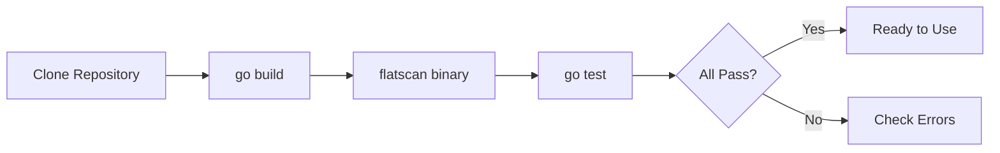
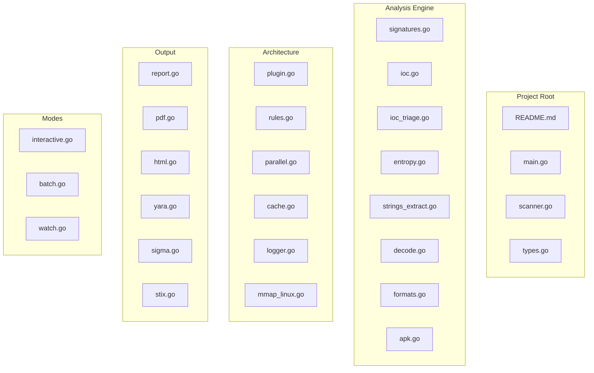
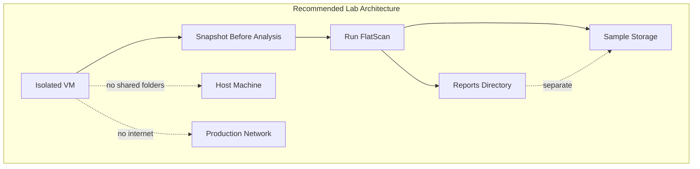

# Installation

Repository: https://github.com/Masriyan/FlatScan

This guide covers building, verifying, cross-compiling, and setting up a safe analysis environment for FlatScan.

---

## Table of Contents

- [Requirements](#requirements)
- [Build](#build)
- [Verify](#verify)
- [Cross-Compilation](#cross-compilation)
- [Project Structure](#project-structure)
- [Safe Lab Setup](#safe-lab-setup)
- [Troubleshooting](#troubleshooting)

---

## Requirements

| Requirement | Version | Required? |
|------------|---------|-----------|
| **Go** | 1.22+ | ✅ Yes |
| **OS** | Linux, macOS, or Windows | ✅ Yes |
| **Terminal** | Any shell | ✅ Yes |
| `file` | any | Optional — `--external-tools` |
| `exiftool` | any | Optional — `--external-tools` |
| `rabin2` | any | Optional — `--external-tools` |
| `jadx` | any | Optional — `--external-tools` |
| `apktool` | any | Optional — `--external-tools` |
| `yara` | any | Optional — validate generated `.yar` |
| `sigmac` | any | Optional — validate generated `.sigma.yml` |

> **FlatScan uses the Go standard library only.** No third-party Go modules required. No `go.mod` dependencies.

---

## Build

### Clone and Build

```bash
git clone https://github.com/Masriyan/FlatScan
cd FlatScan
go build -o flatscan .
```

### Build With Version Tag

```bash
go build -ldflags "-X main.version=0.3.0" -o flatscan .
```

### Restricted Build Cache

If the default Go build cache is restricted:

```bash
GOCACHE=/tmp/flatscan-go-build go build -o flatscan .
```

### Build Flow



---

## Verify

### Run Tests

```bash
go test -v ./...
```

Expected output:

```text
=== RUN   TestExtractIOCs
--- PASS: TestExtractIOCs (0.00s)
=== RUN   TestDetectFileType
--- PASS: TestDetectFileType (0.00s)
    --- PASS: TestDetectFileType/pe (0.00s)
    --- PASS: TestDetectFileType/elf (0.00s)
    --- PASS: TestDetectFileType/pdf (0.00s)
    --- PASS: TestDetectFileType/zip (0.00s)
    --- PASS: TestDetectFileType/java-class (0.00s)
...
PASS
ok      flatscan        0.007s
```

### Run Race Detector

```bash
go test -race -count=1 ./...
```

### Run Vet

```bash
go vet ./...
```

### Check Binary

```bash
./flatscan --version
./flatscan --help
```

Expected version:

```text
FlatScan 0.3.0
```

### Verification Checklist

| Check | Command | Expected |
|-------|---------|----------|
| Build | `go build -o flatscan .` | No errors |
| Tests | `go test ./...` | 12/12 pass |
| Race | `go test -race ./...` | No races |
| Vet | `go vet ./...` | No warnings |
| Version | `./flatscan --version` | Version string |
| Help | `./flatscan --help` | Usage text |

---

## Cross-Compilation

FlatScan cross-compiles to any Go-supported platform:

```bash
# Linux AMD64
GOOS=linux GOARCH=amd64 go build -o flatscan-linux-amd64 .

# Linux ARM64
GOOS=linux GOARCH=arm64 go build -o flatscan-linux-arm64 .

# Windows AMD64
GOOS=windows GOARCH=amd64 go build -o flatscan.exe .

# macOS Apple Silicon
GOOS=darwin GOARCH=arm64 go build -o flatscan-darwin-arm64 .

# macOS Intel
GOOS=darwin GOARCH=amd64 go build -o flatscan-darwin-amd64 .
```

### Platform Feature Matrix

| Feature | Linux | macOS | Windows |
|---------|-------|-------|---------|
| Core scanning | ✅ | ✅ | ✅ |
| Colorized output | ✅ | ✅ | ✅ (ANSI terminals) |
| Memory-mapped I/O | ✅ (syscall.Mmap) | ❌ (fallback to read) | ❌ (fallback to read) |
| Watch mode | ✅ | ✅ | ✅ |
| External tools | ✅ | ✅ | Partial |

> **Note:** Memory-mapped I/O is Linux-only via `syscall.Mmap`. On other platforms, FlatScan transparently falls back to buffered read with identical analysis results.

### Install Globally (Optional)

Linux/macOS:

```bash
sudo install -m 0755 flatscan /usr/local/bin/flatscan
flatscan --help
```

Or run from the project directory:

```bash
./flatscan --help
```

---

## Project Structure



### Full Directory Layout

```text
.
├── main.go                 # CLI entry point, flag parsing
├── scanner.go              # Core analysis pipeline
├── types.go                # Data structures (ScanResult, Finding, etc.)
├── interactive.go          # Interactive wizard and shell modes
├── batch.go                # --dir batch scanning
├── watch.go                # --dir --watch monitoring
├── parallel.go             # Concurrent pipeline executor
├── plugin.go               # Plugin interface and registry
├── cache.go                # SHA256-based scan result cache
├── logger.go               # Structured leveled logging
├── mmap_linux.go           # Memory-mapped I/O (Linux)
├── mmap_other.go           # Fallback for non-Linux
├── color.go                # ANSI terminal colorization
├── progress.go             # Progress bar renderer
├── splash.go               # Startup banner
├── platform.go             # Platform detection helpers
│
├── signatures.go           # Behavioral signature detection
├── ioc.go                  # IOC extraction engine
├── ioc_triage.go           # IOC deduplication and suppression
├── entropy.go              # Shannon entropy analysis
├── strings_extract.go      # String extraction (ASCII + UTF-16LE)
├── decode.go               # Base64/hex/URL decoder
├── formats.go              # File type detection
├── apk.go                  # Android APK/DEX analysis
├── carve.go                # Safe embedded file carving
├── config_extract.go       # Crypto/config artifact extraction
├── family.go               # Malware family classifier
├── similarity.go           # Similarity hash generation
├── expert.go               # Malware profile enrichment
├── rules.go                # Custom rule pack engine
├── external_tools.go       # Optional external tool integration
│
├── report.go               # Text report renderer
├── pdf.go                  # PDF report generator
├── html.go                 # HTML report generator
├── yara.go                 # YARA rule generator
├── sigma.go                # Sigma rule generator
├── stix.go                 # STIX 2.1 bundle generator
├── case_report_pack.go     # Report pack + case database
│
├── scanner_test.go         # Test suite
│
├── plugins/                # Example plugin packs
│   └── android-risk.rule
├── rules/                  # Example rule packs
│   └── starter.rule
├── reports/                # Generated report output
│
├── README.md
├── install.md
├── usage.md
├── contributing.md
├── security.md
└── changelog.md
```

---

## Safe Lab Setup



| Recommendation | Reason |
|----------------|--------|
| Isolated VM with snapshots | Revert after analysis sessions |
| No shared clipboard/folders | Prevent accidental sample escape |
| No direct production network access | Contain potential C2 callbacks |
| Dedicated sample storage directory | Organized and isolated |
| Password-protected archives | Safe sample transfer |
| Separate output directory for reports | Keep reports away from malware |

FlatScan does not execute the target file, but sample handling still requires care.

---

## Troubleshooting

| Issue | Solution |
|-------|----------|
| `go: cannot find main module` | Ensure you're in the FlatScan directory |
| Build cache errors | Use `GOCACHE=/tmp/flatscan-go-build` |
| `permission denied` | Check file permissions on the binary |
| mmap errors on non-Linux | Normal — falls back to buffered read |
| `--watch` without `--dir` | Watch mode requires `--dir` flag |
| Color codes in pipe output | Use `--no-color` when piping output |
