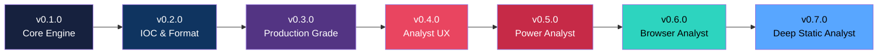
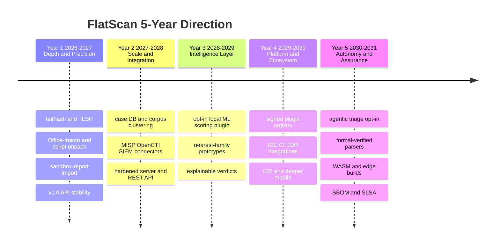

# FlatScan Roadmap

Repository: https://github.com/Masriyan/FlatScan

This document records **what FlatScan has shipped** and where it is headed over the **next five
years (2026 → 2031)**. The roadmap is directional, not a contract — dates and ordering will move
as the threat landscape and contributor bandwidth change. It is reviewed at each minor release.

---

## Guiding Principles (the roadmap must respect these)

These are the constraints every future feature is measured against. They are *non-negotiable for
the core*; anything that cannot honor them ships as an **opt-in plugin or enrichment**, never in the
default path.

| Principle | What it means for the roadmap |
|-----------|-------------------------------|
| **Zero dependencies** | The core stays Go standard library only. Network/ML/heavy parsers arrive via the plugin interface, not `go.mod`. |
| **Static only** | The engine never executes a sample. Dynamic insight is *imported* (sandbox reports), never produced by running malware. |
| **Offline-first** | A full scan must always work air-gapped. Any enrichment (TI lookups, model downloads) is explicit, documented, and disable-able. |
| **Analyst + management in one pass** | Every capability must serve both machine output (JSON/STIX/YARA) and human reporting (HTML/PDF). |
| **Conservative scoring** | New signals must not inflate false positives. A single weak indicator never tips a verdict alone. |

---

## What We've Built (0.1.0 → 0.7.0)

| Version | Theme | Highlights |
|---------|-------|-----------|
| **0.7.0** | Deep Static Analyst | **PE Header Intelligence** (DllCharacteristics/exploit-mitigation posture, Rich-header hash, TLS callbacks, Authenticode signer, entry-point sanity), **DGA domain scorer** (T1568.002), in-memory **.NET reflective-loader detection**, **detection-artifact FP guard**, PDF Unicode rendering fix, HTML/PDF downloads in web mode |
| **0.6.0** | Browser Analyst | Self-contained `--web` GUI (zero new deps), drag-and-drop upload, async scan jobs, 9 result tabs, on-the-fly downloads incl. zipped report pack |
| **0.5.0** | Power Analyst | API behavioral-chain detection, packer/protector fingerprinting, CI/CD gate mode + semantic exit codes, parallel batch, per-category score breakdown, wallet/mutex/pipe IOC types, cryptominer & wiper families |
| **0.4.0** | Analyst UX | Shell completion, grouped help, post-scan hints, dark HTML report, PDF risk bar |
| **0.3.0** | Production Grade | Parallel pipeline, plugin system, STIX 2.1, watch mode, mmap I/O, structured logging |
| **0.2.0** | IOC & Format | IOC triage/suppression, MSIX/AppX analysis, Magniber detection, interactive mode |
| **0.1.0** | Core Engine | Full static engine, multi-format output, PE/ELF/Mach-O/APK/DEX parsers |

### Current capability snapshot (v0.7.0)

- **Formats:** PE (incl. header intelligence), ELF, Mach-O, ZIP/JAR/APK/MSIX/AppX/Office-XML, DEX, PDF.
- **Detection:** behavioral signatures, API attack chains, packer fingerprints, family classifier
  (ransomware / stealer / loader / RAT / cryptominer / wiper / riskware), .NET reflective loading,
  detection-artifact recognition.
- **Intelligence:** IOC extraction + triage, DGA scoring, entropy/high-entropy regions, similarity
  hashes (FlatHash, imphash, section, Rich-header, string-set, byte-histogram), MITRE ATT&CK mapping.
- **Output:** Text, JSON, PDF, HTML, IOC list, YARA, Sigma, STIX 2.1, report pack.
- **Modes:** CLI, interactive, shell, batch, watch, CI/CD gate, local web GUI.

> Validated on a real-sample set: caught the WannaCry killswitch domain via DGA scoring and lifted a
> reflective .NET loader from "High suspicion" to "Likely malicious" with zero benign-side regression.
> Forward-looking candidates are catalogued in [`Docs/research-gap-analysis-2026-06-07.md`](Docs/research-gap-analysis-2026-06-07.md).

---

## The 5-Year Roadmap (2026 → 2031)

### Year 1 — Depth & Precision  ·  `v0.8` → `v1.0`

Finish the research-backed static depth and reach a stable 1.0.

- **More similarity / attribution hashing:** `telfhash` (ELF symbol-hash analog of imphash) and
  `TLSH` locality-sensitive hashing with a defined distance metric — pure-Go, strengthens clustering.
- **Deeper format coverage:** Office macros (OLE/VBA extraction + deobfuscation), LNK, OneNote,
  ISO/IMG/VHD/VHDX containers, email (EML/MSG), `.deb`/`.rpm`, and script unpacking
  (PowerShell / JS / VBS / HTA layered decode).
- **Hybrid context (still static):** import an external **sandbox/dynamic report**
  (CAPE / Cuckoo / Triage JSON) to overlay runtime IOCs onto the static profile — never executes.
- **Taxonomy completeness:** canonical **MITRE Mobile** technique IDs on Android findings,
  **CAPEC** cross-references alongside ATT&CK, consistent technique IDs across all modules.
- **Visualization:** byteplot / entropy-map image in the HTML report (stdlib `image/png`).
- **`v1.0` milestone:** semver stability guarantee, stable JSON schema, signed + reproducible
  releases, fuzz-tested parsers, documented public API.

### Year 2 — Scale & Integration  ·  `v1.x`

Move from single-file triage to corpus-scale workflows and the wider ecosystem.

- **Case database & corpus clustering:** persistent local case store, cross-sample correlation and
  campaign clustering built on the existing similarity hashes, sample timelines.
- **Threat-intel ecosystem (opt-in):** MISP import/export, OpenCTI / STIX 2.1 push, and
  enrichment connectors (VirusTotal, MalwareBazaar) shipped as plugins — offline-first preserved.
- **SIEM / SOAR connectors:** first-class Splunk / Elastic / Microsoft Sentinel output and
  webhook/SOAR actions from watch and CI modes.
- **Hardened server mode:** an authenticated REST API and multi-user daemon beyond the current
  single-user loopback web GUI; rate limiting, RBAC, audit log.
- **Performance at scale:** streaming analysis for multi-GB files, distributed/parallel batch,
  incremental re-scan, content-addressed result cache with version keys.

### Year 3 — Intelligence Layer  ·  `v2.0`

Add learned signal — strictly opt-in, local, and explainable — without compromising the core.

- **Pluggable ML scoring:** family-prototype / nearest-neighbour classification and learned
  packer/obfuscation detection delivered through the plugin interface with **local, bundled or
  BYO models** — the zero-dependency static core remains fully functional without them.
- **Explainable verdicts:** every score fully traceable; per-finding contribution graphs and
  "why this verdict" narratives.
- **Smarter rule generation:** behavior-graph-aware YARA/Sigma, auto-tuned thresholds,
  rule-quality linting.
- **Cross-architecture behavioral matching (IR-lite):** symbol- and capability-level normalization
  for ARM/MIPS/x86 IoT malware without heavyweight lifters.

### Year 4 — Platform & Ecosystem  ·  `v2.x`

Make FlatScan something teams build *on*.

- **Signed plugin registry:** discoverable, signed community plugins and subscribable rule packs.
- **Deep integrations:** native GitHub/GitLab CI actions, pre-commit hook, VS Code/JetBrains
  extensions, EDR/sandbox bridges.
- **SDKs & bindings:** Go, Python, and Rust client libraries against the stable API.
- **Mobile-first deep analysis:** iOS IPA parsing, deeper APK/DEX (Flutter / React-Native),
  certificate-pinning and SDK-risk insight.
- **Self-hosted multi-tenant deployment:** teams, projects, retention policy, and reporting roll-ups.

### Year 5 — Autonomy & Assurance  ·  `v3.0`

Analyst-grade autonomy and the assurance to trust it in regulated environments.

- **Agentic triage (opt-in):** orchestrate FlatScan + imported sandbox + TI into analyst-ready
  incident narratives using local or BYO-key LLMs — recommendations, never autonomous actions.
- **Continuous adaptation:** auto-updating family/rule knowledge with full provenance and rollback.
- **Assurance:** formally verified safety-critical parsers, continuous fuzzing, memory-safety
  guarantees, supply-chain attestation (SLSA), SBOM, and a FIPS-friendly build.
- **FlatScan everywhere:** WASM build for in-browser client-side triage and edge/embedded builds
  for appliance and gateway deployment (preemptive scanning before files reach endpoints).

---

## Themes at a glance

| Year | Version line | Theme | North-star outcome |
|------|--------------|-------|--------------------|
| 1 | 0.8 → 1.0 | Depth & Precision | Most complete *static* triage engine; stable, signed 1.0 |
| 2 | 1.x | Scale & Integration | From one file to whole corpora; lives in the SOC stack |
| 3 | 2.0 | Intelligence Layer | Opt-in, explainable learned scoring on top of the static core |
| 4 | 2.x | Platform & Ecosystem | A platform teams extend, integrate, and build on |
| 5 | 3.0 | Autonomy & Assurance | Trusted, near-autonomous triage; runs everywhere |

---

## Explicit Non-Goals

To keep the project focused, FlatScan will **not**:

- Execute or detonate samples in its core (dynamic data is *imported*, never produced by running malware).
- Require network access, an account, or a cloud service for a complete scan.
- Pull mandatory third-party Go modules into the core engine.
- Ship telemetry or "phone-home" behavior.
- Replace a sandbox, an EDR, or a SIEM — it *feeds* them.

---

## Influencing the Roadmap

This roadmap is community-shaped. Open an issue or discussion on the
[repository](https://github.com/Masriyan/FlatScan) to propose a capability, vote on priorities, or
volunteer a plugin. Research-derived candidates and their feasibility notes live in
[`Docs/research-gap-analysis-2026-06-07.md`](Docs/research-gap-analysis-2026-06-07.md); the release
history lives in [`changelog.md`](changelog.md).
