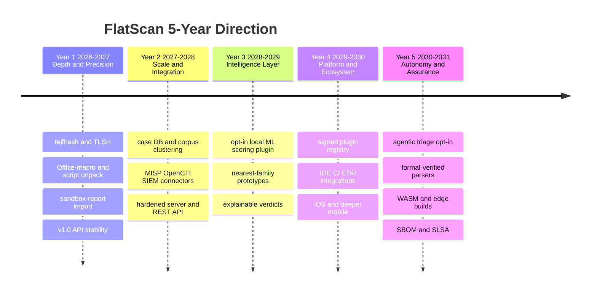

# FlatScan Roadmap

Repository: https://github.com/Masriyan/FlatScan

This document records **what FlatScan has shipped** and where it is headed over the **next five
years (2026 → 2031)**. The roadmap is directional, not a contract — dates and ordering will move
as the threat landscape and contributor bandwidth change. It is reviewed at each minor release.

---

## Guiding Principles (the roadmap must respect these)

These are the constraints every future feature is measured against. They are *non-negotiable for
the core*; anything that cannot honor them ships as an **opt-in plugin or enrichment**, never in the
default path.

| Principle | What it means for the roadmap |
|-----------|-------------------------------|
| **Minimal, cgo-free dependencies** | The core stays on the Go standard library plus a single pinned, pure-Go module (`golang.org/x/arch`, for disassembly). Network/ML/heavy parsers arrive via the plugin interface, not new `go.mod` deps; cgo stays out of the default build. |
| **Static only** | The engine never executes a sample. Dynamic insight is *imported* (sandbox reports), never produced by running malware. |
| **Offline-first** | A full scan must always work air-gapped. Any enrichment (TI lookups, model downloads) is explicit, documented, and disable-able. |
| **Analyst + management in one pass** | Every capability must serve both machine output (JSON/STIX/YARA) and human reporting (HTML/PDF). |
| **Conservative scoring** | New signals must not inflate false positives. A single weak indicator never tips a verdict alone. |

---

## What We've Built (0.1.0 → 0.9.0)

```mermaid
graph LR
    A["v0.1.0<br/>Core Engine"] --> B["v0.2.0<br/>IOC & Format"]
    B --> C["v0.3.0<br/>Production Grade"]
    C --> D["v0.4.0<br/>Analyst UX"]
    D --> E["v0.5.0<br/>Power Analyst"]
    E --> F["v0.6.0<br/>Browser Analyst"]
    F --> G["v0.7.0<br/>Deep Static Analyst"]
    G --> H["v0.7.1<br/>Initial-Access Vectors"]
    H --> I["v0.8.0<br/>Code-Level Analysis"]
    I --> J["v0.9.0<br/>Detection Precision"]
    style A fill:#16213e,color:#fff
    style B fill:#0f3460,color:#fff
    style C fill:#533483,color:#fff
    style D fill:#e94560,color:#fff
    style E fill:#c62a47,color:#fff
    style F fill:#2dd4bf,color:#000
    style G fill:#58a6ff,color:#000
    style H fill:#f59e0b,color:#000
    style I fill:#84cc16,color:#000
    style J fill:#a78bfa,color:#000
```



| Version | Theme | Highlights |
|---------|-------|-----------|
| **0.9.0** | Detection Precision | **IOC confidence & categorization** (actionable vs build-artifact/source-path/namespace) + export hygiene, **multi-evidence correlation** + per-finding confidence/evidence-count, **named-family fingerprints** (RedLine/Lumma/StealC/AsyncRAT/…), **similarity matching** vs a reference store (`--similarity-db`), **CAPA-style capability rules** + **YARA-quality scoring**, **malware-config extraction**, **offline threat-intel enrichment** (`--intel-db`), **expected-behavior prediction** |
| **0.8.0** | Code-Level Analysis | **Instruction-level disassembly pass** (x86/x64 PE+ELF via `golang.org/x/arch`) — API-hashing (ROR13) loops, PEB walks, GetPC/shellcode stubs, instruction-level anti-VM (VMware backdoor, hypervisor CPUID, Red Pill); **hash-database resolution of hash-obfuscated imports** (ROR13/DJB2/SDBM) feeding the import/behavior layer |
| **0.7.1** | Initial-Access Vectors | **Windows shortcut (.lnk) parser** (LOLBin target + embedded command-line extraction), **PowerShell/script behavioral engine** (Defender/AMSI tampering, download cradles), **multi-layer deobfuscation** (base64 → delimited-hex → reversed-string, recovers hidden C2), deeper **ELF posture/packing** heuristics, **.NET downloader-dropper** detection |
| **0.7.0** | Deep Static Analyst | **PE Header Intelligence** (DllCharacteristics/exploit-mitigation posture, Rich-header hash, TLS callbacks, Authenticode signer, entry-point sanity), **DGA domain scorer** (T1568.002), in-memory **.NET reflective-loader detection**, **detection-artifact FP guard**, PDF Unicode rendering fix, HTML/PDF downloads in web mode |
| **0.6.0** | Browser Analyst | Self-contained `--web` GUI (zero new deps), drag-and-drop upload, async scan jobs, 9 result tabs, on-the-fly downloads incl. zipped report pack |
| **0.5.0** | Power Analyst | API behavioral-chain detection, packer/protector fingerprinting, CI/CD gate mode + semantic exit codes, parallel batch, per-category score breakdown, wallet/mutex/pipe IOC types, cryptominer & wiper families |
| **0.4.0** | Analyst UX | Shell completion, grouped help, post-scan hints, dark HTML report, PDF risk bar |
| **0.3.0** | Production Grade | Parallel pipeline, plugin system, STIX 2.1, watch mode, mmap I/O, structured logging |
| **0.2.0** | IOC & Format | IOC triage/suppression, MSIX/AppX analysis, Magniber detection, interactive mode |
| **0.1.0** | Core Engine | Full static engine, multi-format output, PE/ELF/Mach-O/APK/DEX parsers |

### Current capability snapshot (v0.9.0)

- **Formats:** PE (incl. header intelligence), ELF (incl. static/stripped posture), Mach-O,
  **Windows shortcut (.lnk)**, **scripts (.ps1/.bat/.vbs/.js/.wsf/.hta/.sh)**,
  ZIP/JAR/APK/MSIX/AppX/Office-XML, DEX, PDF.
- **Code-level:** x86/x64 entry-point disassembly — API-hashing (ROR13) loops, PEB walks,
  GetPC/shellcode stubs, instruction-level anti-VM; hash-database resolution of hash-obfuscated imports.
- **Detection:** behavioral signatures, **multi-evidence correlation engine** (per-finding
  confidence + evidence count), **CAPA-style capability rules** (over strings + hashdb-resolved
  imports + disasm techniques + IOC categories), API attack chains, packer fingerprints,
  generic family classifier + **named-family fingerprints** (RedLine/Lumma/StealC/AsyncRAT/Quasar/
  Remcos/XWorm/njRAT/Vidar/Raccoon/FormBook), .NET reflective loading + downloader-dropper,
  script defense-evasion/download-cradle, multi-layer deobfuscation, detection-artifact recognition.
- **Intelligence:** IOC extraction + **categorization/confidence** + triage + export hygiene,
  **malware-config extraction**, **similarity matching** vs a reference store, **offline TI
  enrichment** (`--intel-db`), **expected-behavior prediction**, DGA scoring, similarity hashes
  (FlatHash, imphash, section, Rich-header, string-set, byte-histogram), MITRE ATT&CK mapping.
- **Output:** Text, JSON, CSV, PDF, HTML, IOC list, YARA (with quality/FP-risk score), Sigma,
  STIX 2.1, report pack.
- **Modes:** CLI, interactive, shell, batch, watch, CI/CD gate, local web GUI.

> Validated on real-sample sets: caught the WannaCry killswitch domain via DGA scoring; lifted a
> reflective .NET loader from "High suspicion" to "Likely malicious"; and in the 0.7.1/0.8.0 sweep
> turned a malicious LNK (22→78, with recovered C2), an obfuscated Defender-disabling PowerShell
> dropper (4→100), and a packed anti-VM DLL (68→84) into correct verdicts — all with zero benign-side
> regression. The next focus is **detection precision** (IOC categorization, evidence-weighted
> correlation, named-family fingerprinting); forward-looking candidates are catalogued in
> [`Docs/research-gap-analysis-2026-06-07.md`](Docs/research-gap-analysis-2026-06-07.md).

---

## The 5-Year Roadmap (2026 → 2031)



### Year 1 — Depth & Precision  ·  `v0.8` → `v1.0`

Finish the research-backed static depth and reach a stable 1.0.

- **More similarity / attribution hashing:** `telfhash` (ELF symbol-hash analog of imphash) and
  `TLSH` locality-sensitive hashing with a defined distance metric — pure-Go, strengthens clustering.
- **Deeper format coverage:** Office macros (OLE/VBA extraction + deobfuscation), LNK, OneNote,
  ISO/IMG/VHD/VHDX containers, email (EML/MSG), `.deb`/`.rpm`, and script unpacking
  (PowerShell / JS / VBS / HTA layered decode).
- **Dynamic Context without detonation — Tiers 1 & 3** (see the [Flagship Epic](#flagship-epic--dynamic-context-without-detonation)):
  **recursive static payload resolution** (peel every encoded/compressed/encrypted layer into a payload tree)
  + **external sandbox-report fusion** (ingest CAPE / Cuckoo / Triage JSON, overlay runtime + network IOCs).
  Both pure-stdlib and 100% static — the sample is never executed.
- **Taxonomy completeness:** canonical **MITRE Mobile** technique IDs on Android findings,
  **CAPEC** cross-references alongside ATT&CK, consistent technique IDs across all modules.
- **Visualization:** byteplot / entropy-map image in the HTML report (stdlib `image/png`).
- **`v1.0` milestone:** semver stability guarantee, stable JSON schema, signed + reproducible
  releases, fuzz-tested parsers, documented public API.

### Year 2 — Scale & Integration  ·  `v1.x`

Move from single-file triage to corpus-scale workflows and the wider ecosystem.

- **Case database & corpus clustering:** persistent local case store, cross-sample correlation and
  campaign clustering built on the existing similarity hashes, sample timelines.
- **Threat-intel ecosystem (opt-in):** MISP import/export, OpenCTI / STIX 2.1 push, and
  enrichment connectors (VirusTotal, MalwareBazaar) shipped as plugins — offline-first preserved.
- **SIEM / SOAR connectors:** first-class Splunk / Elastic / Microsoft Sentinel output and
  webhook/SOAR actions from watch and CI modes.
- **Hardened server mode:** an authenticated REST API and multi-user daemon beyond the current
  single-user loopback web GUI; rate limiting, RBAC, audit log.
- **Performance at scale:** streaming analysis for multi-GB files, distributed/parallel batch,
  incremental re-scan, content-addressed result cache with version keys.
- **Dynamic Context — Tier 4** (see the [Flagship Epic](#flagship-epic--dynamic-context-without-detonation)):
  opt-in **orchestrated detonation** — submit to a delegated isolated backend (local QEMU/Firecracker
  microVM or a sandbox service API) for live network behavior; FlatScan orchestrates, never contains.

### Year 3 — Intelligence Layer  ·  `v2.0`

Add learned signal — strictly opt-in, local, and explainable — without compromising the core.

- **Pluggable ML scoring:** family-prototype / nearest-neighbour classification and learned
  packer/obfuscation detection delivered through the plugin interface with **local, bundled or
  BYO models** — the zero-dependency static core remains fully functional without them.
- **Explainable verdicts:** every score fully traceable; per-finding contribution graphs and
  "why this verdict" narratives.
- **Smarter rule generation:** behavior-graph-aware YARA/Sigma, auto-tuned thresholds,
  rule-quality linting.
- **Cross-architecture behavioral matching (IR-lite):** symbol- and capability-level normalization
  for ARM/MIPS/x86 IoT malware without heavyweight lifters.

### Year 4 — Platform & Ecosystem  ·  `v2.x`

Make FlatScan something teams build *on*.

- **Signed plugin registry:** discoverable, signed community plugins and subscribable rule packs.
- **Deep integrations:** native GitHub/GitLab CI actions, pre-commit hook, VS Code/JetBrains
  extensions, EDR/sandbox bridges.
- **SDKs & bindings:** Go, Python, and Rust client libraries against the stable API.
- **Mobile-first deep analysis:** iOS IPA parsing, deeper APK/DEX (Flutter / React-Native),
  certificate-pinning and SDK-risk insight.
- **Self-hosted multi-tenant deployment:** teams, projects, retention policy, and reporting roll-ups.

### Year 5 — Autonomy & Assurance  ·  `v3.0`

Analyst-grade autonomy and the assurance to trust it in regulated environments.

- **Agentic triage (opt-in):** orchestrate FlatScan + imported sandbox + TI into analyst-ready
  incident narratives using local or BYO-key LLMs — recommendations, never autonomous actions.
- **Continuous adaptation:** auto-updating family/rule knowledge with full provenance and rollback.
- **Assurance:** formally verified safety-critical parsers, continuous fuzzing, memory-safety
  guarantees, supply-chain attestation (SLSA), SBOM, and a FIPS-friendly build.
- **FlatScan everywhere:** WASM build for in-browser client-side triage and edge/embedded builds
  for appliance and gateway deployment (preemptive scanning before files reach endpoints).

---

## Flagship Epic — Dynamic Context (without Detonation)

The single biggest lift to zero-day recall is getting **behavioral and network insight** — the things
static analysis can't see — *without* betraying FlatScan's core promise of never running malware on the
analyst's machine. This epic spans Years 1–2 and rests on one precise distinction:

> **Execution ≠ Detonation.** *Detonation* = real-world effects (real syscalls, filesystem, network,
> processes on a real/VM OS). *Execution* can also mean running instructions on a **virtual CPU over a
> memory buffer with no OS underneath** — no syscall reaches a kernel, no packet hits a NIC. "Dynamic
> Context without detonation" obtains the *information* detonation would give while never granting the
> sample real OS resources.

It is delivered as four tiers along a safety gradient. Every dynamic datum is **labeled by provenance**
(`static` | `emulated` | `sandbox:<name>`) so an analyst always knows what was inferred vs. observed.

### Tier 1 — Recursive Static Payload Resolution  *(safe · pure stdlib · Year 1)*
Peel every layer of a package until the real code is reached, producing a **payload tree**.
- **How:** per artifact, detect container/encoding/compression/encryption → decompress (`compress/*`)
  → decode base64/hex/url (`decode.go`) → **decrypt with keys FlatScan already extracts**
  (single/multi-byte XOR, RC4, AES from embedded key candidates in `config_extract.go`) →
  re-detect file type → if a new PE/ELF/script/archive emerges, **recurse and full-scan it**.
- **Builds on:** `carve.go`, `decode.go`, `config_extract.go` (makes them recursive + exhaustive).
- **Yields:** the buried stage surfaced and scored, each node carrying provenance (offset, method, key).
- **Limit:** can't decrypt when the key isn't in the file (e.g. C2-delivered keys).
- **Detonation? No** — pure data transformation.

### Tier 2 — Constrained Code Emulation  *(opt-in plugin · Year 1–2)*
"**Emulate the unpacker, not the malware.**" Run *only* code stretches on a CPU emulator
(Unicorn/Qiling/speakeasy-style) whose entire world is a virtual CPU + virtual memory.
- **How:** map the binary into emulated memory, set a fake stack, emulate from the entry point;
  **trap every syscall/API call** — log `would-call connect(1.2.3.4:443)` but never forward it; hook
  memory writes to detect self-modifying code; stop at the original entry point and **dump the
  decrypted image** back into Tier 1.
- **Three payoffs:** (1) automatic unpacking (defeats UPX/custom packers); (2) deobfuscation of
  stack-strings and **API-hashing resolvers**; (3) a **behavioral API trace without real execution** —
  the trapped-call log *is* a behavior list.
- **Detonation? No, but it does execute instructions** — safe because there is no OS to escape to and
  no NIC to reach; syscalls are stubbed. Residual emulator-bug risk is contained by running the
  emulator in a locked-down child process (seccomp, no-net).
- **Cost (honest):** breaks pure zero-dep (Unicorn is cgo) → ships as an **opt-in plugin / build tag**,
  never in the core; emulation coverage is incomplete (heavy threading/exceptions/virtualization-based
  obfuscation defeat emulators).

### Tier 3 — External Sandbox Report Fusion  *(safest · pure stdlib · Year 1)*
FlatScan stays 100% static but **ingests a JSON report** from a real sandbox
(CAPE/Cuckoo/Joe/Triage/Hybrid-Analysis) that detonated the sample **elsewhere**.
- **How:** a normalizer maps each vendor schema → FlatScan's model (matched by SHA-256), overlaying
  **network IOCs (C2 IPs/domains/URLs, DNS, HTTP), dropped files, registry/persistence, processes,
  mutexes, dynamic ATT&CK**.
- **The value is fusion:** cross-validate static vs. dynamic — *static capability + dynamic confirmation*
  → high confidence; *static-only* → "potential"; *dynamic-only* → "runtime-only, statically missed" —
  yielding a unified verdict and a **"behaviorally confirmed"** confidence boost.
- **Detonation? No** — just parsing JSON; a hardened external platform did the running.

### Tier 4 — Orchestrated Detonation  *(opt-in · delegated isolation · Year 2)*
For fresh runtime + live network when no report exists: FlatScan **submits** the sample to a properly
isolated backend and pulls results back — it **orchestrates, never contains**.
- **Backends:** a local libvirt/QEMU/Firecracker microVM with a guest agent + network simulation
  (INetSim/FakeNet), **or** a sandbox service API (Triage / Joe / Hybrid Analysis). Results fold into
  Tier 3's normalizer.
- **Detonation? Yes — but delegated** to a battle-tested separate-kernel VM or remote service, **off by
  default**, and loudly flagged. FlatScan's own process never holds live malware.

### Data model
A new provenance-tagged `DynamicContext` on `ScanResult`:
```
DynamicContext{
  PayloadTree      []PayloadNode    // T1/T2: method, offset, key, per-node verdict
  EmulatedCalls    []APICall        // T2: name + args, "would-call" (never executed)
  RecoveredStrings []string         // T2: deobfuscated stack-strings / resolved API names
  NetworkBehavior  NetworkBehavior  // T3/T4: DNS, HTTP, TCP/UDP endpoints, user-agents
  RuntimeArtifacts RuntimeArtifacts // T3/T4: dropped files, registry, persistence, processes, mutexes
  Confirmed        []string         // static capabilities the dynamic side confirmed fired
  Source           string           // "static" | "emulated" | "sandbox:<name>"
}
```

### Safety invariant
> In **Tiers 1–3, FlatScan's host never makes a real syscall or network connection on the sample's
> behalf.** Tier 2 executes instructions only inside an OS-less CPU emulator. Tier 4 *delegates*
> detonation to an external isolated backend and is opt-in and off by default.

### Phasing & honest limits
| Phase | Tiers | Zero-dep | Notes |
|-------|-------|----------|-------|
| 1 | Recursive unpack (T1) + sandbox fusion (T3) | ✅ stdlib | Highest ROI; start here |
| 2 | Constrained emulation (T2) | ❌ opt-in plugin (cgo) | Recovers behavior with no sandbox |
| 3 | Orchestrated detonation (T4) | core stdlib; backend external | Opt-in, flagged |

Still out of reach (kept honest): C2-delivered decryption keys (T1), virtualization-based obfuscation
that defeats emulators (T2), and malware that evades *the chosen sandbox* (T3/T4). This is **much higher
behavioral recall, safely — not 100%**. Tiers 1 + 3 alone (both pure-stdlib, fully static) already
deliver most of "read the buried zero-day stage *and* see its network calls."

---

## Themes at a glance

| Year | Version line | Theme | North-star outcome |
|------|--------------|-------|--------------------|
| 1 | 0.8 → 1.0 | Depth & Precision | Most complete *static* triage engine; stable, signed 1.0 |
| 2 | 1.x | Scale & Integration | From one file to whole corpora; lives in the SOC stack |
| 3 | 2.0 | Intelligence Layer | Opt-in, explainable learned scoring on top of the static core |
| 4 | 2.x | Platform & Ecosystem | A platform teams extend, integrate, and build on |
| 5 | 3.0 | Autonomy & Assurance | Trusted, near-autonomous triage; runs everywhere |

---

## Explicit Non-Goals

To keep the project focused, FlatScan will **not**:

- **Detonate** samples — give them real OS resources (syscalls, filesystem, network, processes) — in its
  core. The static core never runs malware; runtime data is *imported* (Tier 3) or *delegated* to an
  external isolated backend (Tier 4, opt-in). Constrained **CPU emulation with no OS** (Tier 2) is an
  opt-in plugin and is not detonation — see the Flagship Epic for the execution-vs-detonation distinction.
- Require network access, an account, or a cloud service for a complete scan.
- Pull mandatory third-party Go modules into the core engine.
- Ship telemetry or "phone-home" behavior.
- Replace a sandbox, an EDR, or a SIEM — it *feeds* them.

---

## Influencing the Roadmap

This roadmap is community-shaped. Open an issue or discussion on the
[repository](https://github.com/Masriyan/FlatScan) to propose a capability, vote on priorities, or
volunteer a plugin. Research-derived candidates and their feasibility notes live in
[`Docs/research-gap-analysis-2026-06-07.md`](Docs/research-gap-analysis-2026-06-07.md); the release
history lives in [`changelog.md`](changelog.md).
