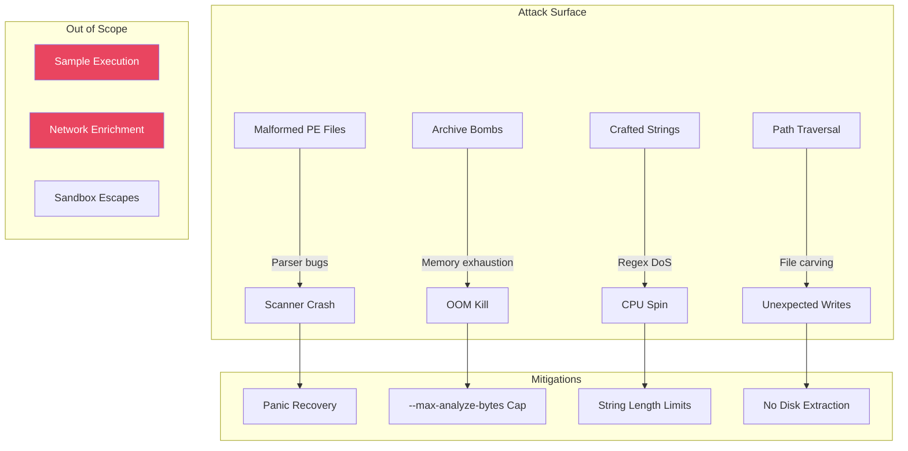
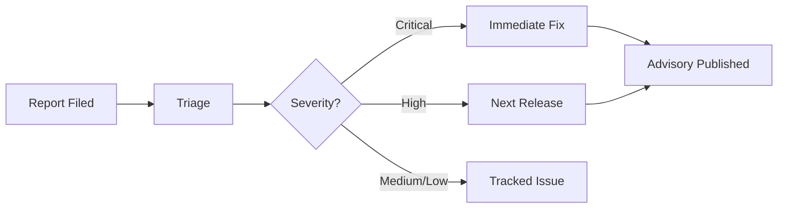
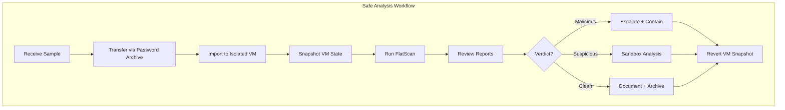
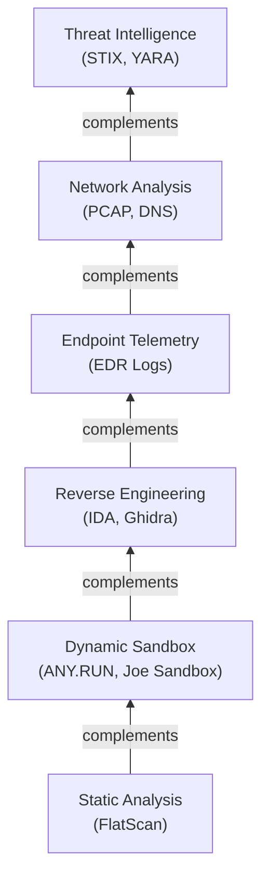
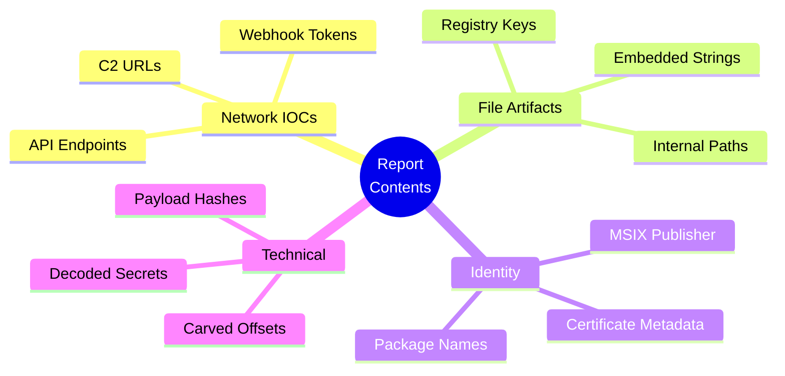
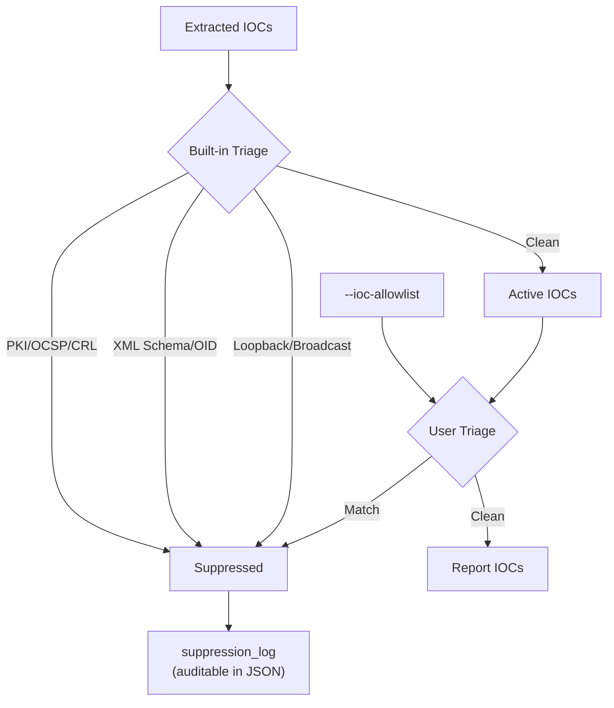
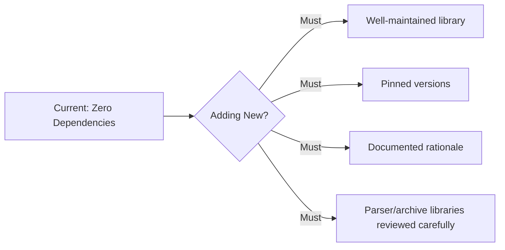

# Security Policy

Repository: https://github.com/Masriyan/FlatScan

FlatScan is a malware-analysis utility. Security handling matters both for the tool itself and for the samples analyzed with it.

---

## Table of Contents

- [Security Scope](#security-scope)
- [Threat Model](#threat-model)
- [Reporting Security Issues](#reporting-security-issues)
- [Safe Malware Handling](#safe-malware-handling)
- [Static Analysis Disclaimer](#static-analysis-disclaimer)
- [Output Security](#output-security)
- [IOC Safety](#ioc-safety)
- [Network Behavior](#network-behavior)
- [Dependency Policy](#dependency-policy)
- [Responsible Use](#responsible-use)

---

## Security Scope

Security reports may include:

| Category | Examples |
|----------|---------|
| **Unsafe Sample Handling** | Any behavior that could execute a target sample |
| **Parser Crashes** | Panics or crashes on malformed files |
| **Resource Exhaustion** | Crafted samples causing excessive memory or CPU |
| **Unsafe File Writes** | Incorrect output paths or unsafe file operations |
| **Data Exposure** | Report generation exposing unintended data |
| **IOC Triage Errors** | Benign infrastructure emitted as blocking indicators |
| **Future Dependency Issues** | Vulnerabilities in any added dependencies |

> **FlatScan is intended to perform static analysis only.** Any behavior that executes a target sample is considered a **critical security issue**.

---

## Threat Model

### Mitigations

| Threat | Mitigation |
|--------|-----------|
| **Malformed input crashes** | `recover()` in scan pipeline, graceful error reporting |
| **Memory exhaustion** | `--max-analyze-bytes` cap (default 256MB), `--max-archive-files` (500), `--max-carves` (80) |
| **Regex DoS** | String extraction limits (30K–250K by mode), min-string-length filter |
| **Archive bombs** | Entry count limits, no recursive extraction to disk |
| **Path traversal** | Safe carving reports offsets only — no file extraction |
| **Sensitive data leakage** | Reports contain extracted strings — treated as incident artifacts |

---

## Reporting Security Issues

Report issues through: https://github.com/Masriyan/FlatScan

> ⚠️ **If the issue includes sensitive details**, do not post live malware, private tokens, credentials, victim data, or exploit payloads publicly. Provide a minimal reproducer when possible.

### Response Process

---

## Safe Malware Handling

### Recommended Analyst Workflow

| Recommendation | Reason |
|----------------|--------|
| Use an isolated VM | Prevent host compromise |
| Keep VM snapshotted | Revert after analysis |
| Disable shared clipboard/folders | Prevent sample escape |
| Don't run samples on production hosts | Contain risk |
| Dedicated sample storage directory | Organization |
| Don't open samples with GUI tools | Prevent active content execution |
| Password-protect shared samples | Prevent accidental execution |
| Separate reports from raw samples | Prevent confusion |

---

## Static Analysis Disclaimer

FlatScan does **not** execute target samples. It reads bytes and parses metadata. However:

| Limitation | Impact |
|-----------|--------|
| **File parsers can have bugs** | Malformed inputs might trigger unexpected behavior |
| **Malformed inputs can consume resources** | High memory or CPU usage possible |
| **Static analysis can miss behavior** | Environment-gated, packed, or staged malware won't be detected |
| **Clean report ≠ clean file** | A low-score report is NOT proof the file is benign |

> **Use FlatScan as one component** in a broader workflow that includes sandboxing, reverse engineering, endpoint telemetry, network monitoring, and threat intelligence.

### Analysis Confidence Hierarchy

---

## Output Security

### Sensitive Content in Reports

Generated reports may contain:

> ⚠️ **Handle reports as sensitive incident artifacts.** Do not publish reports without reviewing them for exposed tokens or victim-specific data.

### Output Format Security

| Format | Risk | Mitigation |
|--------|------|-----------|
| **PDF** | May contain clickable malicious URLs | Don't click links from malware reports on production systems |
| **HTML** | May contain URLs in IOC cards | Static HTML — no JavaScript execution of URLs |
| **STIX** | Contains IOC indicators | Review before feeding to automated blocklists |
| **YARA** | May contain sensitive strings | Review before deploying to production |
| **Sigma** | May contain detection logic | Review field names against your SIEM schema |
| **JSON** | Complete scan data | Contains all extracted strings and IOCs |

---

## IOC Safety

### IOC Suppression Pipeline

### Before Using IOC Exports for Blocking

| Step | Action |
|------|--------|
| 1 | Review `iocs.pe_hashes` first — embedded payload hashes are highest value |
| 2 | Review suppressed values if you need certificate or publisher pivoting |
| 3 | Extend suppression with `--ioc-allowlist` for your environment |
| 4 | **Never** block schema, OCSP, CRL, or cert-provider domains without independent malicious context |

---

## Network Behavior

| Version | Network Activity |
|---------|-----------------|
| **Current (0.3.0)** | **None.** All analysis is local and static. |
| **Future** | Any enrichment features will be explicitly opt-in, clearly documented, safe for sensitive data, and easy to disable in offline environments. |

---

## Dependency Policy

The project currently uses **the Go standard library only**. No third-party Go modules. If dependencies are added:

| Requirement | Reason |
|-------------|--------|
| Well-maintained libraries | Ongoing security patches |
| Pinned versions | Reproducible builds |
| Documented rationale | Clear need for the dependency |
| Careful review of parser libraries | Parser bugs are the primary attack surface |

---

## Responsible Use

FlatScan is intended for:

| ✅ Approved Use | ❌ Prohibited Use |
|----------------|-----------------|
| Defensive malware analysis | Improving malware deployment |
| Incident response | Evasion development |
| Threat hunting | Unauthorized system access |
| Security education | Offensive operations without authorization |
| Blue team operations | Data exfiltration |

> **Do not use FlatScan to improve malware deployment, evasion, or unauthorized activity.**
