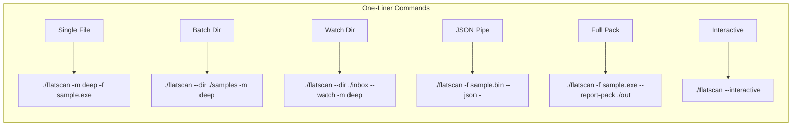
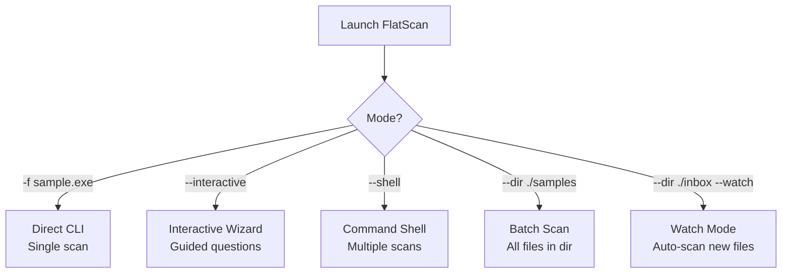
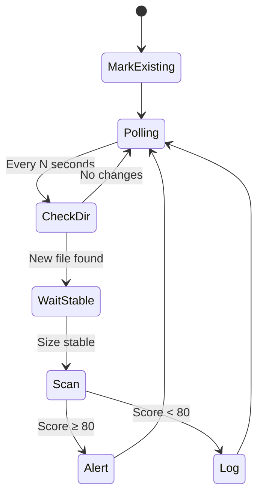
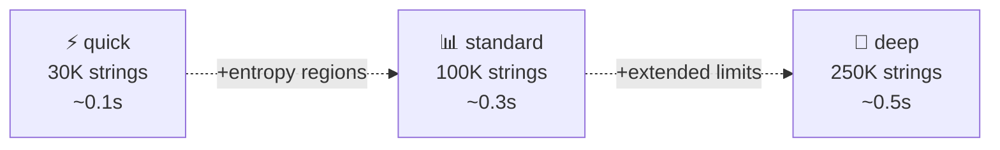
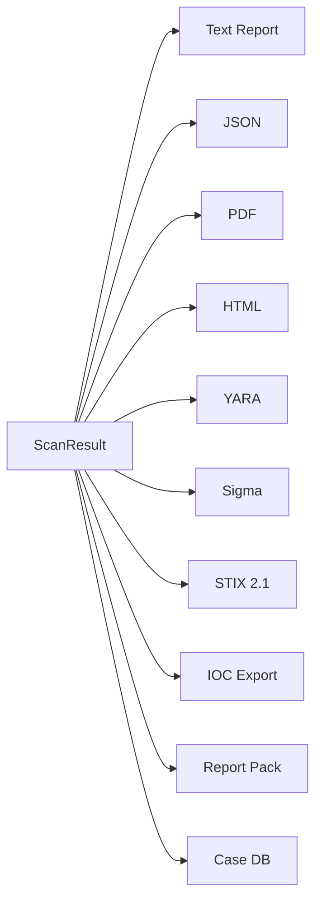
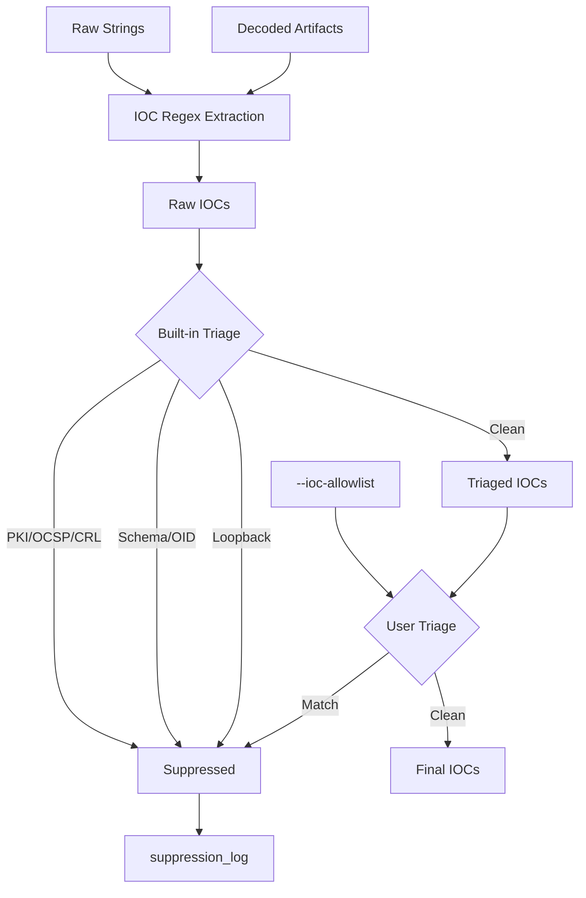
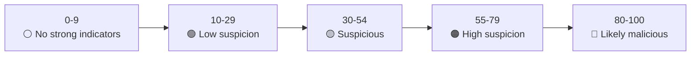

# Usage Guide

Repository: https://github.com/Masriyan/FlatScan

Complete reference for FlatScan commands, flags, modes, output formats, real-world examples, and use cases.

---

## Table of Contents

- [Quick Reference](#quick-reference)
- [Complete Flag Reference](#complete-flag-reference)
- [Operator Modes](#operator-modes)
- [Scan Modes](#scan-modes)
- [Report Modes](#report-modes)
- [Output Formats](#output-formats)
- [Batch & Watch Modes](#batch--watch-modes)
- [Custom Rules & Plugins](#custom-rules--plugins)
- [IOC Management](#ioc-management)
- [Advanced Analysis](#advanced-analysis)
- [Score Interpretation](#score-interpretation)
- [Real-World Scan Commands](#real-world-scan-commands)
- [Use Case Scenarios](#use-case-scenarios)
- [Automation Recipes](#automation-recipes)
- [Troubleshooting](#troubleshooting)

---

## Quick Reference



### Minimal Scan

```bash
./flatscan -m deep -f sample.exe
```

### Full One-Liner (All Outputs)

```bash
./flatscan -m deep -f sample.exe --report-mode Full --report reports/sample.txt --json reports/sample.json --pdf reports/sample.pdf --html reports/sample.html --yara reports/sample.yar --sigma reports/sample.yml --stix reports/sample.stix.json --extract-ioc reports/sample.iocs.txt --report-pack reports/sample-pack --carve --debug
```

### Batch Directory Scan

```bash
./flatscan --dir ./samples -m deep
```

### JSON to Stdout for Scripting

```bash
./flatscan -m deep -f sample.exe --json - --no-progress --no-splash --no-color | jq '.verdict'
```

---

## Complete Flag Reference

### Input & Mode

| Flag | Short | Default | Description |
|------|-------|---------|-------------|
| `--file` | `-f` | *required* | Target file path |
| `--mode` | `-m` | `quick` | Scan mode: `quick`, `standard`, `deep` |
| `--dir` | — | — | Scan all files in directory (batch mode) |
| `--watch` | — | false | Monitor directory for new files (requires `--dir`) |
| `--watch-interval` | — | `3` | Polling interval in seconds for watch mode |
| `--interactive` | `-i` | false | Launch guided interactive wizard |
| `--shell` | — | false | Launch manual command shell |

### Output

| Flag | Default | Description |
|------|---------|-------------|
| `--report` | — | Text report file path |
| `--report-mode` | `summary` | Text verbosity: `Full`, `Summary`, `minimal` |
| `--json` | — | JSON report path. Use `-` for stdout |
| `--pdf` | — | PDF CISO/management report |
| `--html` | — | Interactive HTML analyst report |
| `--yara` | — | Auto-generated YARA hunting rule |
| `--sigma` | — | Auto-generated Sigma SIEM/EDR rule |
| `--stix` | — | STIX 2.1 threat intelligence bundle |
| `--extract-ioc` | — | Categorized IOC text export |
| `--report-pack` | — | All formats in one directory |

### Analysis

| Flag | Default | Description |
|------|---------|-------------|
| `--carve` | false | Enable safe embedded file carving |
| `--max-carves` | `80` | Maximum carved artifacts |
| `--external-tools` | false | Run external metadata tools |
| `--rules` | — | Custom rule pack files/directories |
| `--plugins` | — | Custom plugin pack files/directories |
| `--ioc-allowlist` | — | IOC suppression allowlist |
| `--min-string` | `5` | Minimum extractable string length |
| `--decode-depth` | `2` | Nested decode depth (0-5) |
| `--max-analyze-bytes` | `268435456` | Max bytes for in-memory analysis (256 MB) |
| `--max-archive-files` | `500` | Max archive entries to inspect |

### Session & Display

| Flag | Default | Description |
|------|---------|-------------|
| `--case` | — | Case ID for local case database |
| `--case-db` | auto | JSONL case database path |
| `--debug` | false | Enable debug logging |
| `--no-progress` | false | Disable progress output |
| `--no-splash` | false | Disable startup banner |
| `--no-color` | false | Disable ANSI colors |
| `--splash-seconds` | `20` | Splash duration |
| `--version` | — | Print version and exit |

---

## Operator Modes



### Direct CLI

```bash
# Quick triage
./flatscan -m quick -f suspicious.exe

# Deep scan with all outputs
./flatscan -m deep -f malware.bin --report-mode Full --report-pack reports/case-001

# Automation-friendly (no color, no progress, no splash)
./flatscan -m deep -f sample.exe --json reports/out.json --no-progress --no-splash --no-color
```

### Interactive Mode

```bash
./flatscan --interactive
```

Guides you through: target file → scan mode → report mode → output profile → carving → external tools → debug → IOC allowlist → rules/plugins → scan execution.

Output profiles in interactive mode:

| # | Profile | Outputs |
|---|---------|---------|
| 1 | Terminal only | Text to stdout |
| 2 | Standard files | Text + JSON + IOC |
| 3 | Full analyst/CISO pack | Text + JSON + IOC + PDF + HTML + YARA + Sigma + STIX + Report Pack |
| 4 | Custom paths | User-specified |

### Shell Mode

```bash
./flatscan --shell
```

```text
flatscan> -m deep -f sample1.exe --report-mode Full --json reports/s1.json
flatscan> -m quick -f sample2.bin --report-mode minimal
flatscan> help
flatscan> examples
flatscan> exit
```

### Batch Mode

```bash
./flatscan --dir /path/to/samples -m deep
```

Scans all regular files, prints colorized summary table with verdicts, scores, and IOC counts.

### Watch Mode

```bash
./flatscan --dir /var/spool/malware-inbox --watch -m deep --watch-interval 5
```

Monitors directory, auto-scans new files, and alerts when score ≥ 80.



---

## Scan Modes



| Mode | Strings | Best For |
|------|---------|----------|
| `quick` | 30,000 | Fast triage, CI/CD gates, bulk sorting |
| `standard` | 100,000 | Normal analyst triage, adds entropy regions + ZIP inspection |
| `deep` | 250,000 | Final reports, incident response, richest profile |

---

## Report Modes

| Mode | Content | Use Case |
|------|---------|----------|
| `minimal` | Version, target, verdict, score, SHA256 | Shell scripts, CI gates |
| `Summary` | Metadata, profile, top findings, IOC summary | Terminal triage |
| `Full` | Everything: all hashes, all findings, all IOCs, PE/ELF/APK details, debug log | Analyst handoff, archival |

---

## Output Formats

| Format | Flag | Purpose |
|--------|------|---------|
| Text report | `--report` | Human-readable, honors `--report-mode` |
| JSON | `--json` | Machine-readable for automation (use `-` for stdout) |
| PDF | `--pdf` | CISO/management with executive summary, MITRE matrix, risk cards |
| HTML | `--html` | Interactive analyst report with filters and expandable sections |
| IOC export | `--extract-ioc` | Categorized IOC text with promoted payload hashes |
| YARA rule | `--yara` | Auto-generated hunting rule with structural guards |
| Sigma rule | `--sigma` | SIEM/EDR hunting rule with ATT&CK tags |
| STIX 2.1 | `--stix` | Threat intel bundle: File SCO, Malware SDO, Indicators, Relationships |
| Report Pack | `--report-pack` | All of the above in one directory |
| Case DB | `--case` | JSONL append-only case record |



---

## Batch & Watch Modes

### Batch: Scan Entire Directory

```bash
# Scan all files in a malware sample directory
./flatscan --dir ./samples -m deep

# With specific rules and plugins
./flatscan --dir ./quarantine -m deep --rules rules/ --plugins plugins/ --carve
```

### Watch: Monitor for New Files

```bash
# SOC intake monitoring
./flatscan --dir /var/spool/malware-inbox --watch -m deep --watch-interval 10

# Fast triage of incoming samples
./flatscan --dir ./inbox --watch -m quick --watch-interval 3
```

---

## Custom Rules & Plugins

### JSON Rule Pack

```bash
./flatscan -m deep -f sample.exe --rules rules/custom.json
```

```json
{
  "name": "org-rules",
  "rules": [
    {
      "id": "org.webhook",
      "name": "Webhook exfiltration endpoint",
      "severity": "High",
      "category": "Exfiltration",
      "score": 18,
      "strings_any": ["discord.com/api/webhooks", "api.telegram.org/bot"],
      "tactic": "Exfiltration",
      "technique": "Exfiltration Over Web Service"
    }
  ]
}
```

### Line-Based `.rule` Format

```text
id: android.runtime.exec
name: Android runtime execution
severity: Medium
category: Android
score: 10
strings_any: Runtime.exec, ProcessBuilder
file_types: APK package, DEX bytecode
```

### Rule Matching Keys

| Key | Description |
|-----|-------------|
| `strings_any` | Fire if any string found in corpus |
| `strings_all` | Fire if all strings found |
| `regex_any` | Regex match against extracted strings |
| `functions_any` | Match detected function/API names |
| `domains_any` | Match extracted IOC domains |
| `urls_any` | Match extracted IOC URLs |
| `sha256_any` | Match file SHA256 |
| `file_types` | Only fire for these file types |
| `min_entropy` / `max_entropy` | Entropy range filter |

### Plugin Packs

```bash
./flatscan -m deep -f sample.exe --plugins plugins/
```

JSON plugin manifest format supports `string_checks` with `contains`, `severity`, `category`, `title`, `score`, `tactic`, `technique`.

---

## IOC Management



### IOC Allowlist

```bash
./flatscan -m deep -f sample.bin --ioc-allowlist allowlist.txt
```

```text
domains:
  - "*.example-cdn.local"
  - "telemetry.example.com"
url_prefixes:
  - "https://updates.example.com/"
ipv4:
  - "10.10.10.*"
```

---

## Advanced Analysis

### Safe Carving

```bash
./flatscan -m deep -f dropper.exe --carve --max-carves 120
```

Detects embedded PE, ELF, DEX, ZIP, PDF, gzip, 7-Zip, RAR by offset/hash without extracting to disk.

### MSIX/AppX Analysis

FlatScan detects MSIX/AppX packages: identity, publisher, capabilities, undeclared payloads, Magniber ransomware hypothesis.

### Android APK/DEX Analysis

Parses `AndroidManifest.xml`, dangerous permissions, exported components, DEX strings, native libraries.

### External Tools

```bash
./flatscan -m deep -f sample.exe --external-tools
```

Supported: `file`, `exiftool`, `rabin2`, `jadx`, `apktool`, `sigmac`, `yara` (when installed).

### Case Database

```bash
./flatscan -m deep -f sample.exe --case CASE-001 --case-db reports/cases.jsonl
```

---

## Score Interpretation



| Score | Verdict | Recommended Action |
|-------|---------|-------------------|
| 0-9 | No strong indicators | Not a clean verdict — may be packed or beyond static reach |
| 10-29 | Low suspicion | Review context, may be benign with unusual traits |
| 30-54 | Suspicious | Correlate with endpoint telemetry and network logs |
| 55-79 | High suspicion | Escalate to sandbox analysis, treat as high risk |
| 80-100 | Likely malicious | Prioritize containment, block IOCs, generate hunting rules |

---

## Real-World Scan Commands

### 🔬 Stealer Malware Analysis

```bash
# Single stealer sample - full analysis with all outputs
./flatscan -m deep \
  -f sample/mercuristealer \
  --report-mode Full \
  --report reports/mercurial.full.txt \
  --json reports/mercurial.report.json \
  --pdf reports/mercurial.ciso.pdf \
  --html reports/mercurial.analyst.html \
  --yara reports/mercurial.yar \
  --sigma reports/mercurial.sigma.yml \
  --stix reports/mercurial.stix.json \
  --extract-ioc reports/mercurial.iocs.txt \
  --carve --debug

# Batch scan entire stealer sample directory
./flatscan --dir sample/MercurialStealer/Samples -m deep

# Report pack for stealer case
./flatscan -m deep -f sample/mercuristealer \
  --report-pack reports/mercurial-case \
  --case STEALER-001 \
  --case-db reports/cases.jsonl \
  --carve
```

### 🔐 Ransomware Analysis (Magniber MSIX)

```bash
# Scan MSIX ransomware package
./flatscan -m deep \
  -f "sample/MagniberRansomware/Samples/e2d3af7acd9bb440f9972b192cbfa83b07abdbb042f8bf1c2bb8f63944a4ae39 (1).msix" \
  --report-mode Full \
  --report-pack reports/magniber-case \
  --case RANSOM-001 \
  --carve --debug

# Batch scan all ransomware samples
./flatscan --dir sample/MagniberRansomware/Samples -m deep --carve
```

### 📱 Android Malware Analysis

```bash
# Scan APK with custom Android rules
./flatscan -m deep \
  -f "sample/sudo3rs - sample Xploit_Hunter.apk" \
  --rules rules/,plugins/ \
  --report-pack reports/xploit-hunter-case \
  --case APK-001 \
  --carve

# Quick triage of APK
./flatscan -m quick -f suspicious.apk --report-mode Summary
```

### 📦 Archive / Compressed Samples

```bash
# Scan compressed archive (FlatScan inspects ZIP entries)
./flatscan -m deep -f sample/C2.zip --carve --max-archive-files 1000

# Scan 7z archive
./flatscan -m deep -f sample/MercurialStealer.7z --carve
```

### 🌐 C2 Infrastructure Analysis

```bash
# Deep scan C2 toolkit with IOC extraction
./flatscan -m deep -f sample/C2.zip \
  --extract-ioc reports/c2.iocs.txt \
  --stix reports/c2.stix.json \
  --json reports/c2.json \
  --carve --debug
```

### 🔄 Multi-Sample Comparison

```bash
# Batch scan and compare verdicts
./flatscan --dir sample/MercurialStealer/Samples -m deep

# Individual scans with JSON for diffing
for f in sample/MercurialStealer/Samples/*; do
  ./flatscan -m deep -f "$f" \
    --json "reports/$(basename "$f").json" \
    --no-progress --no-splash --no-color
done
```

### ⚡ Quick Triage Commands

```bash
# Fast verdict only
./flatscan -m quick -f sample.exe --report-mode minimal --no-splash

# Score check for scripting
./flatscan -m quick -f sample.exe --json - --no-progress --no-splash --no-color 2>/dev/null | jq '.risk_score'

# Verdict + hash only
./flatscan -m quick -f sample.exe --json - --no-progress --no-splash --no-color 2>/dev/null | jq '{verdict, risk_score, sha256: .hashes.sha256}'
```

### 🎯 STIX Threat Intelligence Feed

```bash
# Generate STIX for all samples in a directory
for f in samples/*; do
  ./flatscan -m deep -f "$f" \
    --stix "stix/$(basename "$f").stix.json" \
    --no-progress --no-splash --no-color
done

# Single STIX export
./flatscan -m deep -f malware.exe --stix reports/threat-intel.stix.json
```

### 🛡️ YARA + Sigma Hunting Rules

```bash
# Generate YARA rule for EDR deployment
./flatscan -m deep -f sample.exe --yara reports/hunt.yar

# Generate Sigma rule for SIEM
./flatscan -m deep -f sample.exe --sigma reports/hunt.sigma.yml

# Both at once
./flatscan -m deep -f sample.exe --yara reports/hunt.yar --sigma reports/hunt.sigma.yml
```

---

## Use Case Scenarios

### 🏢 SOC Analyst: Daily Triage

**Goal**: Quickly triage incoming samples from email gateway.

```bash
# 1. Monitor incoming samples automatically
./flatscan --dir /var/spool/malware-inbox --watch -m standard --watch-interval 10

# 2. Or batch scan quarantine folder
./flatscan --dir /var/quarantine -m deep

# 3. Deep dive on flagged sample
./flatscan -m deep -f /var/quarantine/flagged.exe \
  --report-pack reports/triage-$(date +%Y%m%d) \
  --case TRIAGE-$(date +%Y%m%d) \
  --carve
```

### 🔍 Incident Responder: Full Case Workup

**Goal**: Complete analysis for incident report and threat intel sharing.

```bash
# Full case workup with all outputs
./flatscan -m deep \
  -f /evidence/malware.exe \
  --report-mode Full \
  --report-pack reports/IR-2026-001 \
  --case IR-2026-001 \
  --case-db reports/cases.jsonl \
  --stix reports/IR-2026-001/threat-intel.stix.json \
  --carve \
  --debug \
  --rules rules/ \
  --plugins plugins/

# Extract just IOCs for blocking
./flatscan -m deep -f /evidence/malware.exe \
  --extract-ioc reports/block-list.txt \
  --no-progress --no-splash
```

### 📊 CISO: Executive Briefing

**Goal**: Generate management-ready PDF for leadership.

```bash
# PDF report for board meeting
./flatscan -m deep -f incident-sample.exe \
  --pdf reports/executive-briefing.pdf \
  --report-mode Full

# Or full pack with executive summary
./flatscan -m deep -f incident-sample.exe \
  --report-pack reports/board-briefing
```

### 🔧 CI/CD Pipeline: Build Artifact Scanning

**Goal**: Gate releases on malware score.

```bash
#!/bin/bash
./flatscan -m quick -f "$BUILD_ARTIFACT" \
  --json reports/scan.json \
  --no-progress --no-splash --no-color

SCORE=$(jq '.risk_score' reports/scan.json)
VERDICT=$(jq -r '.verdict' reports/scan.json)

echo "Score: $SCORE | Verdict: $VERDICT"

if [ "$SCORE" -ge 30 ]; then
  echo "❌ BUILD BLOCKED: Suspicious artifact (score=$SCORE)"
  exit 1
fi
echo "✅ BUILD PASSED"
```

### 🧪 Malware Researcher: Family Classification

**Goal**: Classify and compare malware families.

```bash
# Analyze stealer family
./flatscan -m deep -f stealer.exe \
  --json reports/stealer.json \
  --no-progress --no-splash --no-color

# Extract family classification
jq '{family: .family_matches, classification: .profile.classification, ttps: .profile.ttps}' reports/stealer.json

# Compare similarity hashes across samples
for f in samples/*.exe; do
  HASH=$(./flatscan -m deep -f "$f" --json - --no-progress --no-splash --no-color 2>/dev/null | jq -r '.similarity.flathash')
  echo "$(basename "$f"): $HASH"
done
```

### 🌍 Threat Intel Team: STIX Feed Generation

**Goal**: Produce STIX bundles for TIP ingestion.

```bash
# Generate STIX for each sample
mkdir -p stix-feed
for f in incoming/*; do
  NAME=$(basename "$f" | sed 's/[^a-zA-Z0-9]/_/g')
  ./flatscan -m deep -f "$f" \
    --stix "stix-feed/${NAME}.stix.json" \
    --no-progress --no-splash --no-color
done

# Single high-fidelity export
./flatscan -m deep -f apt-sample.exe \
  --stix reports/apt-campaign.stix.json \
  --extract-ioc reports/apt-iocs.txt \
  --yara reports/apt-hunt.yar
```

### 📱 Mobile Security: APK Audit

**Goal**: Audit Android app for suspicious behavior.

```bash
# Full APK analysis with Android-specific rules
./flatscan -m deep \
  -f app-release.apk \
  --rules plugins/android-risk.rule \
  --report-pack reports/apk-audit \
  --carve

# Quick permission check
./flatscan -m quick -f app.apk --json - --no-progress --no-splash --no-color 2>/dev/null | \
  jq '.apk_info.permissions[] | select(.risk == "High" or .risk == "Critical")'
```

---

## Automation Recipes

### Batch Report Pack for All Samples

```bash
for f in samples/*; do
  NAME=$(basename "$f" | cut -d. -f1)
  ./flatscan -m deep -f "$f" \
    --report-pack "reports/${NAME}" \
    --case "${NAME}" \
    --case-db reports/cases.jsonl \
    --no-splash --no-progress
done
```

### Score-Based Alert System

```bash
./flatscan --dir /var/incoming --watch -m deep --watch-interval 5 2>&1 | \
  while IFS= read -r line; do
    if echo "$line" | grep -q "ALERT"; then
      echo "$line" | mail -s "FLATSCAN ALERT" soc@company.com
    fi
  done
```

### Daily Summary Report

```bash
#!/bin/bash
DATE=$(date +%Y-%m-%d)
OUTDIR="reports/daily-${DATE}"
mkdir -p "$OUTDIR"

./flatscan --dir /var/quarantine -m deep 2>&1 | tee "${OUTDIR}/summary.txt"

echo "Daily scan complete: $(date)" >> "${OUTDIR}/summary.txt"
```

### JSON Field Extraction

```bash
# Get just verdict and score
./flatscan -f sample.exe --json - --no-progress --no-splash --no-color 2>/dev/null | \
  jq '{file: .file_name, verdict, score: .risk_score, findings: (.findings | length), iocs: ((.iocs.urls // [] | length) + (.iocs.domains // [] | length))}'

# Get top findings
./flatscan -f sample.exe --json - --no-progress --no-splash --no-color 2>/dev/null | \
  jq '.findings[] | {severity, title, score}'

# Get all IOC domains
./flatscan -f sample.exe --json - --no-progress --no-splash --no-color 2>/dev/null | \
  jq -r '.iocs.domains[]'
```

---

## Troubleshooting

| Problem | Solution |
|---------|----------|
| `missing required -f/--file path` | Provide `-f path` or use `--dir` for batch |
| `--watch requires --dir` | Watch mode needs a directory: `--dir ./inbox --watch` |
| Color codes in piped output | Add `--no-color` when piping |
| Splash delays automation | Add `--no-splash --no-progress` |
| JSON stdout has text mixed in | Fixed in v0.3.0. Use `--json -` (text is suppressed) |
| Large file slow | Files >100MB use mmap on Linux automatically |
| Archive bomb warning | Increase `--max-archive-files` or `--max-carves` |
| Custom rules not loading | Check path: `--rules path/to/rules/` (accepts files or directories) |
| `--report-pack` missing STIX | Fixed in v0.3.0. STIX is now included in report packs |
