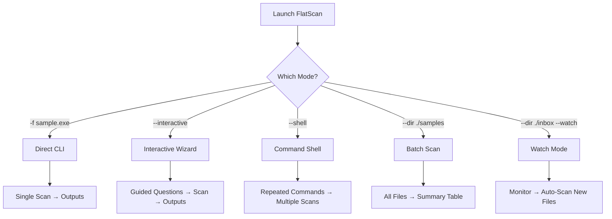
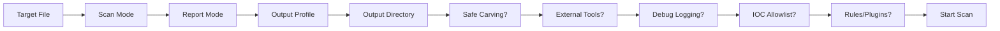
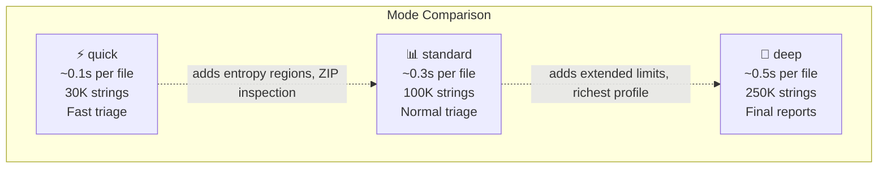
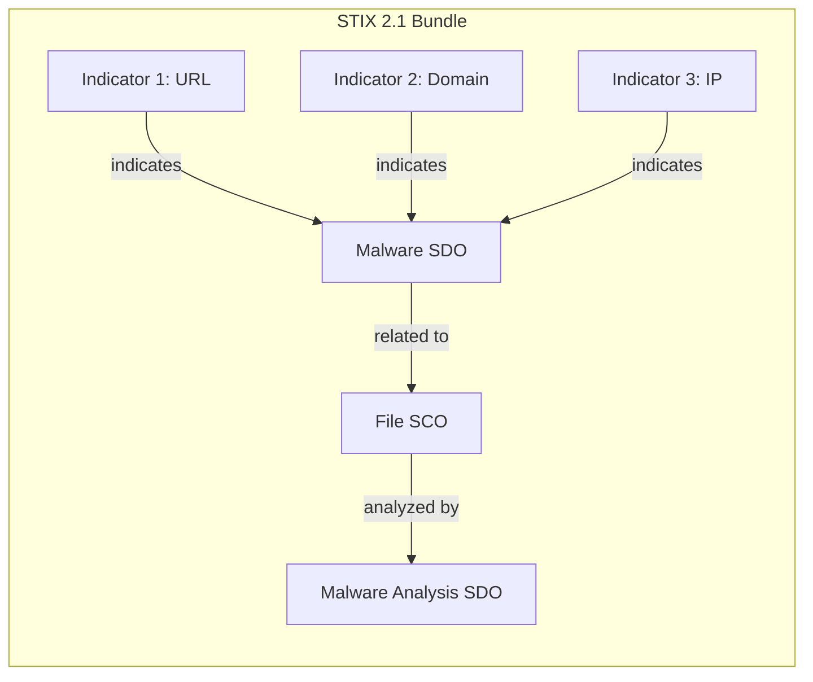
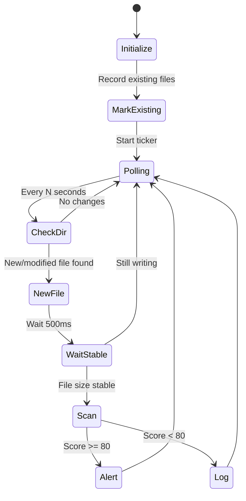
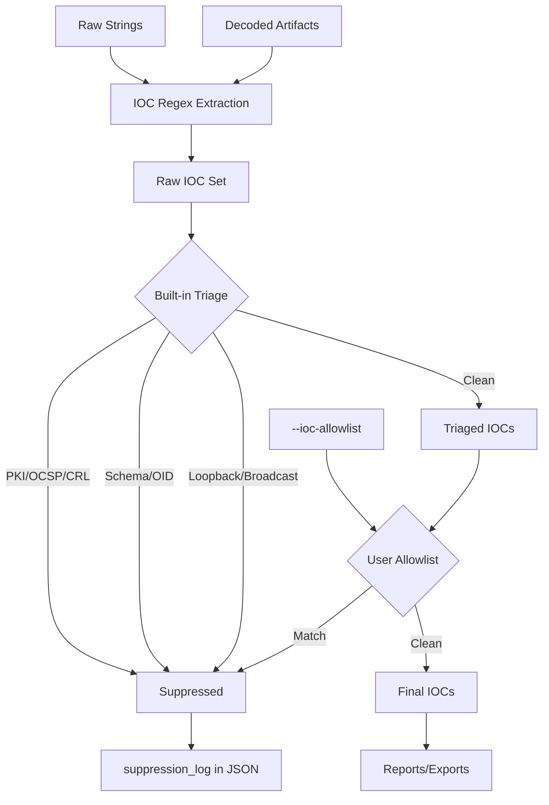
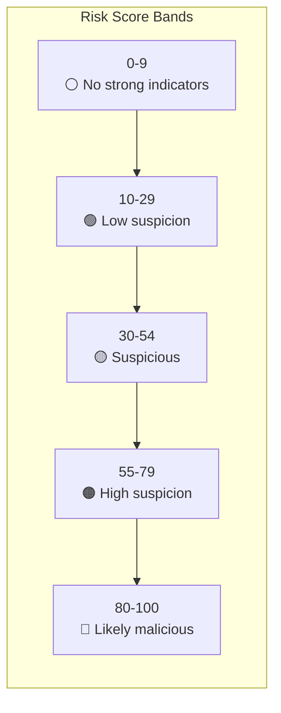
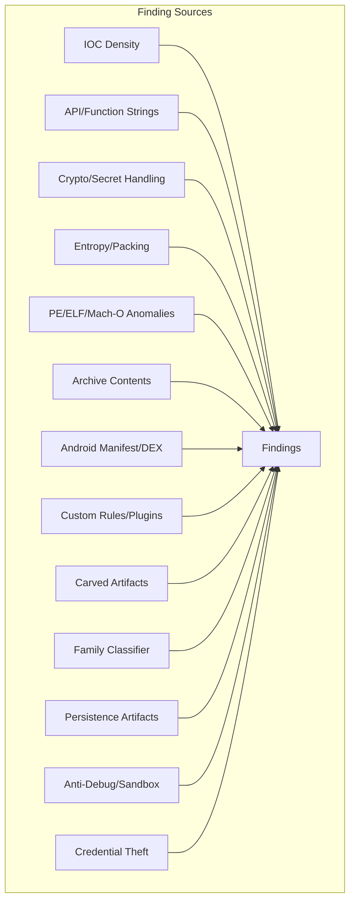

# Usage Guide

Repository: https://github.com/Masriyan/FlatScan

This guide provides comprehensive documentation for all FlatScan commands, flags, modes, output formats, and interpretation guidelines.

---

## Table of Contents

- [Command Shape](#command-shape)
- [Complete Flag Reference](#complete-flag-reference)
- [Operator Modes](#operator-modes)
- [Scan Modes](#scan-modes)
- [Report Modes](#report-modes)
- [Output Formats](#output-formats)
- [Batch & Watch Modes](#batch--watch-modes)
- [Custom Rules & Plugins](#custom-rules--plugins)
- [IOC Management](#ioc-management)
- [Advanced Analysis](#advanced-analysis)
- [Score Interpretation](#score-interpretation)
- [Finding Sources](#finding-sources)
- [Cryptography Analysis](#cryptography-analysis)
- [Automation Recipes](#automation-recipes)
- [Real-World Examples](#real-world-examples)

---

## Command Shape

```bash
./flatscan -m <mode> -f <target-file> [options]
```

### Minimal Example

```bash
./flatscan -m deep -f sample.exe --report-mode Full
```

### Full Example With All Outputs

```bash
./flatscan -m deep \
  -f sample.exe \
  --report-mode Full \
  --report reports/sample.full.txt \
  --extract-ioc reports/sample.iocs.txt \
  --json reports/sample.report.json \
  --pdf reports/sample.ciso.pdf \
  --html reports/sample.analyst.html \
  --yara reports/sample.yar \
  --sigma reports/sample.sigma.yml \
  --stix reports/sample.stix.json \
  --report-pack reports/sample-pack \
  --case CASE-001 \
  --case-db reports/cases.jsonl \
  --carve \
  --debug
```

---

## Complete Flag Reference

### Input & Mode Flags

| Flag | Default | Description |
| --- | --- | --- |
| `-f`, `--file` | *required* | Target file to scan |
| `-m`, `--mode` | `quick` | Scan mode: `quick`, `standard`, or `deep` |
| `--dir` | none | Scan all files in a directory (batch mode) |
| `--watch` | false | Monitor directory for new files and auto-scan (requires `--dir`) |
| `--watch-interval` | `3` | Polling interval in seconds for watch mode |

### Output Flags

| Flag | Default | Description |
| --- | --- | --- |
| `--report` | none | Write text report to path. Prints to stdout if omitted |
| `--report-mode` | `summary` | Text report mode: `Full`, `Summary`, or `minimal` |
| `--json` | none | Write JSON report. Use `-` to pipe to stdout |
| `--pdf` | none | Write CISO/management-ready PDF report |
| `--html` | none | Write interactive analyst HTML report |
| `--yara` | none | Write generated YARA hunting rule |
| `--sigma` | none | Write generated Sigma SIEM/EDR hunting rule |
| `--stix` | none | Write STIX 2.1 threat intelligence bundle |
| `--extract-ioc` | none | Write categorized IOC text export |
| `--report-pack` | none | Write all formats to a directory |

### Analysis Flags

| Flag | Default | Description |
| --- | --- | --- |
| `--carve` | false | Enable safe embedded-file carving by magic bytes |
| `--max-carves` | `80` | Maximum embedded artifacts reported |
| `--external-tools` | false | Run safe external metadata tools when installed |
| `--rules` | none | Custom FlatScan JSON/rule-pack detection files or directories |
| `--plugins` | none | Custom plugin pack files or directories |
| `--ioc-allowlist` | none | IOC allowlist for suppressing organization-specific benign domains |
| `--min-string` | `5` | Minimum string length to extract |
| `--decode-depth` | `2` | Nested decode depth (0-5) |
| `--max-analyze-bytes` | `268435456` | Maximum bytes retained for in-memory analysis |
| `--max-archive-files` | `500` | Maximum archive entries inspected |

### Case & Session Flags

| Flag | Default | Description |
| --- | --- | --- |
| `--case` | none | Case identifier for local case database |
| `--case-db` | auto | Local JSONL case database path |
| `--debug` | false | Include debug log and stronger error context |

### Display Flags

| Flag | Default | Description |
| --- | --- | --- |
| `--no-progress` | false | Disable progress output for automation |
| `--no-splash` | false | Disable startup ASCII banner/loading bar |
| `--no-color` | false | Disable colorized terminal output |
| `--splash-seconds` | `20` | Startup splash duration |
| `--version` | — | Print FlatScan version |

---

## Operator Modes

FlatScan supports five distinct operator modes:



### Direct CLI

Standard one-line commands for automation and scripting:

```bash
./flatscan -m deep -f sample.exe --json reports/sample.json --no-progress --no-color
```

### Interactive Mode

Guided wizard that asks for each setting:

```bash
./flatscan --interactive
```

The wizard covers:



Output profiles available in interactive mode:

| Profile | Outputs |
|---------|---------|
| Terminal only | Text to stdout |
| Standard files | Text + JSON + IOC |
| Full analyst/CISO pack | Text + JSON + IOC + PDF + HTML + YARA + Sigma + STIX + Report Pack |
| Custom paths | User-specified |

### Command Shell

Type multiple commands in one session:

```bash
./flatscan --shell
```

```text
flatscan> -m deep -f sample.exe --report-mode Full --json reports/sample.json --carve
flatscan> -m quick -f another.bin --report-mode minimal --no-progress
flatscan> help
flatscan> examples
flatscan> exit
```

Shell commands: `help`, `examples`, `version`, `back` (return to menu from interactive), `exit`/`quit`.

### Batch Mode

Scan all files in a directory with colorized summary table:

```bash
./flatscan --dir ./samples -m deep
```

Output includes:

```text
━━━━━━━━━━━━━━━━━━━━━━━━━━━━━━━━━━━━━━━━━━━━━━━━━━━━━━━━━━━━
FlatScan  Batch scan: 5 files in ./samples
          Mode: deep
━━━━━━━━━━━━━━━━━━━━━━━━━━━━━━━━━━━━━━━━━━━━━━━━━━━━━━━━━━━━

→ [1/5] malware.exe
  ✓ Likely malicious score=92 findings=14
→ [2/5] document.pdf
  ✓ No strong indicators score=2 findings=1

📊 Batch Summary  (5 files in 2.4s)
━━━━━━━━━━━━━━━━━━━━━━━━━━━━━━━━━━━━━━━━━
  File                    Verdict          Score  Finds  IOCs
  ──────────────────────────────────────────────────────────
  malware.exe             Likely malicious    92     14    23
  document.pdf            No strong indic..    2      1     0
  🔴 Malicious: 1  🟠 Suspicious: 0  🟢 Clean: 4
```

### Watch Mode

Continuous directory monitoring with auto-scan:

```bash
./flatscan --dir ./inbox --watch -m deep --watch-interval 5
```

```text
━━━━━━━━━━━━━━━━━━━━━━━━━━━━━━━━━━━━━━━━━━━━━━━━━━━━━━━━━━━━
FlatScan  Watch mode active
          Directory: ./inbox
          Mode: deep  Interval: 5s
          Existing files: 3 (skipped)
━━━━━━━━━━━━━━━━━━━━━━━━━━━━━━━━━━━━━━━━━━━━━━━━━━━━━━━━━━━━
👁 Waiting for new files...

📄 [14:32:15] New file detected: dropper.exe (1.2 MB)
  ✓ Likely malicious score=87 findings=11 sha256=a28a3e35...
  ⚠ ALERT: Malicious file detected! Immediate action recommended.
👁 Total scanned: 1 | Waiting...
```

---

## Scan Modes



### quick

Fast triage — hashes, type, strings, IOCs, decoding, key signatures:

```bash
./flatscan -m quick -f sample.bin --report-mode Summary
```

### standard

Normal analyst triage — adds high-entropy regions and ZIP-family entry inspection:

```bash
./flatscan -m standard -f sample.bin --report-mode Full
```

### deep

Final reports — largest string/import/decode limits and richest profile:

```bash
./flatscan -m deep -f sample.bin --report-mode Full --pdf reports/sample.pdf
```

---

## Report Modes

### minimal

Small output for shell scripts and CI:

```bash
./flatscan -m quick -f sample.bin --report-mode minimal --no-progress --no-color
```

Contains: tool version, target, verdict, score, file type, SHA256, finding/IOC counts.

### Summary

Good for terminal triage:

```bash
./flatscan -m standard -f sample.bin --report-mode Summary
```

Contains: metadata, malware profile, top findings, IOC summary, suspicious strings, decoded highlights.

### Full

Best for analyst handoff:

```bash
./flatscan -m deep -f sample.bin --report-mode Full --debug
```

Contains: full hashes, malware profile, all findings, suspicious functions/APIs, full IOC sections, decoded artifacts, PE/ELF/Mach-O/container details, APK/DEX details, family classifier, rule matches, crypto/config, carved artifacts, similarity hashes, debug log.

---

## Output Formats

### PDF Report

```bash
./flatscan -m deep -f sample.exe --pdf reports/sample.ciso.pdf
```



```mermaid
graph TD
    subgraph "PDF Report Structure"
        A[Cover Page] --> B[Executive Assessment]
        B --> C[CISO Decision Summary]
        C --> D[Risk & Confidence Cards]
        D --> E[Business Impact]
        E --> F[Management Actions]
        F --> G[Evidence Summary Table]
        G --> H[MITRE ATT&CK Matrix]
        H --> I[Priority Findings]
        I --> J[Cryptography Assessment]
        J --> K[Hunting Guidance]
        K --> L[Sample Metadata & IOCs]
        L --> M[Technical Details]
        M --> N[Appendix]
    end
```

### HTML Report

Interactive analyst report with finding severity filters, MITRE mapping, IOC cards, family classifier output, and raw JSON:

```bash
./flatscan -m deep -f sample.exe --html reports/sample.analyst.html
```

### STIX 2.1 Bundle

Standards-compliant threat intelligence for SIEM/EDR/TIP ingestion:

```bash
./flatscan -m deep -f sample.exe --stix reports/sample.stix.json
```



### Report Pack

Write all formats to a single directory:

```bash
./flatscan -m deep -f sample.exe --report-pack reports/sample-pack
```

Generates: `full.txt`, `summary.txt`, `report.json`, `ciso.pdf`, `analyst.html`, `iocs.txt`, `hunting.yar`, `hunting.sigma.yml`, `stix.json`, `executive.md`.

### JSON Report

Complete structured result for automation:

```bash
./flatscan -m deep -f sample.exe --json - | jq '.verdict'
```

Key JSON fields:

| Field | Type | Description |
|-------|------|-------------|
| `risk_score` | int | 0-100 cumulative score |
| `verdict` | string | Human-readable verdict |
| `findings` | array | All findings with severity, category, evidence, MITRE |
| `iocs` | object | Categorized IOCs (URLs, domains, IPs, hashes, etc.) |
| `profile` | object | Enriched malware profile with TTPs |
| `hashes` | object | MD5, SHA1, SHA256, SHA512 |
| `plugins` | array | Plugin results |
| `family_matches` | array | Family classifier hypotheses |
| `stix_bundle` | object | Embedded STIX if `--stix` used |

---

## Batch & Watch Modes

### Batch Scanning

```bash
# Scan all files in a directory
./flatscan --dir ./samples -m deep

# With JSON export per file
./flatscan --dir ./samples -m deep --json reports/batch.json
```

### Watch Mode

```bash
# Monitor with 5-second polling interval
./flatscan --dir ./inbox --watch -m deep --watch-interval 5
```

Watch mode behavior:



---

## Custom Rules & Plugins

### JSON Rule Pack

```bash
./flatscan -m deep -f sample.exe --rules rules/
```

```json
{
  "name": "org-triage-rules",
  "rules": [
    {
      "id": "org.webhook",
      "name": "Organization webhook marker",
      "severity": "High",
      "category": "Custom Rule",
      "score": 18,
      "strings_any": ["discord.com/api/webhooks", "telegram"],
      "tactic": "Exfiltration",
      "technique": "Exfiltration Over Web Service",
      "recommendation": "Review extracted endpoints and block confirmed malicious destinations."
    }
  ]
}
```

### Line-Based `.rule` Format

```text
id: android.runtime.exec
name: Android runtime execution marker
severity: Medium
category: Android
score: 10
strings_any: Runtime.exec, ProcessBuilder
file_types: APK package, DEX bytecode
recommendation: Review decompiled call sites.
```

### Rule Matching Keys

| Key | Type | Description |
|-----|------|-------------|
| `strings_any` | list | Match if any string is found in corpus |
| `strings_all` | list | Match if all strings are found in corpus |
| `regex_any` | list | Match if any regex matches a string |
| `functions_any` | list | Match against detected function/API names |
| `domains_any` | list | Match against extracted IOC domains |
| `urls_any` | list | Match against extracted IOC URLs |
| `sha256_any` | list | Match against file SHA256 |
| `file_types` | list | Only fire for these file types |
| `min_entropy` / `max_entropy` | float | Entropy range filter |

### Analysis Plugins

```bash
./flatscan -m deep -f sample.exe --plugins plugins/
```

Plugins use the `AnalysisPlugin` interface with `Name()`, `Version()`, `ShouldRun()`, and `Run()` methods. JSON plugin manifests can be dropped into the plugins directory without recompiling.

---

## IOC Management

### IOC Extraction Pipeline



### IOC Allowlist

```bash
./flatscan -m deep -f sample.bin --ioc-allowlist allowlist.txt
```

Supported format:

```text
domains:
  - "*.example-cdn.local"
  - "telemetry.example.com"

url_prefixes:
  - "https://updates.example.com/"

ipv4:
  - "10.10.10.*"
```

---

## Advanced Analysis

### Safe Carving

```bash
./flatscan -m deep -f sample.bin --carve --max-carves 120
```

Detects embedded PE, ELF, DEX, ZIP, PDF, gzip, 7-Zip, and RAR artifacts by offset/hash without extracting to disk. Payload hashes are promoted to `iocs.pe_hashes` when pointing at `.exe`/`.dll`.

### MSIX/AppX Analysis

FlatScan recognizes MSIX/AppX packages and extracts:

- Identity name, publisher, and version
- Declared application executables
- Requested capabilities (`runFullTrust`)
- Undeclared embedded `.exe` and `.dll` payloads
- Magniber ransomware family hypothesis scoring

### Android APK/DEX Analysis

For APK files, FlatScan parses:

- `AndroidManifest.xml` package name, version, SDK targets, permissions
- Dangerous Android permissions (SMS, contacts, location, camera, etc.)
- Exported components and intent actions
- DEX strings and Android API indicators
- Native libraries, signature files, assets

### External Tool Integration

```bash
./flatscan -m deep -f sample.exe --external-tools
```

Supported tools (when installed): `file`, `exiftool`, `rabin2`, `jadx`, `apktool`, `sigmac`, `yara`.

### Case Database

```bash
./flatscan -m deep -f sample.exe --case CASE-001 --case-db reports/cases.jsonl
```

Append-only JSONL. Each record stores: case ID, timestamps, hashes, verdict, score, file type, IOC count, family hypotheses, FlatHash.

---

## Score Interpretation



| Score | Verdict | Action |
| --- | --- | --- |
| `0-9` | No strong indicators | Not a clean verdict — sample may be packed or use techniques beyond static reach |
| `10-29` | Low suspicion | Review context. May be benign software with unusual characteristics |
| `30-54` | Suspicious | Correlate with endpoint telemetry, network logs, and threat intel |
| `55-79` | High suspicion | Treat as high risk. Escalate to sandbox analysis |
| `80-100` | Likely malicious | Multiple high-confidence indicators. Prioritize containment and response |

---

## Finding Sources

Findings are generated from multiple evidence layers:



---

## Cryptography Analysis

FlatScan identifies crypto usage patterns (does not break encryption):

| Category | Indicators |
|----------|-----------|
| **Windows CNG** | `BCrypt*` strings |
| **Windows CryptoAPI** | DPAPI-style strings |
| **Browser Secrets** | Chromium `encrypted_key` workflows |
| **Symmetric Crypto** | AES/GCM/tag/IV/nonce markers |
| **Obfuscation** | Encoded/decoded artifacts |
| **XOR Encoding** | Single-byte XOR candidates with printable output |
| **Compressed Blobs** | Embedded compressed stream markers |

---

## Automation Recipes

### CI/CD Pipeline

```bash
./flatscan -m deep -f $ARTIFACT \
  --report-mode minimal \
  --json reports/scan.json \
  --no-progress --no-color

SCORE=$(cat reports/scan.json | jq '.risk_score')
if [ "$SCORE" -ge 30 ]; then
  echo "SUSPICIOUS: score=$SCORE"
  exit 1
fi
```

### Batch Triage

```bash
./flatscan --dir ./quarantine -m deep
```

### SOC Intake Monitoring

```bash
./flatscan --dir /var/spool/malware-inbox --watch -m deep --watch-interval 10
```

### Report Pack Generation

```bash
./flatscan -m deep -f sample.exe \
  --report-pack reports/CASE-$(date +%Y%m%d) \
  --case CASE-$(date +%Y%m%d) \
  --case-db reports/cases.jsonl
```

### STIX Feed

```bash
for f in samples/*; do
  ./flatscan -m deep -f "$f" --stix "stix/$(basename $f).stix.json" --no-progress --no-color
done
```

---

## Real-World Examples

### Ransomware Sample

```bash
./flatscan -m deep \
  -f /path/to/magniber-sample.bin \
  --report-mode Full \
  --report reports/magniber.full.txt \
  --extract-ioc reports/magniber.iocs.txt \
  --json reports/magniber.report.json \
  --pdf reports/magniber.ciso.pdf \
  --html reports/magniber.analyst.html \
  --yara reports/magniber.yar \
  --sigma reports/magniber.sigma.yml \
  --stix reports/magniber.stix.json \
  --carve \
  --debug
```

### Android Malware

```bash
./flatscan -m deep \
  -f suspicious.apk \
  --rules rules/ \
  --plugins plugins/ \
  --report-pack reports/android-case \
  --case APK-001
```

### Quick CI Check

```bash
./flatscan -m quick -f build-output.exe \
  --report-mode minimal \
  --json - \
  --no-progress --no-color | jq '{verdict, risk_score, findings: (.findings | length)}'
```
