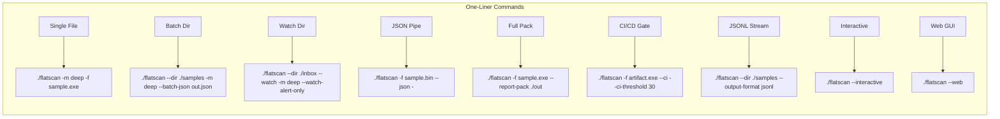
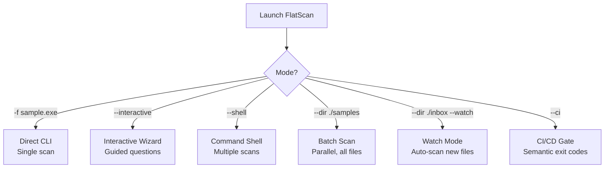
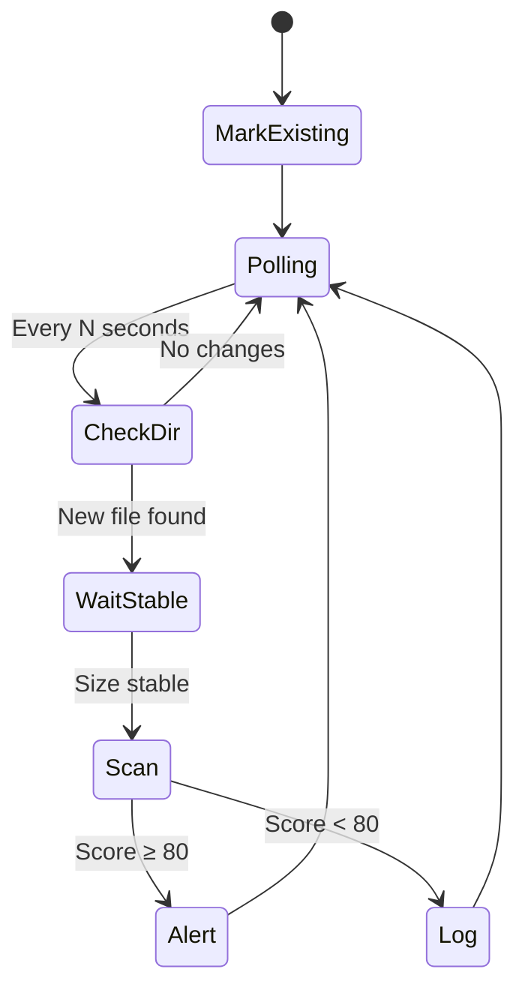
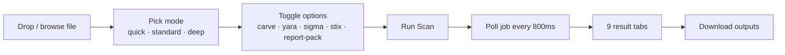
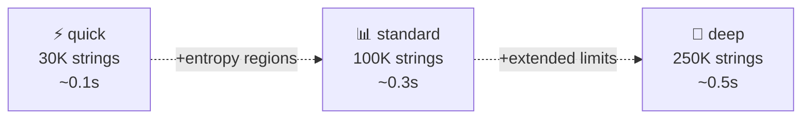
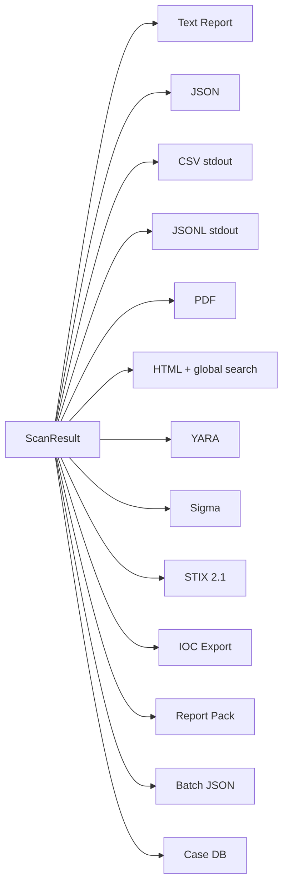
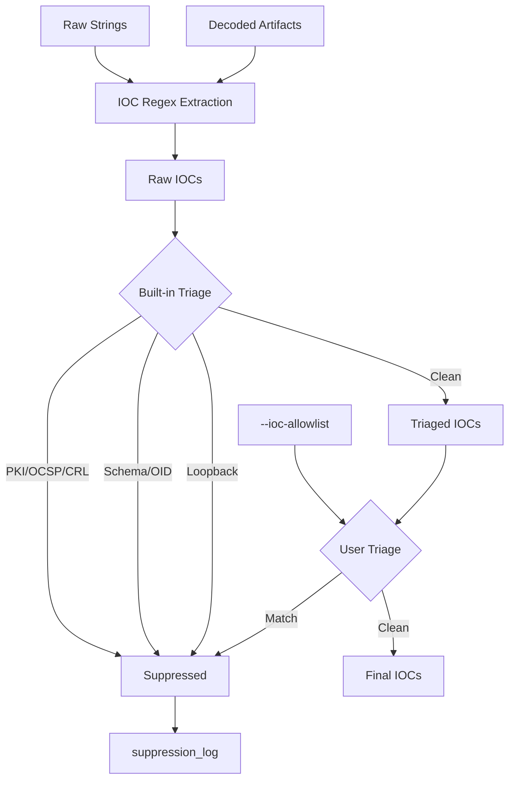
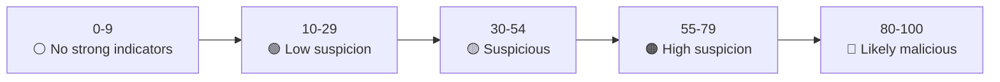

# Usage Guide

Repository: https://github.com/Masriyan/FlatScan

Complete reference for FlatScan commands, flags, modes, output formats, real-world examples, and use cases.

---

## Table of Contents

- [Quick Reference](#quick-reference)
- [Complete Flag Reference](#complete-flag-reference)
- [Operator Modes](#operator-modes)
- [Web Mode](#web-mode)
- [Scan Modes](#scan-modes)
- [Report Modes](#report-modes)
- [Output Formats](#output-formats)
- [Batch & Watch Modes](#batch--watch-modes)
- [CI/CD Mode](#cicd-mode)
- [Custom Rules & Plugins](#custom-rules--plugins)
- [IOC Management](#ioc-management)
- [Advanced Analysis](#advanced-analysis)
- [Score Interpretation](#score-interpretation)
- [Real-World Scan Commands](#real-world-scan-commands)
- [Use Case Scenarios](#use-case-scenarios)
- [Automation Recipes](#automation-recipes)
- [Troubleshooting](#troubleshooting)

---

## Quick Reference


```mermaid
graph LR
    subgraph "One-Liner Commands"
        A["Single File"] --> B["./flatscan -m deep -f sample.exe"]
        C["Batch Dir"] --> D["./flatscan --dir ./samples -m deep --batch-json out.json"]
        E["Watch Dir"] --> F["./flatscan --dir ./inbox --watch -m deep --watch-alert-only"]
        G["JSON Pipe"] --> H["./flatscan -f sample.bin --json -"]
        I["Full Pack"] --> J["./flatscan -f sample.exe --report-pack ./out"]
        K["CI/CD Gate"] --> L["./flatscan -f artifact.exe --ci --ci-threshold 30"]
        M["JSONL Stream"] --> N["./flatscan --dir ./samples --output-format jsonl"]
        O["Interactive"] --> P["./flatscan --interactive"]
        Q["Web GUI"] --> R["./flatscan --web"]
    end
```

### Minimal Scan

```bash
./flatscan -m deep -f sample.exe
```

### Full One-Liner (All Outputs)

```bash
./flatscan -m deep -f sample.exe --report-mode Full --report reports/sample.txt --json reports/sample.json --pdf reports/sample.pdf --html reports/sample.html --yara reports/sample.yar --sigma reports/sample.yml --stix reports/sample.stix.json --extract-ioc reports/sample.iocs.txt --report-pack reports/sample-pack --carve --debug
```

### Batch Directory Scan

```bash
./flatscan --dir ./samples -m deep
```

### JSON to Stdout for Scripting

```bash
./flatscan -m deep -f sample.exe --json - --no-progress --no-splash --no-color | jq '.verdict'
```

### CI/CD Gate (0.5.0+)

```bash
# Exit 0 = clean, 10 = suspicious, 20 = malicious
./flatscan -m quick -f artifact.exe --ci --ci-threshold 30 --no-splash
```

### CSV / JSONL Machine Output (0.5.0+)

```bash
# Stream JSONL to jq
./flatscan --dir ./samples -m quick --output-format jsonl --no-splash | jq 'select(.risk_score >= 55)'

# CSV for spreadsheet import
./flatscan --dir ./samples -m quick --output-format csv --no-splash > results.csv
```

### Initial-Access Artifacts — LNK & Scripts (0.7.1+)

```bash
# Malicious shortcut: parses the embedded command line, recovers reversed/encoded C2 URLs
./flatscan -f invoice.lnk -m deep --extract-ioc iocs.txt

# Obfuscated PowerShell dropper: follow more nested decode layers (base64 -> delimited-hex -> reversed)
./flatscan -f stage1.ps1 -m deep --decode-depth 4 --html report.html
```

### Code-Level Disassembly (0.8.0+)

```bash
# Standard/deep modes disassemble the entry point of x86/x64 PE & ELF binaries:
# API-hashing (ROR13) loops, PEB walks, GetPC/shellcode stubs, anti-VM, and
# hash-database resolution of hash-obfuscated imports. See the JSON "code" object
# (techniques, resolved_hashed_apis) or the report's "Code analysis (disassembly)" section.
./flatscan -f loader.exe -m deep --json - --no-splash | jq '.code'
```

---

## Complete Flag Reference

### Input & Mode

| Flag | Short | Default | Description |
|------|-------|---------|-------------|
| `--file` | `-f` | *required* | Target file path |
| `--mode` | `-m` | `quick` | Scan mode: `quick`, `standard`, `deep` |
| `--dir` | — | — | Scan all files in directory (batch mode) |
| `--watch` | — | false | Monitor directory for new files (requires `--dir`) |
| `--watch-interval` | — | `3` | Polling interval in seconds for watch mode |
| `--interactive` | `-i` | false | Launch guided interactive wizard |
| `--shell` | — | false | Launch manual command shell |

### Output

| Flag | Default | Description |
|------|---------|-------------|
| `--report` | — | Text report file path |
| `--report-mode` | `summary` | Text verbosity: `Full`, `Summary`, `minimal` |
| `--json` | — | JSON report path. Use `-` for stdout |
| `--pdf` | — | PDF CISO/management report |
| `--html` | — | Interactive HTML analyst report |
| `--yara` | — | Auto-generated YARA hunting rule |
| `--sigma` | — | Auto-generated Sigma SIEM/EDR rule |
| `--stix` | — | STIX 2.1 threat intelligence bundle |
| `--extract-ioc` | — | Categorized IOC text export |
| `--report-pack` | — | All formats in one directory |

### Analysis

| Flag | Default | Description |
|------|---------|-------------|
| `--carve` | false | Enable safe embedded file carving |
| `--max-carves` | `80` | Maximum carved artifacts |
| `--external-tools` | false | Run external metadata tools |
| `--rules` | — | Custom rule pack files/directories |
| `--plugins` | — | Custom plugin pack files/directories |
| `--ioc-allowlist` | — | IOC suppression allowlist |
| `--min-string` | `5` | Minimum extractable string length |
| `--decode-depth` | `2` | Nested decode depth (0-5) |
| `--max-analyze-bytes` | `268435456` | Max bytes for in-memory analysis (256 MB) |
| `--max-archive-files` | `500` | Max archive entries to inspect |

### CI/CD & Automation

| Flag | Default | Description |
|------|---------|-------------|
| `--ci` | false | CI mode: suppress UI, print one-line result to stderr, semantic exit codes |
| `--ci-threshold` | `55` | Score threshold for `--ci` exit code (1–100) |
| `--output-format` | `text` | Output format: `text`, `json`, `csv`, `jsonl` |
| `--batch-json` | — | Write batch scan JSON summary to this file path |
| `--watch-alert-only` | false | Watch mode: only print files scoring ≥ alert threshold (suppresses clean) |

### Session & Display

| Flag | Default | Description |
|------|---------|-------------|
| `--case` | — | Case ID for local case database |
| `--case-db` | auto | JSONL case database path |
| `-q`, `--quiet` | false | Suppress report body, post-scan tips, splash, and progress — keeps only the verdict. Ideal for scripting. |
| `--debug` | false | Enable debug logging |
| `--no-progress` | false | Disable progress output |
| `--no-splash` | false | Disable startup banner |
| `--no-color` | false | Disable ANSI colors (also honors the `NO_COLOR` env var) |
| `--splash-seconds` | `20` | Splash duration (0–120) |
| `-h`, `--help` | — | Print grouped help to **stdout** (pipeable) and exit |
| `--version` | — | Print version and exit |

> **Unknown flags** now produce a single actionable error with a "did you mean" suggestion
> (e.g. `--carv` → `did you mean --carve ?`) instead of dumping the full help.
>
> **Mutually-exclusive combinations are rejected** (exit 2): `--web` with `-f`/`--dir`,
> `--watch` with `-f`, `--ci` with `--interactive`/`--shell`, and out-of-range
> `--web-port` / `--watch-interval`.

### Web GUI (0.6.0+)

| Flag | Default | Description |
|------|---------|-------------|
| `--web` | false | Launch the local web GUI (binds `127.0.0.1`, no authentication) |
| `--web-port` | `5000` | Port for `--web` mode |

---

## Operator Modes


```mermaid
graph TD
    A[Launch FlatScan] --> B{Mode?}
    B -->|"-f sample.exe"| C["Direct CLI<br/>Single scan"]
    B -->|"--interactive"| D["Interactive Wizard<br/>Guided questions"]
    B -->|"--shell"| E["Command Shell<br/>Multiple scans"]
    B -->|"--dir ./samples"| F["Batch Scan<br/>Parallel, all files"]
    B -->|"--dir ./inbox --watch"| G["Watch Mode<br/>Auto-scan new files"]
    B -->|"--ci"| H["CI/CD Gate<br/>Semantic exit codes"]
```

### Direct CLI

```bash
# Quick triage
./flatscan -m quick -f suspicious.exe

# Deep scan with all outputs
./flatscan -m deep -f malware.bin --report-mode Full --report-pack reports/case-001

# Automation-friendly (no color, no progress, no splash)
./flatscan -m deep -f sample.exe --json reports/out.json --no-progress --no-splash --no-color
```

### Interactive Mode

```bash
./flatscan --interactive
```

Guides you through: target file → scan mode → report mode → output profile → carving → external tools → debug → IOC allowlist → rules/plugins → scan execution.

Output profiles in interactive mode:

| # | Profile | Outputs |
|---|---------|---------|
| 1 | Terminal only | Text to stdout |
| 2 | Standard files | Text + JSON + IOC |
| 3 | Full analyst/CISO pack | Text + JSON + IOC + PDF + HTML + YARA + Sigma + STIX + Report Pack |
| 4 | Custom paths | User-specified |

### Shell Mode

```bash
./flatscan --shell
```

```text
flatscan> -m deep -f sample1.exe --report-mode Full --json reports/s1.json
flatscan> -m quick -f sample2.bin --report-mode minimal
flatscan> help
flatscan> examples
flatscan> exit
```

### Batch Mode

```bash
./flatscan --dir /path/to/samples -m deep
```

Scans all regular files in parallel (one goroutine per CPU core), prints a colorized summary table with verdicts, scores, and IOC counts.

### Watch Mode

```bash
./flatscan --dir /var/spool/malware-inbox --watch -m deep --watch-interval 5
```

Monitors directory, auto-scans new files, and alerts when score ≥ 80.

### CI/CD Mode

```bash
./flatscan -f artifact.exe --ci --ci-threshold 30
```

Suppresses all UI (splash, progress, hints). Prints one-line result to stderr and exits with a semantic code.


```mermaid
stateDiagram-v2
    [*] --> MarkExisting
    MarkExisting --> Polling
    Polling --> CheckDir: Every N seconds
    CheckDir --> Polling: No changes
    CheckDir --> WaitStable: New file found
    WaitStable --> Scan: Size stable
    Scan --> Alert: Score ≥ 80
    Scan --> Log: Score < 80
    Alert --> Polling
    Log --> Polling
```

### Web Mode (0.6.0+)

```bash
./flatscan --web                  # serve on http://localhost:5000
./flatscan --web --web-port 8080  # custom port
```

Launches a self-contained browser GUI. Upload a file, choose a scan mode and options, and view the result across nine tabs — no install, no external assets, no authentication.

---

## Web Mode

The web GUI (`--web`) wraps the same scan engine as the CLI behind a small local HTTP server. The entire single-page application is embedded in the binary (`web_ui.go`); there are **no external dependencies, fonts, or CDN calls**.

### Starting the server

```bash
./flatscan --web
# [flatscan-web] WARNING: no authentication — bind to localhost only
# [flatscan-web] listening on http://localhost:5000
# [flatscan-web] open your browser at http://localhost:5000
```

The server binds to `127.0.0.1` only. Use `--web-port <n>` to change the port (default `5000`).

### Using the interface


```mermaid
graph LR
    A[Drop / browse file] --> B[Pick mode<br/>quick · standard · deep]
    B --> C[Toggle options<br/>carve · yara · sigma · stix · report-pack]
    C --> D[Run Scan]
    D --> E[Poll job every 800ms]
    E --> F[9 result tabs]
    F --> G[Download outputs]
```

1. **Drop zone** — drag a file in or click to browse. The file name, size, and type are previewed.
2. **Scan mode** — quick / standard / deep (default standard).
3. **Options** — `--carve`, `--yara` (on), `--sigma` (on), `--stix`, `--report-pack`.
4. **Run Scan** — uploads the file and starts an asynchronous job.
5. **Results** — nine tabs: overview, findings, IOC, functions, PE details, artifacts, profile, log, outputs.
6. **History** — the last 10 scans are kept in the session; click any entry to reload it.

### HTTP API

The same endpoints the UI uses are available for scripting on the loopback interface:

| Endpoint | Method | Body / Params | Response |
|----------|--------|---------------|----------|
| `/` | GET | — | Embedded HTML UI |
| `/api/scan` | POST | `multipart/form-data`: `file`, `mode`, `carve`, `yara`, `sigma`, `stix`, `report_pack` | `202 {"job_id": "..."}` |
| `/api/result/{id}` | GET | — | `202 {"status":"scanning",...}` while running; `200` with full `ScanResult` + `status:"done"` + `available_downloads` when complete; `200 {"status":"error",...}` on failure |
| `/api/download/{id}/{format}` | GET | `format` ∈ `json·txt·iocs·yar·yml·stix·pack` | Streams the artifact (`pack` = report pack zipped on the fly) |

```bash
# Scripted upload + poll + download against the local server
JOB=$(curl -s -F "file=@sample.exe" -F "mode=deep" -F "yara=true" \
  http://localhost:5000/api/scan | jq -r .job_id)

# poll until done
until curl -s http://localhost:5000/api/result/$JOB | jq -e '.status=="done"' >/dev/null; do sleep 1; done

# download the JSON report and the zipped report pack
curl -s http://localhost:5000/api/download/$JOB/json -o sample.json
curl -s http://localhost:5000/api/download/$JOB/pack -o sample.pack.zip
```

### Notes & limits

- **No authentication** — anyone who can reach the port can scan and download. Keep it on `127.0.0.1` (the default) and never expose it to untrusted networks.
- **Per-job isolation** — each upload and its outputs live in a private temp directory, deleted ~30 minutes after the scan finishes. Reload old results from history before then.
- **Upload cap** — 256 MB per file.
- The web server forces `--no-splash`, `--no-progress`, and `--no-color` internally; case-database writes are disabled so nothing is written outside the per-job temp directory.

---

## Scan Modes


```mermaid
graph LR
    Q["⚡ quick<br/>30K strings<br/>~0.1s"] -.->|"+entropy regions"| S["📊 standard<br/>100K strings<br/>~0.3s"]
    S -.->|"+extended limits"| D["🔬 deep<br/>250K strings<br/>~0.5s"]
```

| Mode | Strings | Best For |
|------|---------|----------|
| `quick` | 30,000 | Fast triage, CI/CD gates, bulk sorting |
| `standard` | 100,000 | Normal analyst triage, adds entropy regions + ZIP inspection |
| `deep` | 250,000 | Final reports, incident response, richest profile |

---

## Report Modes

| Mode | Content | Use Case |
|------|---------|----------|
| `minimal` | Version, target, verdict, score, SHA256 | Shell scripts, CI gates |
| `Summary` | Metadata, profile, top findings, IOC summary | Terminal triage |
| `Full` | Everything: all hashes, all findings, all IOCs, PE/ELF/APK details, debug log | Analyst handoff, archival |

---

## Output Formats

| Format | Flag | Purpose |
|--------|------|---------|
| Text report | `--report` | Human-readable, honors `--report-mode` |
| JSON | `--json` | Machine-readable for automation (use `-` for stdout) |
| CSV | `--output-format csv` | One-line CSV to stdout: `filename,score,verdict,findings,iocs,sha256` |
| JSONL | `--output-format jsonl` | One JSON object per line to stdout — pipe to SIEM or `jq` |
| PDF | `--pdf` | CISO/management with executive summary, MITRE matrix, risk cards |
| HTML | `--html` | Interactive analyst report with global search, filters, IOC tabs |
| IOC export | `--extract-ioc` | Categorized IOC text including wallets, mutexes, named pipes |
| YARA rule | `--yara` | Auto-generated hunting rule with structural guards |
| Sigma rule | `--sigma` | SIEM/EDR hunting rule with ATT&CK tags |
| STIX 2.1 | `--stix` | Threat intel bundle: File SCO, Malware SDO, Indicators, Relationships |
| Report Pack | `--report-pack` | All of the above in one directory |
| Batch JSON | `--batch-json` | JSON summary of batch scan results (written after `--dir` scan) |
| Case DB | `--case` | JSONL append-only case record |


```mermaid
graph LR
    A[ScanResult] --> B[Text Report]
    A --> C[JSON]
    A --> C2[CSV stdout]
    A --> C3[JSONL stdout]
    A --> D[PDF]
    A --> E["HTML + global search"]
    A --> F[YARA]
    A --> G[Sigma]
    A --> H[STIX 2.1]
    A --> I[IOC Export]
    A --> J[Report Pack]
    A --> J2[Batch JSON]
    A --> K[Case DB]
```

---

## Batch & Watch Modes

### Batch: Scan Entire Directory

```bash
# Scan all files in a malware sample directory (parallel, auto NumCPU workers)
./flatscan --dir ./samples -m deep

# With specific rules and plugins
./flatscan --dir ./quarantine -m deep --rules rules/ --plugins plugins/ --carve

# Save JSON summary of all results
./flatscan --dir ./samples -m standard --batch-json reports/batch-summary.json

# Stream JSONL to filter on-the-fly
./flatscan --dir ./samples -m quick --output-format jsonl --no-splash | jq 'select(.risk_score >= 55)'
```

**Batch JSON summary format** (`--batch-json`):

```json
{
  "scanned": 50,
  "malicious": 3,
  "suspicious": 12,
  "clean": 35,
  "errors": 0,
  "duration": "4.2s",
  "results": [
    { "file_name": "sample.exe", "verdict": "MALICIOUS", "score": 92, "findings": 11, ... }
  ]
}
```

### Watch: Monitor for New Files

```bash
# SOC intake monitoring — print every scan
./flatscan --dir /var/spool/malware-inbox --watch -m deep --watch-interval 10

# Alert-only mode — suppress clean files, show only score ≥ 55
./flatscan --dir ./inbox --watch -m quick --watch-interval 3 --watch-alert-only

# Fast triage of incoming samples
./flatscan --dir ./inbox --watch -m quick --watch-interval 3
```

`--watch-alert-only` silently skips files scoring below the alert threshold and maintains a rolling status line: `[Watch] Monitored: 47 files  Alerts: 3  Last: dropper.exe (score=91)`.

---

## CI/CD Mode

Use `--ci` for automated pipelines. It suppresses all interactive UI and prints a single parseable line to stderr:

```
FLATSCAN: MALICIOUS score=92 file=artifact.exe findings=11 sha256=deadbeef...
```

### Exit Codes

| Code | Meaning |
|------|---------|
| `0` | Scan succeeded, clean (score < 30, or < `--ci-threshold` in CI) |
| `10` | Suspicious — single-file score ≥ 30, or in CI score ≥ `--ci-threshold` |
| `20` | Likely malicious — score ≥ 80 (emitted in both normal and CI mode) |
| `1` | Scan error (file not found, parse failure) |
| `2` | Usage error (bad or mutually-exclusive flags) |

> **Batch mode** (`--dir`) now returns the **worst file's** exit code (20 → 10 → 0),
> so a directory scan can gate a pipeline just like a single-file scan. The batch
> summary table is written to **stdout** (redirectable); per-file progress goes to stderr.
> Combine with `-q`/`--quiet` and `--batch-json` for clean machine-readable output.

### GitHub Actions Example

```yaml
- name: Scan build artifact
  run: |
    ./flatscan -m quick -f dist/app.exe --ci --ci-threshold 30 --no-splash
  # Exit 10 or 20 → step fails → pipeline blocked
```

### GitLab CI Example

```yaml
scan:
  script:
    - ./flatscan -m quick -f $CI_BUILDS_DIR/artifact.exe --ci --ci-threshold 30
  allow_failure: false
```

### Makefile Gate

```makefile
scan-gate:
	./flatscan -m quick -f $(BINARY) --ci --ci-threshold 30 --no-splash || (echo "Scan blocked release"; exit 1)
```

---

## Custom Rules & Plugins

### JSON Rule Pack

```bash
./flatscan -m deep -f sample.exe --rules rules/custom.json
```

```json
{
  "name": "org-rules",
  "rules": [
    {
      "id": "org.webhook",
      "name": "Webhook exfiltration endpoint",
      "severity": "High",
      "category": "Exfiltration",
      "score": 18,
      "strings_any": ["discord.com/api/webhooks", "api.telegram.org/bot"],
      "tactic": "Exfiltration",
      "technique": "Exfiltration Over Web Service"
    }
  ]
}
```

### Line-Based `.rule` Format

```text
id: android.runtime.exec
name: Android runtime execution
severity: Medium
category: Android
score: 10
strings_any: Runtime.exec, ProcessBuilder
file_types: APK package, DEX bytecode
```

### Rule Matching Keys

| Key | Description |
|-----|-------------|
| `strings_any` | Fire if any string found in corpus |
| `strings_all` | Fire if all strings found |
| `regex_any` | Regex match against extracted strings |
| `functions_any` | Match detected function/API names |
| `domains_any` | Match extracted IOC domains |
| `urls_any` | Match extracted IOC URLs |
| `sha256_any` | Match file SHA256 |
| `file_types` | Only fire for these file types |
| `min_entropy` / `max_entropy` | Entropy range filter |

### Plugin Packs

```bash
./flatscan -m deep -f sample.exe --plugins plugins/
```

JSON plugin manifest format supports `string_checks` with `contains`, `severity`, `category`, `title`, `score`, `tactic`, `technique`.

---

## IOC Management


```mermaid
graph TD
    A[Raw Strings] --> B[IOC Regex Extraction]
    C[Decoded Artifacts] --> B
    B --> D[Raw IOCs]
    D --> E{Built-in Triage}
    E -->|PKI/OCSP/CRL| F[Suppressed]
    E -->|Schema/OID| F
    E -->|Loopback| F
    E -->|Clean| G[Triaged IOCs]
    H["--ioc-allowlist"] --> I{User Triage}
    G --> I
    I -->|Match| F
    I -->|Clean| J[Final IOCs]
    F --> K[suppression_log]
```

### IOC Allowlist

```bash
./flatscan -m deep -f sample.bin --ioc-allowlist allowlist.txt
```

```text
domains:
  - "*.example-cdn.local"
  - "telemetry.example.com"
url_prefixes:
  - "https://updates.example.com/"
ipv4:
  - "10.10.10.*"
```

---

## Advanced Analysis

### Safe Carving

```bash
./flatscan -m deep -f dropper.exe --carve --max-carves 120
```

Detects embedded PE, ELF, DEX, ZIP, PDF, gzip, 7-Zip, RAR by offset/hash without extracting to disk.

### MSIX/AppX Analysis

FlatScan detects MSIX/AppX packages: identity, publisher, capabilities, undeclared payloads, Magniber ransomware hypothesis.

### Android APK/DEX Analysis

Parses `AndroidManifest.xml`, dangerous permissions, exported components, DEX strings, native libraries.

### External Tools

```bash
./flatscan -m deep -f sample.exe --external-tools
```

Supported: `file`, `exiftool`, `rabin2`, `jadx`, `apktool`, `sigmac`, `yara` (when installed).

### Case Database

```bash
./flatscan -m deep -f sample.exe --case CASE-001 --case-db reports/cases.jsonl
```

---

## Score Interpretation


```mermaid
graph LR
    A["0-9<br/>⚪ No strong indicators"] --> B["10-29<br/>🟢 Low suspicion"]
    B --> C["30-54<br/>🟡 Suspicious"]
    C --> D["55-79<br/>🟠 High suspicion"]
    D --> E["80-100<br/>🔴 Likely malicious"]
```

| Score | Verdict | Recommended Action |
|-------|---------|-------------------|
| 0-9 | No strong indicators | Not a clean verdict — may be packed or beyond static reach |
| 10-29 | Low suspicion | Review context, may be benign with unusual traits |
| 30-54 | Suspicious | Correlate with endpoint telemetry and network logs |
| 55-79 | High suspicion | Escalate to sandbox analysis, treat as high risk |
| 80-100 | Likely malicious | Prioritize containment, block IOCs, generate hunting rules |

### Score Breakdown (0.5.0+)

The terminal report header now includes a per-category breakdown showing which detection categories contributed to the total risk score:

```
Risk score: 82/100   Score breakdown: [Injection:28 Network:18 Evasion:14 Credential:12 Persistence:10]
```

The breakdown is also available in JSON output under `score_breakdown`:

```bash
./flatscan -f sample.exe --json - --no-splash --no-progress 2>/dev/null | jq '.score_breakdown'
```

### Exit Codes (0.5.0+)

| Exit Code | Meaning |
|-----------|---------|
| `0` | Score < 30 — clean / no significant indicators |
| `10` | Score ≥ 30 — suspicious (also used in `--ci` mode when at/above `--ci-threshold`) |
| `20` | Score ≥ 80 — likely malicious |
| `1` | Scan error (file not found, unreadable, parse failure) |
| `2` | Usage error (bad flags) |

---

## Real-World Scan Commands

### 🔬 Stealer Malware Analysis

```bash
# Single stealer sample - full analysis with all outputs
./flatscan -m deep \
  -f sample/mercuristealer \
  --report-mode Full \
  --report reports/mercurial.full.txt \
  --json reports/mercurial.report.json \
  --pdf reports/mercurial.ciso.pdf \
  --html reports/mercurial.analyst.html \
  --yara reports/mercurial.yar \
  --sigma reports/mercurial.sigma.yml \
  --stix reports/mercurial.stix.json \
  --extract-ioc reports/mercurial.iocs.txt \
  --carve --debug

# Batch scan entire stealer sample directory
./flatscan --dir sample/MercurialStealer/Samples -m deep

# Report pack for stealer case
./flatscan -m deep -f sample/mercuristealer \
  --report-pack reports/mercurial-case \
  --case STEALER-001 \
  --case-db reports/cases.jsonl \
  --carve
```

### 🔐 Ransomware Analysis (Magniber MSIX)

```bash
# Scan MSIX ransomware package
./flatscan -m deep \
  -f "sample/MagniberRansomware/Samples/e2d3af7acd9bb440f9972b192cbfa83b07abdbb042f8bf1c2bb8f63944a4ae39 (1).msix" \
  --report-mode Full \
  --report-pack reports/magniber-case \
  --case RANSOM-001 \
  --carve --debug

# Batch scan all ransomware samples
./flatscan --dir sample/MagniberRansomware/Samples -m deep --carve
```

### 📱 Android Malware Analysis

```bash
# Scan APK with custom Android rules
./flatscan -m deep \
  -f "sample/sudo3rs - sample Xploit_Hunter.apk" \
  --rules rules/,plugins/ \
  --report-pack reports/xploit-hunter-case \
  --case APK-001 \
  --carve

# Quick triage of APK
./flatscan -m quick -f suspicious.apk --report-mode Summary
```

### 📦 Archive / Compressed Samples

```bash
# Scan compressed archive (FlatScan inspects ZIP entries)
./flatscan -m deep -f sample/C2.zip --carve --max-archive-files 1000

# Scan 7z archive
./flatscan -m deep -f sample/MercurialStealer.7z --carve
```

### 🌐 C2 Infrastructure Analysis

```bash
# Deep scan C2 toolkit with IOC extraction
./flatscan -m deep -f sample/C2.zip \
  --extract-ioc reports/c2.iocs.txt \
  --stix reports/c2.stix.json \
  --json reports/c2.json \
  --carve --debug
```

### 🔄 Multi-Sample Comparison

```bash
# Batch scan and compare verdicts
./flatscan --dir sample/MercurialStealer/Samples -m deep

# Individual scans with JSON for diffing
for f in sample/MercurialStealer/Samples/*; do
  ./flatscan -m deep -f "$f" \
    --json "reports/$(basename "$f").json" \
    --no-progress --no-splash --no-color
done
```

### ⚡ Quick Triage Commands

```bash
# Fast verdict only
./flatscan -m quick -f sample.exe --report-mode minimal --no-splash

# Score check for scripting
./flatscan -m quick -f sample.exe --json - --no-progress --no-splash --no-color 2>/dev/null | jq '.risk_score'

# Verdict + hash only
./flatscan -m quick -f sample.exe --json - --no-progress --no-splash --no-color 2>/dev/null | jq '{verdict, risk_score, sha256: .hashes.sha256}'
```

### 🎯 STIX Threat Intelligence Feed

```bash
# Generate STIX for all samples in a directory
for f in samples/*; do
  ./flatscan -m deep -f "$f" \
    --stix "stix/$(basename "$f").stix.json" \
    --no-progress --no-splash --no-color
done

# Single STIX export
./flatscan -m deep -f malware.exe --stix reports/threat-intel.stix.json
```

### 🛡️ YARA + Sigma Hunting Rules

```bash
# Generate YARA rule for EDR deployment
./flatscan -m deep -f sample.exe --yara reports/hunt.yar

# Generate Sigma rule for SIEM
./flatscan -m deep -f sample.exe --sigma reports/hunt.sigma.yml

# Both at once
./flatscan -m deep -f sample.exe --yara reports/hunt.yar --sigma reports/hunt.sigma.yml
```

---

## Use Case Scenarios

### 🏢 SOC Analyst: Daily Triage

**Goal**: Quickly triage incoming samples from email gateway.

```bash
# 1. Alert-only watch — suppress noise, surface threats immediately
./flatscan --dir /var/spool/malware-inbox --watch -m standard \
  --watch-interval 10 --watch-alert-only

# 2. Batch scan quarantine folder with JSON summary
./flatscan --dir /var/quarantine -m deep --batch-json reports/daily-batch.json

# 3. Deep dive on flagged sample
./flatscan -m deep -f /var/quarantine/flagged.exe \
  --report-pack reports/triage-$(date +%Y%m%d) \
  --case TRIAGE-$(date +%Y%m%d) \
  --carve
```

### 🔍 Incident Responder: Full Case Workup

**Goal**: Complete analysis for incident report and threat intel sharing.

```bash
# Full case workup with all outputs
./flatscan -m deep \
  -f /evidence/malware.exe \
  --report-mode Full \
  --report-pack reports/IR-2026-001 \
  --case IR-2026-001 \
  --case-db reports/cases.jsonl \
  --stix reports/IR-2026-001/threat-intel.stix.json \
  --carve \
  --debug \
  --rules rules/ \
  --plugins plugins/

# Extract just IOCs for blocking
./flatscan -m deep -f /evidence/malware.exe \
  --extract-ioc reports/block-list.txt \
  --no-progress --no-splash
```

### 📊 CISO: Executive Briefing

**Goal**: Generate management-ready PDF for leadership.

```bash
# PDF report for board meeting
./flatscan -m deep -f incident-sample.exe \
  --pdf reports/executive-briefing.pdf \
  --report-mode Full

# Or full pack with executive summary
./flatscan -m deep -f incident-sample.exe \
  --report-pack reports/board-briefing
```

### 🔧 CI/CD Pipeline: Build Artifact Scanning

**Goal**: Gate releases on malware score using `--ci` mode (0.5.0+).

```bash
#!/bin/bash
# Single command — exit 0=clean, 10=suspicious, 20=malicious
./flatscan -m quick -f "$BUILD_ARTIFACT" --ci --ci-threshold 30 --no-splash
EXIT=$?

if [ $EXIT -eq 20 ]; then
  echo "BUILD BLOCKED: MALICIOUS artifact"
  exit 1
elif [ $EXIT -eq 10 ]; then
  echo "BUILD BLOCKED: suspicious artifact"
  exit 1
fi
echo "BUILD PASSED"
```

Or with JSONL for richer pipeline logging:

```bash
./flatscan -m quick -f "$BUILD_ARTIFACT" \
  --output-format jsonl --no-splash --no-progress | \
  tee scan.jsonl | jq '{verdict, score: .risk_score, findings: (.findings | length)}'
```

### 🧪 Malware Researcher: Family Classification

**Goal**: Classify and compare malware families.

```bash
# Analyze stealer family
./flatscan -m deep -f stealer.exe \
  --json reports/stealer.json \
  --no-progress --no-splash --no-color

# Extract family classification
jq '{family: .family_matches, classification: .profile.classification, ttps: .profile.ttps}' reports/stealer.json

# Compare similarity hashes across samples
for f in samples/*.exe; do
  HASH=$(./flatscan -m deep -f "$f" --json - --no-progress --no-splash --no-color 2>/dev/null | jq -r '.similarity.flathash')
  echo "$(basename "$f"): $HASH"
done
```

### 🌍 Threat Intel Team: STIX Feed Generation

**Goal**: Produce STIX bundles for TIP ingestion.

```bash
# Generate STIX for each sample
mkdir -p stix-feed
for f in incoming/*; do
  NAME=$(basename "$f" | sed 's/[^a-zA-Z0-9]/_/g')
  ./flatscan -m deep -f "$f" \
    --stix "stix-feed/${NAME}.stix.json" \
    --no-progress --no-splash --no-color
done

# Single high-fidelity export
./flatscan -m deep -f apt-sample.exe \
  --stix reports/apt-campaign.stix.json \
  --extract-ioc reports/apt-iocs.txt \
  --yara reports/apt-hunt.yar
```

### 📱 Mobile Security: APK Audit

**Goal**: Audit Android app for suspicious behavior.

```bash
# Full APK analysis with Android-specific rules
./flatscan -m deep \
  -f app-release.apk \
  --rules plugins/android-risk.rule \
  --report-pack reports/apk-audit \
  --carve

# Quick permission check
./flatscan -m quick -f app.apk --json - --no-progress --no-splash --no-color 2>/dev/null | \
  jq '.apk_info.permissions[] | select(.risk == "High" or .risk == "Critical")'
```

---

## Automation Recipes

### Batch Report Pack for All Samples

```bash
for f in samples/*; do
  NAME=$(basename "$f" | cut -d. -f1)
  ./flatscan -m deep -f "$f" \
    --report-pack "reports/${NAME}" \
    --case "${NAME}" \
    --case-db reports/cases.jsonl \
    --no-splash --no-progress
done
```

### Parallel Batch with JSON Summary (0.5.0+)

```bash
# Scan entire directory in parallel, save machine-readable summary
./flatscan --dir ./samples -m standard \
  --batch-json reports/batch-$(date +%Y%m%d).json \
  --no-splash

# Parse results
jq '.results[] | select(.score >= 55) | {file: .file_name, score, verdict}' \
  reports/batch-$(date +%Y%m%d).json
```

### JSONL Pipeline to SIEM (0.5.0+)

```bash
# Stream results directly to jq filter then to curl for SIEM ingestion
./flatscan --dir ./incoming -m quick --output-format jsonl --no-splash | \
  jq -c 'select(.risk_score >= 30)' | \
  while read -r event; do
    curl -s -X POST https://siem.local/api/events \
      -H "Content-Type: application/json" -d "$event"
  done
```

### Score-Based Alert System

```bash
# Alert-only watch with live status line
./flatscan --dir /var/incoming --watch -m deep \
  --watch-interval 5 --watch-alert-only
```

### Daily Summary Report

```bash
#!/bin/bash
DATE=$(date +%Y-%m-%d)
OUTDIR="reports/daily-${DATE}"
mkdir -p "$OUTDIR"

./flatscan --dir /var/quarantine -m deep \
  --batch-json "${OUTDIR}/batch.json" \
  --no-splash 2>&1 | tee "${OUTDIR}/summary.txt"

# Extract counts
jq '{malicious, suspicious, clean, scanned}' "${OUTDIR}/batch.json"
```

### JSON Field Extraction

```bash
# Get just verdict and score
./flatscan -f sample.exe --json - --no-progress --no-splash --no-color 2>/dev/null | \
  jq '{file: .file_name, verdict, score: .risk_score, findings: (.findings | length), iocs: ((.iocs.urls // [] | length) + (.iocs.domains // [] | length))}'

# Get top findings
./flatscan -f sample.exe --json - --no-progress --no-splash --no-color 2>/dev/null | \
  jq '.findings[] | {severity, title, score}'

# Get all IOC domains
./flatscan -f sample.exe --json - --no-progress --no-splash --no-color 2>/dev/null | \
  jq -r '.iocs.domains[]'

# Get crypto wallets (0.5.0+)
./flatscan -f sample.exe --json - --no-progress --no-splash --no-color 2>/dev/null | \
  jq -r '.iocs.crypto_wallets[]?'

# Get score breakdown (0.5.0+)
./flatscan -f sample.exe --json - --no-progress --no-splash --no-color 2>/dev/null | \
  jq '.score_breakdown'
```

### CSV Triage Sheet (0.5.0+)

```bash
# Write header then scan results
echo "file,score,verdict,findings,iocs,sha256" > triage.csv
./flatscan --dir ./samples -m quick \
  --output-format csv --no-splash >> triage.csv
```

---

## Troubleshooting

| Problem | Solution |
|---------|----------|
| `missing required -f/--file path` | Provide `-f path` or use `--dir` for batch |
| `--watch requires --dir` | Watch mode needs a directory: `--dir ./inbox --watch` |
| Color codes in piped output | Add `--no-color` when piping |
| Splash delays automation | Add `--no-splash --no-progress`, or use `--ci` which suppresses all UI |
| JSON stdout has text mixed in | Use `--json -` (text report suppressed) or `--output-format json` |
| CSV/JSONL mixed with progress | Progress is on stderr, CSV/JSONL on stdout — pipe safely without `2>/dev/null` |
| `--ci` exit code always 0 | Check `--ci-threshold` (default 55) — lower it if the score is below the threshold. Note `--ci` returns **20** for score ≥ 80 and **10** at/above the threshold. |
| Batch scan exits 0 despite bad files | Fixed in 0.10.1 — batch now returns the worst file's code. Rebuild if you are on an older binary. |
| `flatscan --help \| less` shows nothing | Fixed in 0.10.1 — `--help` now writes to stdout. |
| Unknown flag dumps the whole help | Fixed in 0.10.1 — you now get one line plus a "did you mean" suggestion. |
| Large file slow | Files >100MB use mmap on Linux automatically |
| Archive bomb warning | Increase `--max-archive-files` or `--max-carves` |
| Custom rules not loading | Check path: `--rules path/to/rules/` (accepts files or directories) |
| `--report-pack` missing STIX | STIX is included in report packs since v0.3.0 |
| High false-positive entropy score | Compressed formats (zip, 7z, gz, etc.) no longer trigger global entropy findings as of v0.5.0 |
| Batch scan slow | v0.5.0 uses parallel workers (NumCPU). If still slow, check I/O bottleneck |
